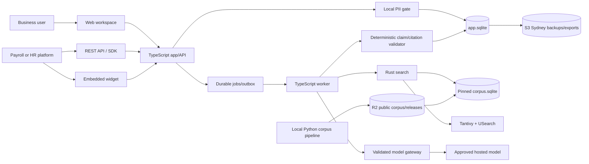
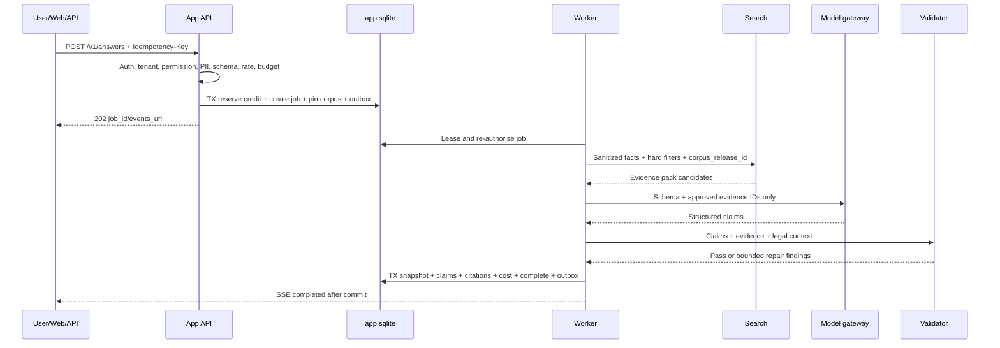
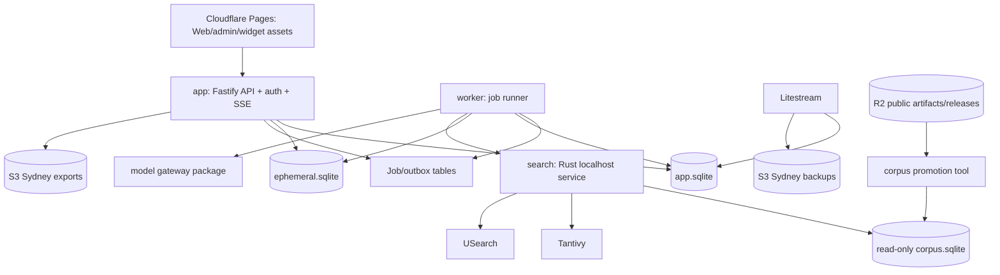

# AustraliaEmploymentRAG

## Product Requirements and Technical Implementation Specification

| Field | Value |
|---|---|
| Product | AustraliaEmploymentRAG |
| Release | MVP v1.0 |
| Document revision | 2.0 — detailed product and engineering entry manual |
| Document status | Approved discovery baseline; implementation specification |
| Document date | 3 August 2026 |
| Product language | English |
| Market | B2B only |
| Initial geography | Australia |
| Owner | Founder |
| Commercial success criterion | At least one genuine B2B organisation voluntarily pays to use the product |
| Founder-funded operating-cost ceiling | A$50 per calendar month |
| Delivery planning horizon | Six-week aggressive functional target plus two-week quality/data-risk buffer |

This document is the authoritative PRD for the MVP. The previous TaxRAG template is preserved at `docs/archive/PRD-taxrag-original.md` and is superseded. The discovery record is preserved in `docs/discovery/decision-log-2026-08-02.md`; the visible conversation transcript is preserved in `docs/discovery/conversation-transcript.md` and `.jsonl`.

## How to use this document

This PRD is both the approved product specification and the entry manual for
people joining the project. It is intentionally long. Do not read it from top
to bottom unless you are conducting a complete review; use the route below.

| Reader or task | Read first | Then use |
|---|---|---|
| Founder, buyer or executive | Product in 60 seconds; §§2–7 | §§24–27 for money, delivery and risk |
| Product designer | §§4–8 | §§30–33 for routes, screens and workflows |
| Frontend engineer | §§8, 10, 13 | §§31–33, 37 and 41 |
| API/backend engineer | §§8–10, 15–18 | §§30, 34–39 and 42 |
| Search/RAG engineer | §§6, 9, 14, 17 | §§35–36 and 39 |
| Corpus/data engineer | §§6–7, 11–12, 15 | §§35–36 and 40 |
| Security reviewer | §§10, 19, 21 | §§37–38 and 42 |
| QA/human tester | §§13–14, 26 | §§30, 33, 41 and 43 |
| Operator/on-call founder | §§12, 19, 22–23 | §§40, 42 and 44 |
| Coding agent | §20 | §§30 and 45 before changing code or schemas |

Search by requirement ID (`AUTH-`, `SRCH-`, `ANS-`, `COV-`, `CMP-`,
`REC-`, `MON-`, `EXP-`, `DEV-`, `ADM-`, `COR-`, `PII-`, `SEC-`, `OPS-`
or `EVAL-`) to move from a behaviour to its screen, API, data owner and test.

### Document authority and supporting records

| Document | Authority | Purpose |
|---|---|---|
| `PRD.md` | Normative | Product, engineering and release contract |
| `docs/discovery/decision-log-2026-08-02.md` | Decision evidence | Why accepted decisions were made |
| `docs/discovery/conversation-transcript.md` | Historical source | Verbatim visible discovery conversation |
| `docs/discovery/conversation-transcript.jsonl` | Canonical archive | Machine-readable copy of the conversation |
| `docs/archive/PRD-taxrag-original.md` | Superseded | Original TaxRAG template; not an active requirement |

If these records disagree, this PRD controls unless a later dated, approved
change record explicitly supersedes it.

## Product in 60 seconds

### What the customer buys

AustraliaEmploymentRAG gives a business one authenticated place to search,
ask, compare and monitor official Australian employment-law material. A user
supplies an anonymous business/work scenario, an Australian jurisdiction and a
legal date. The product returns one of six explicit answer statuses, a short
conditional conclusion, material assumptions, next checks and pinpoint links
to the exact source versions used. When the evidence cannot support a reliable
answer, the product says so instead of filling the gap from model memory.

The same evidence system serves three delivery forms: the Web research
workspace, a REST API/SDK for payroll or HR platforms, and an embeddable widget.
Saved work becomes an immutable, reviewable Research Record. Monitored sources
can later produce structured change alerts and show which saved answers may
require review.

### Project fact sheet

| Question | Concrete answer |
|---|---|
| Who pays? | Australian SME payroll/HR platforms, overseas platforms entering Australia, and B2B HR/payroll/compliance/legal research teams |
| What problem is solved? | Finding, understanding, proving and monitoring which official Australian employment-law material applies at a stated date and jurisdiction |
| Why not general ChatGPT? | This product pins official source versions, validates claim-level citations and refuses unsupported conclusions instead of relying on unsourced model memory |
| What is the first commercial win? | One real B2B organisation voluntarily pays for an invite-only pilot/customer workspace |
| What is included in MVP? | Search, Quick, Deep, Coverage, Compare, Records/review, Monitor, API, TS/Python SDKs, widget, admin, SSO/MFA/service accounts and exports |
| What law is included? | Agreed Commonwealth scope plus all eight state/territory employment, payroll-tax, court/tribunal and adjacent official-source groups in §40 |
| What time range? | Point-in-time support for 2026–27, 2025–26 and 2024–25; older cases and still-operative instruments retained as needed |
| What customer data is accepted? | Anonymous scenarios and public employer/business facts only; no private documents or identifiable employee data |
| What language? | English product, API, exports and answers |
| What is the operating constraint? | Founder-funded recurring cost cannot exceed A$50/calendar month; customer variable generation is prepaid or approved BYOK |
| What is the delivery assumption? | Six-week aggressive functional target plus two-week quality/data buffer; quality gates can delay launch |
| What is the largest risk? | Extremely broad official-source acquisition and legal/temporal validation without an employed domain expert |
| What is the safety response? | Official-source-only corpus, structured evidence, deterministic validators, explicit uncertainty/refusal, 600 synthetic cases and customer-internal review |

### A concrete customer example

This is an illustrative product flow, not a legal answer or evaluation case.

| Step | What the customer sees or does | What the system does |
|---|---|---|
| 1 | A payroll-platform compliance manager selects **Quick Answer**. | Creates a draft request; no generation credit is used yet. |
| 2 | They enter: employer ABN, employing jurisdiction `VIC`, work location `VIC`, employee type `full_time`, principal duties with no name or payroll identifier, question, and legal date `2026-08-03`. | Blocks employee PII, normalises the ABN/date/jurisdiction and asks for any decisive missing field. |
| 3 | They choose `SAVE` and submit. | Reserves one Quick credit, pins one `CorpusRelease`, creates an idempotent background job and begins SSE progress. |
| 4 | The progress panel shows **Checking workplace system**, **Searching agreements**, **Searching awards**, **Validating authorities**. | Runs exact/lexical/semantic retrieval under hard legal-date, jurisdiction, status and licence filters. |
| 5 | The result shows `CONDITIONAL`, a short answer, numbered claims, assumptions and exact source passages. | Accepts only claims whose evidence IDs, offsets, date, jurisdiction, authority and licence pass deterministic validation. |
| 6 | The manager opens a citation. | Opens the immutable node version and official source, not a generated summary. |
| 7 | They assign a reviewer and add the cited authorities to a watchlist. | Preserves an immutable Answer Snapshot and links future official changes back to this Research Record. |
| 8 | A relevant instrument changes. | Creates one structured change, fans it out to matching watchlists and marks affected records `REVIEW_REQUIRED` when impact rules require it. |

### Product control panel

| Surface | Customer input | Primary output | Works without hosted generation? | Durable by default? |
|---|---|---|---:|---:|
| Simple/Advanced Search | Text, exact identifier, filters, legal date | Source snippets and exact versions | Yes | Search history only if enabled |
| Quick Answer | Anonymous scenario, question, date, jurisdiction | Validated conditional answer | No | User chooses `SAVE` or `EPHEMERAL` |
| Deep Research | Anonymous scenario plus complex question | Bounded multi-part research result | No | User chooses `SAVE` or `EPHEMERAL` |
| Coverage Navigator | Employer/ABN, system facts, duties | System/agreement/award/classification candidates | Retrieval remains; synthesis may pause | `SAVE` required for review/monitoring |
| Compare | Two or more dates, jurisdictions or instruments | Dimension-specific claims and citations | Textual/source comparison can continue | User selectable |
| Research Records | Saved facts, turns, answers and comments | Immutable research history and review state | Yes for existing records | Yes |
| Monitor | Documents, nodes, topics, ABNs or saved searches | Structured in-app/email/webhook alerts | Rule-based changes continue | Yes |
| REST API/SDK/widget | Same controlled request schemas | Same answer/search contracts | Search yes; answers no | Explicit per request |
| Exports | Existing immutable snapshots | PDF, DOCX or JSON | Yes | Artifact expires; source record persists |

### Current project reality

| Area | Status on 3 August 2026 | Evidence |
|---|---|---|
| Product discovery | Complete | Decision log and transcript |
| Product/technical specification | Approved baseline; this detailed edition is the implementation entry point | This PRD |
| Application code | Not started in this repository | Repository currently contains documentation and tooling only |
| Source adapters/corpus | Not built | Source groups are specified in §40 |
| Evaluation dataset | 600-case design approved; cases not yet authored | §§14 and 43 |
| Production environment | Architecture selected; not provisioned | §§19, 24 and 42 |
| Paying customer | Not yet acquired | Commercial success remains one voluntary paying B2B organisation |

“Specified” never means “implemented”. Each implementation item moves through
`NOT_STARTED → IN_PROGRESS → IMPLEMENTED → VERIFIED → RELEASED`; only
`VERIFIED` items may satisfy the Definition of Done.

### System picture



The central invariant is: **a displayed legal claim is not trusted because a
model wrote it; it is trusted only after it is tied to exact evidence in one
pinned corpus release and passes deterministic validation.**

## Table of contents

| Part | Sections |
|---|---|
| Orientation | [How to use this document](#how-to-use-this-document) · [Product in 60 seconds](#product-in-60-seconds) · [Glossary](#glossary) |
| Product and market | [1 Normative language](#1-normative-language) · [2 Executive summary](#2-executive-summary) · [3 Vision/goals/non-goals](#3-product-vision-goals-and-non-goals) · [4 Customers/users/jobs](#4-customers-users-and-jobs) · [5 Product surfaces](#5-product-surfaces) |
| Corpus and product behaviour | [6 Legal corpus](#6-legal-corpus-scope) · [7 Source waves](#7-source-acquisition-waves) · [8 Functional requirements](#8-functional-requirements) · [9 Evidence policy](#9-legal-reasoning-and-evidence-policy) · [10 Privacy/retention](#10-privacy-data-use-and-retention) · [11 Licensing](#11-licensing-and-disclaimers) · [12 Freshness/corrections/incidents](#12-freshness-corrections-and-incidents) |
| Quality and contracts | [13 NFRs](#13-non-functional-requirements) · [14 Evaluation](#14-evaluation-and-launch-gates) · [15 Data model](#15-canonical-data-model) · [16 API](#16-api-contract) · [17 Retrieval](#17-retrieval-and-generation-design) |
| Architecture and operation | [18 Architecture](#18-technical-architecture) · [19 Deployment](#19-deployment-topology) · [20 Repository/delivery](#20-repository-and-delivery) · [21 Security](#21-security-architecture) · [22 Observability](#22-observability) · [23 Backup/DR](#23-backup-and-disaster-recovery) · [24 Cost/commercial limits](#24-operating-cost-and-commercial-limits) |
| Release baseline | [25 Delivery plan](#25-delivery-plan) · [26 Definition of Done](#26-definition-of-done) · [27 Risks](#27-key-risks-and-mitigations) · [28 Post-MVP](#28-post-mvp-triggers-not-current-commitments) · [29 References](#29-reference-links) |
| Product implementation manual | [30 Requirement register](#30-requirement-register-and-traceability) · [31 Routes](#31-information-architecture-and-route-inventory) · [32 Screens](#32-screen-contracts) · [33 Workflows](#33-end-to-end-workflows) |
| Engineering contracts | [34 API payloads](#34-concrete-api-contracts) · [35 Data dictionary](#35-minimum-logical-data-dictionary) · [36 Retrieval/answers](#36-retrieval-evidence-and-answer-algorithms) · [37 PII/untrusted content](#37-privacy-pii-and-untrusted-content-implementation) · [38 Identity/permissions/quotas](#38-identity-permission-and-quota-contracts) |
| Build and operate | [39 Runtime](#39-executable-runtime-architecture) · [40 Official sources](#40-official-source-roster-and-corpus-pipeline) · [41 UAT/demo/onboarding](#41-product-acceptance-and-demonstration-manual) · [42 Operations/recovery/cost](#42-operations-recovery-and-cost-manual) |
| Delivery entry point | [43 Evaluation/human test](#43-evaluation-and-human-test-manual) · [44 Work breakdown](#44-delivery-work-breakdown) · [45 Engineer/agent checklist](#45-engineer-and-coding-agent-entry-checklist) |

## Glossary

| Term | Meaning in this product |
|---|---|
| Official source | A public source published by the responsible government, legislature, court, tribunal, commission or regulator; not a commercial legal-summary site |
| Corpus | The versioned collection of eligible official documents, metadata, legal events, nodes and provenance available to Search/research |
| CorpusRelease | One immutable, validated bundle of `corpus.sqlite`, lexical/vector indexes and manifests; every answer is pinned to exactly one release |
| Legal date / `legal_as_at` | The date for which the user wants the law researched, not the date the question is asked |
| Knowledge cutoff | The latest retrieval time represented by the pinned corpus release |
| LegalDocument | Stable identity of an Act, award, agreement, case, decision, guidance item or proposal across versions |
| DocumentVersion | One immutable published/effective version of a LegalDocument |
| NodeVersion | Exact versioned provision, clause, paragraph or heading text used for retrieval and citations |
| Point-in-time | Retrieving the version/status that applied on a specified past/current date |
| Evidence pack | Bounded system-selected exact passages and metadata that a generation model is permitted to use/cite |
| Claim | One material rule, application, conclusion, date/status statement or next step in an answer |
| Pinpoint citation | Exact section/clause/paragraph plus source-version/offset linkage, not merely a homepage URL |
| Quick Answer | Bounded single-plan evidence retrieval and synthesis for a focused question |
| Deep Research | Bounded multi-subquestion workflow with at most one evidence-gap/conflict follow-up round |
| Coverage Navigator | Ordered research for workplace system, enterprise agreement, modern award and classification candidates |
| Research Record | Durable customer workspace container holding immutable turns, answers, comments, review and watch links |
| Answer Snapshot | Immutable formal answer with facts, legal date, corpus/model versions, claims, citations, assumptions and correction state |
| Lexical retrieval | Exact/keyword/field search, implemented with Tantivy/BM25 |
| Dense retrieval | Embedding-similarity search used selectively to improve semantic recall; never overrides legal applicability |
| Source group | One mandatory official collection/authority family in the coverage roster |
| Adapter | Source-specific discover/fetch/identify/parse/normalise/event/relation/validate implementation |
| Quarantine | Holding state for an artifact/version that failed parsing, identity, licensing or quality checks and cannot enter production |
| BYOK | Customer supplies an approved model-provider key; platform safety/evidence/rate controls still apply |
| Kill switch | Audited, scoped operational control that stops a capability/source/tenant/provider without deleting data |
| RPO / RTO | Target maximum recoverable data gap / target time to restore core service |

## 1. Normative language

- **MUST** indicates a release requirement or safety invariant.
- **SHOULD** indicates a strong objective that may be deferred only with a recorded reason and visible limitation.
- **MAY** indicates an allowed implementation choice.
- **Benchmark-selected** parameters are intentionally not fixed until representative corpus and evaluation results exist. They MUST pass the gates defined in this PRD before production use.

## 2. Executive summary

AustraliaEmploymentRAG is an English-language, evidence-grounded Australian employment-law research and conditional compliance-guidance platform for businesses and software platforms. It combines authoritative-source search, point-in-time retrieval, anonymous scenario Q&A, coverage/classification research, legal comparison, monitoring and integration APIs.

It is not a consumer legal-advice service, payroll execution engine, filing service or compliance certification product. It does not guarantee outcomes. It is designed to be materially safer and more auditable than a general-purpose chatbot by enforcing legal-date and jurisdiction filters, immutable source versions, claim-level citations, deterministic citation validation, visible uncertainty and refusal when evidence is insufficient.

The MVP deliberately includes the full agreed Commonwealth, state and territory source categories. It controls cost by tiering semantic indexing—not by silently deleting agreed legal scope. Public and permitted source artifacts are retained cheaply; the complete eligible corpus receives lexical/metadata/citation indexing; high-value material receives full dense indexing; long-tail material receives selective or on-demand semantic processing.

## 3. Product vision, goals and non-goals

### 3.1 Vision

Enable Australian and Australia-bound payroll, HR and compliance platforms—and direct B2B research teams—to find, understand, cite and monitor applicable Australian employment-law authorities without relying on unsourced model memory.

### 3.2 MVP goals

1. Deliver a production-accessible B2B product, not a POC or private demo.
2. Cover the agreed Australian employment-law source categories through an auditable official-source coverage registry.
3. Support current and point-in-time research for the current financial year plus the preceding two financial years.
4. Produce useful conditional conclusions with claim-level authorities, assumptions, limitations and practical next steps.
5. Refuse unsupported, stale, conflicting or out-of-scope conclusions.
6. Serve both direct Web research and embedded/API use from one product and evidence system.
7. Support organisation workspaces, collaboration, review, audit, SSO, MFA and service accounts.
8. Validate quality with 600 stratified synthetic cases and explicit release gates.
9. Keep founder-funded recurring operation at or below A$50/month until customer revenue funds expansion.
10. Convert at least one organisation into a voluntary paid pilot/customer.

### 3.3 Non-goals

The MVP MUST NOT:

- provide direct-to-consumer access;
- represent a client or provide solicitor-client legal representation;
- certify or guarantee compliance;
- predict litigation, tribunal or regulator outcomes as certain;
- make automated high-impact employment decisions;
- submit filings, payroll reports or regulator forms;
- execute payroll, tax or entitlement calculations;
- ingest customer private documents, payslips, employment contracts, medical certificates or personnel files;
- accept identifiable employee scenarios;
- use customer content for training, evaluation or manual product analysis without explicit anonymised opt-in;
- expose an unauthenticated public Q&A or public API key;
- provide SCIM provisioning in the MVP;
- promise contractual availability, zero downtime, zero data loss or 24/7 support.

The product MAY retrieve applicable rates, thresholds, formulas and calculation rules and MAY explain worked legal logic, but MUST NOT present itself as a payroll calculation or execution engine.

## 4. Customers, users and jobs

### 4.1 Initial customer segments

- Australian SME payroll and HR platforms.
- Overseas payroll and HR platforms entering the Australian market.
- Direct B2B workspaces for HR, People, payroll, compliance, in-house legal and professional-services teams.
- Customers may have no internal payroll-compliance or employment-law specialist.

### 4.2 Primary users

| Persona | Primary jobs |
|---|---|
| HR/People researcher | Find current rules, compare jurisdictions, save and share research |
| Payroll/compliance researcher | Identify instruments, rates, dates, obligations and source changes |
| In-house legal/professional-services user | Conduct deeper authority and case treatment research |
| Reviewer/manager | Review, comment, approve internally and track changes |
| Platform developer | Integrate REST API, SDK and widget; manage service accounts and webhooks |
| Organisation administrator | Manage users, roles, SSO, MFA, limits, retention and audit |
| Internal operator | Manage sources, corpus releases, incidents, corrections, evaluation and kill switches |

### 4.3 Core jobs to be done

- Search exact provisions, awards, agreements, cases, official guidance and proposed changes.
- Ask an anonymous scenario question and receive a conditional, cited answer.
- Determine the likely workplace-relations system, agreement, modern award and classification candidates.
- Compare rules across dates, jurisdictions or authorities/instruments.
- Save an auditable research record and rerun it under current law.
- Monitor authorities, topics, employers/ABNs and research records for changes.
- Embed controlled search/Q&A into a customer platform.
- Export a version-specific research record in PDF, DOCX or JSON.

## 5. Product surfaces

The MVP MUST include:

1. Authenticated Web workspace.
2. Simple Search and Advanced Legal Search.
3. Quick Answer and Deep Research.
4. Compare by jurisdiction, time and authority/instrument.
5. Coverage Navigator.
6. Research Records, answer versions, comments and internal review.
7. Monitor/watchlists and in-app, email and webhook alerts.
8. Versioned REST API.
9. TypeScript and Python SDKs.
10. Developer sandbox and portal.
11. Embeddable JavaScript widget and React wrapper.
12. Internal admin console, incident workflow and scoped kill switches.
13. PDF, DOCX and JSON exports.
14. Public marketing and status pages without public research access.

## 6. Legal corpus scope

### 6.1 Source policy

- Only official public sources are eligible for the corpus.
- Customer private documents are excluded.
- Third-party commercial headnotes and summaries are excluded.
- Official regulator summaries MAY supplement but MUST NOT replace primary decisions or operative instruments.
- Every source MUST appear in the Source Coverage Registry with authority, jurisdiction, official endpoints, document/date coverage, licensing, adapter status, change-detection capability, freshness and known gaps.

The product MUST NOT claim that every Australian employment-law document is included without exception. Customer-facing coverage language MUST refer to the published/auditable source registry and visible limitations.

### 6.2 Commonwealth and national scope

- Fair Work Act, regulations and National Employment Standards.
- Modern awards, variations, orders, classifications and relevant pay data.
- Enterprise agreements and their approval, variation, replacement and termination chains.
- Fair Work Commission decisions, orders and Full Bench material.
- Fair Work Ombudsman official guidance.
- PAYG, Single Touch Payroll, FBT, superannuation and Payday Super materials relevant to employment/payroll.
- Employment-related migration and right-to-work materials.
- Employment-related privacy, surveillance and whistleblowing material.
- Commonwealth public-sector employment material.

### 6.3 State and territory scope

For NSW, Victoria, Queensland, Western Australia, South Australia, Tasmania, the ACT and the Northern Territory:

- payroll tax legislation, rates and official guidance;
- employment and industrial-relations legislation and guidance;
- long-service leave;
- WHS/OHS;
- discrimination and equal opportunity;
- workers compensation;
- labour hire licensing;
- portable long-service leave;
- workplace surveillance and employment-related privacy;
- whistleblowing;
- child employment;
- public-sector employment;
- relevant regulators, courts and tribunals.

### 6.4 Case law and decisions

- High Court.
- Federal Court and Full Court.
- Federal Circuit and Family Court.
- Fair Work Commission, including Full Bench decisions.
- Relevant state and territory courts and tribunals.
- Official regulator decision summaries and impact materials.

### 6.5 Future and proposed law

- Bills.
- Explanatory memoranda.
- Enacted but not commenced amendments.
- Draft instruments.
- Consultations.
- Commencement proclamations and equivalent status events.

Future/proposed material MUST be stored and searchable but MUST be separated from current-law answers and visibly labelled.

### 6.6 Historical coverage

At MVP launch, point-in-time retrieval MUST support:

- 2026–27;
- 2025–26;
- 2024–25.

Case law and still-operative instruments MUST NOT be excluded solely because they are older than three financial years. An enterprise agreement MUST NOT be treated as ceased merely because its nominal expiry date has passed.

### 6.7 Legal status taxonomy

- `IN_FORCE`
- `ENACTED_NOT_IN_FORCE`
- `BILL_NOT_ENACTED`
- `DRAFT_OR_CONSULTATION`
- `REPEALED`
- `SUPERSEDED`
- `STATUS_UNCONFIRMED`

Default answers MUST use only material in force at the requested legal date unless the user explicitly requests historical, future or proposed material.

## 7. Source acquisition waves

All waves belong to the MVP; the order describes implementation dependencies, not postponed product versions.

1. **Primary operative law:** Commonwealth and all state/territory legislation registers, history, commencement, amendment and repeal.
2. **Industrial instruments and payroll rules:** awards, agreements, FWC/FWO, ATO, superannuation and all payroll-tax authorities.
3. **Official courts and tribunals:** High Court, federal courts, FWC and official state/territory decision portals.
4. **Employment-adjacent regimes:** WHS/OHS, discrimination, workers compensation, labour hire, portable LSL, surveillance/privacy, whistleblowing, child employment, public sector and migration/right-to-work.
5. **Future/proposed law:** Bills, explanatory material, enacted-not-in-force amendments, drafts, consultations and commencement events.

No mandatory source group may remain `PLANNED_NOT_ACTIVE` at release. A group blocked by official capability or licensing MUST use an explicit status such as `METADATA_AND_LINK_ACTIVE`, `FRESHNESS_LIMITED`, `LICENSING_RESTRICTED` or `SOURCE_UNAVAILABLE` and MUST produce customer-visible warnings when relevant.

## 8. Functional requirements

### 8.1 Access and organisation workspaces

- Access MUST be authenticated and invitation-controlled.
- Public registration MUST be disabled.
- A user MAY belong to multiple organisations, but organisation data MUST remain isolated.
- Fixed roles: Owner, Admin, Researcher, Viewer and Developer.
- Owner/Admin MUST manage invitations, memberships, limits and security settings according to permission.
- Developer MUST NOT automatically gain Research Record content access.
- The last Owner MUST NOT be removable.
- Organisation-internal sharing is supported; unauthenticated public share links are excluded.

### 8.2 Search

Simple Search MUST support ordinary language and keywords. Advanced Legal Search MUST support:

- Boolean expressions;
- exact phrases;
- neutral citations and case numbers;
- section, clause, schedule and paragraph references;
- award/agreement identifiers and titles;
- employer name and ABN;
- jurisdiction, document type, authority, legal status and date filters;
- relevance, authority and date sorting.

Search results MUST display title, document type, pinpoint, snippet, jurisdiction, status, effective interval, authority level, official link and source freshness. Snippets MUST originate from source text, not generated paraphrases. Search MUST remain usable when the AI budget is exhausted.

### 8.3 Quick Answer and Deep Research

Both modes MUST:

- accept only anonymous scenarios;
- require or infer an explicit legal date and jurisdiction with visible assumptions;
- retrieve from approved evidence only;
- return a structured answer status;
- provide claim-level pinpoint citations;
- show assumptions, missing facts, limitations and practical next checks;
- refuse or downgrade when evidence is insufficient, conflicting or stale;
- preserve a single pinned CorpusRelease for the entire answer.

Quick Answer uses a bounded single-plan workflow. Deep Research MAY decompose into bounded subquestions and one bounded evidence-gap/conflict follow-up round. It MUST NOT recurse indefinitely, browse unapproved sources, change scope or exceed explicit cost/time ceilings.

### 8.4 Standard answer structure

1. Short answer: Yes, No, Likely, Depends or insufficient evidence.
2. Explanation and application.
3. Conditions and assumptions.
4. Claim-level authorities.
5. Practical next steps/checks.
6. Limitations and unresolved facts.

Answer statuses:

- `SUPPORTED`
- `CONDITIONAL`
- `INSUFFICIENT_EVIDENCE`
- `CONFLICTING_SOURCES`
- `OUT_OF_SCOPE`
- `SOURCE_NOT_CURRENT`

### 8.5 Coverage Navigator

Coverage Navigator MUST process in this order:

1. Likely workplace-relations system.
2. Employer/ABN enterprise-agreement candidates.
3. Agreement approval, variation, replacement, termination and coverage.
4. Modern-award candidates if no applicable agreement is established.
5. Industry/occupational coverage and exclusions.
6. Classification candidates based on principal duties, qualifications and responsibility.
7. Decisive missing facts and required clarifications.

Job title alone MUST NOT determine classification. Multiple candidates MUST remain visible when evidence cannot select one. `Award-free`, `agreement not applicable` and exclusion conclusions require pinpoint evidence. Candidate status values:

- `CONFIRMED_FROM_STATED_FACTS`
- `LIKELY`
- `POSSIBLE`
- `UNLIKELY`
- `EXCLUDED`
- `INSUFFICIENT_EVIDENCE`

### 8.6 Compare

Compare MUST support jurisdiction, time and authority/instrument dimensions. Each dimension MUST run its own date, jurisdiction and status filtering and MUST have its own claims/citations. The product MUST distinguish textual changes from changes in legal effect. An evidence failure in one dimension MUST NOT cause fabricated symmetry in other dimensions.

### 8.7 Research Records and collaboration

- Research Records MUST persist questions/facts, legal date, jurisdiction, topics, owner, reviewer and workflow status.
- Research turns MUST be immutable; corrections supersede rather than overwrite prior turns.
- Formal answers MUST be immutable Answer Snapshots.
- Rerun under current law MUST create a new version and support comparison with the prior answer.
- Comments MAY target a record, answer, claim or citation.
- Concurrent edits MUST use version/ETag checks.
- Workflow states: `DRAFT`, `IN_REVIEW`, `CUSTOMER_REVIEWED`, `REVIEW_REQUIRED`, `ARCHIVED`.
- `CUSTOMER_REVIEWED` means customer-internal review and MUST NOT imply legal verification by the product owner or a lawyer.

### 8.8 Monitor and alerts

Watch targets MUST support documents, nodes, employers/ABNs, jurisdiction topics, saved searches and authorities referenced by Research Records. Changes MUST be structured as amendment, commencement, rate, replacement, appeal, guidance, source-removal or freshness events—not raw HTML diffs.

Channels:

- in-app;
- email;
- signed webhook.

Webhook delivery MUST use HMAC-SHA256 signatures, timestamps, idempotent event IDs, secret rotation and bounded exponential retry. Payloads MUST avoid complete customer questions/answers by default. A single detected source change MUST fan out to matching watchlists rather than create one crawler per watchlist.

### 8.9 Exports

The product MUST export Research Records, Answer Snapshots, comparisons, coverage assessments, search results and organisation data as applicable in PDF, DOCX and JSON. Exports MUST preserve legal date, corpus release, claims, citations, assumptions, limitations and correction status. They MUST NOT regenerate the answer using current law.

Private export artifacts MUST be stored in S3 Sydney under a separately permissioned prefix, delivered through short-lived signed URLs and deleted after seven days by default. Licensing rules MUST restrict excerpt length. Hidden prompts/reasoning, secrets and internal licensing notes MUST be excluded.

### 8.10 API, SDK and widget

- REST API base version: `/v1`.
- JSON over HTTPS; cursor pagination; stable opaque IDs; request IDs.
- Retryable writes MUST support `Idempotency-Key`.
- Answer and other long-running operations MUST use asynchronous jobs and resumable SSE.
- TypeScript and Python SDKs MUST share an OpenAPI-generated core and provide streaming, wait/cancel, typed errors and webhook verification.
- SDK telemetry MUST NOT contain research content.
- The browser widget MUST use a short-lived organisation-scoped widget session created by the customer's backend; long-lived service credentials MUST NOT enter the browser.
- The widget MUST use a sandboxed iframe with a JavaScript loader and React wrapper, exact origin validation, typed events and no token storage in localStorage.
- The disclaimer, citations and product-source indicator MUST NOT be removable by customer theming.

### 8.11 Internal administration

The internal console/API MUST support:

- source and ingestion health;
- quarantine;
- candidate/active corpus releases;
- licensing review;
- evaluation runs;
- global usage and costs;
- issue triage and corrections;
- incidents;
- scoped kill switches.

Internal administration MUST be separated under `/internal/v1`, require internal identity, MFA and short sessions, and MUST NOT be shipped in customer SDKs.

## 9. Legal reasoning and evidence policy

### 9.1 Authority hierarchy

Default ordering:

1. Constitution and applicable legislation.
2. Regulations and legislative instruments.
3. Binding judicial authority.
4. FWC orders, approved agreements, modern awards and decisions with operative effect.
5. Persuasive court, tribunal and FWC decisions.
6. Official regulator guidance, rulings, decision summaries and impact materials.
7. Explanatory memoranda and interpretive materials.
8. Bills, consultations and non-operative future materials.

The engine MUST additionally consider jurisdiction, legal date, commencement, repeal, transitional provisions, specific-versus-general rules, instrument interaction, the statutory version interpreted by a case and later amendments. Guidance MUST NOT silently override legislation, an operative instrument or binding authority.

### 9.2 Case treatment

- Court/tribunal, level, date, case number and neutral citation MUST be displayed.
- Authority status MUST distinguish binding, potentially binding, persuasive and unknown.
- Appeal, affirmation, reversal, overruling, distinction, following and citation relationships MAY be asserted only with evidence.
- A citation alone establishes `CITES`, not treatment.
- Unconfirmed later treatment MUST display `TREATMENT_NOT_CONFIRMED`.
- Holding/reasons MUST be distinguished from obiter, party submissions and background where the source permits.
- A single decision MUST NOT be generalised into a universal rule without supporting authority.

### 9.3 Relationship evidence

- Official structured assertions may support conclusions.
- Deterministic extraction may support conclusions when exact source evidence and parser version are retained.
- LLM-discovered relationships are `MODEL_SUGGESTED` and MUST NOT change legal status or support a definitive treatment conclusion.

### 9.4 Evidence-first synthesis

The generation sequence MUST be:

```text
retrieve → evidence pack → structured claims → deterministic validation → render → final status check
```

The model may cite only system-supplied evidence IDs. Code MUST create source titles, links, pinpoints and status badges. The validator MUST check evidence identity, exact offsets, corpus membership, legal date, jurisdiction, status, authority role, contradictory evidence and licensing. A bounded repair attempt MAY be made; remaining unsupported claims MUST be removed and the answer downgraded/refused.

Hidden chain-of-thought MUST NOT be requested, stored or displayed. Concise reasoning summaries, assumptions and evidence mappings MAY be shown.

### 9.5 Unsafe or evasive requests

The product MAY explain legality, risk, remediation and lawful alternatives. It MUST refuse operational assistance for unlawful avoidance, sham contracting, adverse action, discrimination, wage theft, falsification, concealment or regulator evasion. Ambiguous intent SHOULD first receive a compliance-oriented interpretation rather than an accusation.

## 10. Privacy, data use and retention

### 10.1 Anonymous scenarios and PII prevention

- Web/widget clients SHOULD provide immediate PII hints and one-click placeholders.
- The server MUST be the authoritative PII boundary before logging, persistence or provider calls.
- Server detection MUST combine deterministic patterns/checksums, local entity recognition and context-aware public-entity rules.
- Actual employee names, private contact/address data, TFNs, bank details, employee/payroll identifiers, precise birth dates and identifying combinations MUST be blocked.
- Employer names, ABNs, public business information, public case parties and necessary role/duty/location facts MAY be accepted.
- Customers MUST NOT bypass a positive employee-PII finding.
- If authoritative detection is unavailable, public legal search MAY continue but free-text Ask/Compare/Coverage MUST fail closed.

### 10.2 Customer-content use

Customer queries and records MUST NOT be used for training, evaluation or manual product analysis by default. Anonymised improvement/shadow use requires explicit opt-in. Provider configurations MUST use no-training and zero or approved minimal retention. Subprocessors and transient cross-border processing MUST be disclosed.

### 10.3 Durable retention

- Research Records and Answer Snapshots: until customer deletion or organisation closure.
- Ordinary application logs: 14 days.
- Security and audit events: 12 months.
- Deleted customer records: 30-day recoverable period, then primary deletion.
- Deleted data in backups: ages out within a further maximum of 30 days.
- Organisation closure: export followed by deletion within 30 days.
- API request/response bodies: not logged by default.
- Public legal sources and non-customer evaluation data: may be retained long term.

### 10.4 Ephemeral retention

Ephemeral content MUST be stored only in a local, non-replicated `ephemeral.sqlite`, not `app.sqlite`. It MUST expire one hour after completion/failure/cancellation and no later than 24 hours after creation. It MUST NOT enter Litestream, daily/weekly backups, exports or support tools. After expiry return `410 EPHEMERAL_CONTENT_EXPIRED`. Ephemeral jobs remain subject to PII/provider controls and are not recoverable after expiry or server loss.

Durable audit/export/review/version comparison/change alerts require `SAVE` mode.

## 11. Licensing and disclaimers

### 11.1 Licensing registry

Every SourceArtifact MUST link to the LicenceSnapshot applicable when acquired. LicenceAssessment MUST independently state commercial-use, storage, indexing, embedding, display, quotation, export, attribution and prohibited-use decisions.

Assessment states:

- `PERMITTED`
- `PERMITTED_WITH_ATTRIBUTION`
- `METADATA_AND_LINK_ONLY`
- `UNCLEAR_RESTRICTED`
- `PROHIBITED`
- `REVIEW_REQUIRED`

Unclear rights default to metadata, limited quotation and official links. The product MUST NOT reproduce third-party commercial headnotes or imply government endorsement. Customer exports MUST apply the same restrictions.

### 11.2 Legal positioning

- The product provides information, evidence-grounded research and conditional guidance, not legal representation.
- It MUST include clear disclaimers in the Web app, widget and exports.
- It MUST NOT state that a customer is definitely compliant.
- Paid legal review is not a release blocker because the founder cannot fund it initially.
- Terms of Service, Privacy Policy, Acceptable Use Policy and disclaimer copy MUST be drafted before paid access.
- `LEGAL_REVIEW_PENDING` MUST remain an explicit launch risk and be revisited when revenue permits.

## 12. Freshness, corrections and incidents

### 12.1 Freshness

- Critical official collections SHOULD be checked every 6–12 hours using feeds/APIs/sitemaps/updated listings/manifests and conditional requests.
- Normal official collections SHOULD be checked at least daily where source capability permits.
- Weekly collection count/hash reconciliation and deeper monthly manifest reconciliation are required.
- The target is to detect official change within 24 hours and normally process/validate/publish within a further 24 hours.
- Sources without reliable delta mechanisms MUST show `FRESHNESS_LIMITED` rather than a false guarantee.

Customer-visible source metadata MUST separate:

- last discovery check;
- last successful change scan;
- last full reconciliation;
- last content ingestion;
- freshness status.

### 12.2 Safe source publication

Failed parsing, licensing ambiguity, count anomalies, OCR defects, identity conflicts and broken structure MUST enter quarantine. Candidate corpus releases MUST pass completeness, time, identity, citation, licensing, smoke search, evaluation-subset and manifest checks. Failed releases MUST NOT modify active production data.

### 12.3 User issues and corrections

Users MUST be able to report incorrect citations, outdated sources, wrong jurisdiction/date, unsupported claims, missing authority and privacy issues at answer/claim/citation/source level. Confirmed errors MUST create a Correction, preserve the original answer, create or link a replacement Answer Snapshot, run impact analysis and notify affected customers when required.

### 12.4 Incidents and kill switches

Incident states:

- `INVESTIGATING`
- `IDENTIFIED`
- `MITIGATING`
- `MONITORING`
- `RESOLVED`
- `POSTMORTEM_REQUIRED`

Severity ranges from SEV-1 (cross-tenant exposure/systemic material legal error) to SEV-4 (low-impact defect). Kill switches MUST be scopeable to generation, provider/model, Deep Research, source, jurisdiction, corpus promotion, ingestion, webhooks, invitations, organisation or credential. Every activation requires actor, reason, scope, incident and review/expiry time and cannot bypass audit or delete data.

## 13. Non-functional requirements

### 13.1 Language and accessibility

- Application, API, SDK, widget, alerts, exports and generated answers MUST be English.
- WCAG 2.2 AA is the release target.
- Web and widget MUST support keyboard navigation, visible focus, screen-reader labels, contrast and responsive layouts.

### 13.2 Service objectives

| Area | MVP objective |
|---|---|
| Availability | 99.5% internal objective; no contractual SLA |
| Search latency | p95 ≤ 2 seconds under tested MVP load |
| Source-node retrieval | p95 ≤ 1 second |
| Answer streaming | first safe progress/output event in approximately 3 seconds |
| Quick Answer completion | normally ≤ 30 seconds |
| Deep Research | normally ≤ 60 seconds or continues as a background job |
| Customer-data RPO | ≤ 15 minutes target |
| Core-service RTO | ≤ 4 hours target |
| Source change detection | normally ≤ 24 hours where official source capability permits |
| Change processing/publication | normally within a further 24 hours after validation |

Performance goals are subject to the representative 2 GB production benchmark. If a goal cannot be met without violating evidence quality, cost or safety, the product MUST preserve correctness and surface delay/degraded status.

### 13.3 Support

- Email and in-app issue reporting.
- Public status page independent of the origin server.
- Target response within two business days.
- Critical incidents: best effort same business day.
- No phone or 24/7 support.

### 13.4 Tested capacity baseline

The MVP MUST be tested at:

- 10 organisations;
- 100 users;
- 5,000 searches/month;
- 1,000 Quick Answers/month;
- 100 Deep Research runs/month;
- 100 active watchlists;
- 10,000 API calls/month.

This is a tested system baseline, not a single-customer entitlement or unlimited-capacity promise.

## 14. Evaluation and launch gates

### 14.1 Dataset

The MVP MUST use 600 stratified synthetic cases derived from official source nodes:

- 360 development;
- 120 validation;
- 120 blind test.

Cases MUST cover federal law, modern awards/classification, enterprise agreements, all states/territories, payroll-related obligations, WHS/OHS, workers compensation, discrimination/privacy/surveillance, case treatment, future/historical time traps, insufficient evidence, conflicts, PII, malicious avoidance, Search, Compare, Coverage and Monitor behaviour.

Each case SHOULD include scenario, question, legal date, jurisdictions, expected answer status, required facts, prohibited assumptions, trap types, gold DocumentVersion/NodeVersion authorities, required/optional/prohibited claims and expected citation roles.

### 14.2 Release thresholds

| Metric | Gate |
|---|---:|
| Factual citation coverage | 100% |
| Citation precision | ≥ 98% |
| Retrieval recall@10 | ≥ 90% |
| Critical legal-date or jurisdiction errors | 0 |
| Unsupported definitive claims | 0 |
| Correct refusal | ≥ 95% |
| Source-status correctness | ≥ 98% |

The release MUST also have no critical regression relative to the current production baseline, acceptable schema success, cost and latency, and no supported-to-unsupported or refusal-to-definitive degradation in material cases.

### 14.3 Evaluation method

- Deterministic checks control legal/citation launch gates.
- A pinned LLM judge MAY assist with clarity, missing conditions, coherence and usefulness but MUST NOT decide legal correctness, binding status, date applicability or release alone.
- Founder review prioritises failures, changed cases, source/prompt/model impacts, conflicts, coverage/classification, case treatment and temporal traps.
- Related smoke subsets run on changes; development cases run nightly where practical; development + validation run weekly; all 600 run for release candidates.
- Blind gold answers MUST remain outside ordinary coding-agent context.
- Formal dataset corrections create a new version and reason; they are not edited invisibly.

### 14.4 Model-profile promotion

Profiles:

- `QUERY_EMBEDDING`
- `LOCAL_RERANK`
- `QUICK_SYNTHESIS`
- `DEEP_SYNTHESIS`
- `STRUCTURED_REPAIR`
- `EVALUATION_JUDGE`

A candidate MUST pass security/cost compatibility, development, frozen validation, blind testing and full non-regression before promotion. Every fallback requires independent approval. Embedding changes require a dual index, retrieval recall/resource comparison and pointer rollback. Production customer shadowing requires explicit anonymised-improvement opt-in; synthetic traffic is the default.

Exact models, tokenizer settings, hot vector count, release-size/concurrency limits and provider token/time ceilings are benchmark-selected configuration—not permanent requirements.

## 15. Canonical data model

### 15.1 Corpus and provenance entities

| Entity | Purpose |
|---|---|
| `Source` | Official authority/endpoint, licensing, crawl policy and health |
| `LegalDocument` | Stable identity of an Act, instrument, case, agreement, guidance item or proposal |
| `DocumentVersion` | Immutable content/status version with publication, effect and retrieval time |
| `DocumentNode` | Logical provision/paragraph/clause/heading identity across versions |
| `NodeVersion` | Exact node text, hierarchy, label and effective interval in one document version |
| `NodeRelation` | Renumber, replace, split, merge, amend, cite, interpret, apply and treatment relations |
| `SearchChunk` | Rebuildable text retrieval artifact tied to one NodeVersion |
| `ChunkEmbedding` | Model/version-specific embedding stored separately from chunk text |
| `LegalEvent` | Evidenced status-changing event, including commencement, repeal, variation and appeal |
| `SourceArtifact` | Immutable raw official response/file with URL, HTTP metadata, hash and storage key |
| `IngestionRun` | Source discovery/fetch/parse result and anomaly counts |
| `CorpusRelease` | Validated immutable corpus/index manifest and release state |
| `LicenceSnapshot` | Immutable copy/hash of source terms at acquisition time |
| `LicenceAssessment` | Conservative permitted-use decisions for that snapshot/source |

### 15.2 Temporal model

The system MUST distinguish:

- publication time;
- effective time;
- retrieval time;
- system knowledge/recorded time.

Legal status MUST be derived from evidenced LegalEvents. Cached status fields MAY improve performance but are not the authoritative history. A query MUST carry `legal_as_at`; an Answer Snapshot MUST also carry `knowledge_cutoff_at` and `corpus_release_id`.

### 15.3 Node and citation invariants

- Provision labels are version-specific display values, not permanent IDs.
- Node lineage supports renumber/replacement/split/merge.
- SearchChunks MUST NOT cross independent legal nodes merely for convenience.
- SearchChunks and embeddings may be deleted/rebuilt.
- Citations MUST target DocumentVersion + NodeVersion + exact offsets + source snapshot, never a SearchChunk.

### 15.4 Tenant and identity entities

| Entity | Purpose |
|---|---|
| `Organization` | Tenant boundary, plan, retention, defaults and limits |
| `User` | Human identity |
| `Membership` | User-to-organisation role/permissions |
| `ServiceAccount` | Non-human organisation actor with scopes |
| `ApiCredential` | Hashed, rotatable, expiring machine credential |
| `Actor` | Unified User, ServiceAccount or SystemJob audit identity |

Every tenant-owned row MUST include `organization_id`. Organisation-scoped composite keys/foreign keys MUST prevent cross-tenant relationships where feasible.

### 15.5 Research entities

| Entity | Purpose |
|---|---|
| `ResearchRecord` | Durable research matter and workflow container |
| `ResearchTurn` | Immutable question, clarification or superseding fact turn |
| `AnswerSnapshot` | Immutable answer/version/configuration/source snapshot |
| `AnswerClaim` | Material structured conclusion/rule/application/date/step/limitation |
| `ClaimCitation` | Exact evidence mapping and role for one claim |
| `AnswerAssumption` | Explicit assumption, source, confirmation and impact if false |
| `ComparisonSnapshot` | Immutable multi-dimension comparison result |
| `CoverageAssessment` | Immutable coverage/agreement/award/classification assessment |

Claim support values:

- `DIRECTLY_SUPPORTED`
- `SUPPORTED_BY_INFERENCE`
- `CONDITIONAL`
- `CONTRADICTED`
- `NOT_SUPPORTED`

Citation roles:

- `SUPPORTS`
- `QUALIFIES`
- `CONTRADICTS`
- `DEFINES`
- `BACKGROUND_ONLY`

`BACKGROUND_ONLY` evidence cannot independently support a definitive legal claim.

### 15.6 Execution, collaboration and operations entities

- `RetrievalRun`, `RetrievalCandidate`, `ModelExecution`, `UsageLedger`.
- `ReviewAction`, `Comment`, `IssueReport`, `Correction`.
- `Watchlist`, `WatchTarget`, `DetectedChange`, `Alert`, `AlertDelivery`.
- `EvaluationCase`, `GoldAuthority`, `ExpectedClaim`, `EvaluationRun`, `EvaluationResult`.
- Durable `Job`, `JobEvent` and transactional `OutboxEvent`.

## 16. API contract

### 16.1 Platform rules

- Base path `/v1`; internal administration `/internal/v1`.
- JSON/HTTPS, stable opaque IDs, ISO 8601 UTC timestamps and cursor pagination.
- Legal dates use explicit Australian calendar dates.
- Organisation is derived from authenticated context, not trusted request fields.
- Every response includes `request_id`.
- Retryable writes support `Idempotency-Key`.
- HTTP status and domain answer status remain separate.
- Optional fields may be added within v1; breaking changes require v2.
- Webhooks carry their own schema version.

Uniform error shape:

```json
{
  "error": {
    "code": "INSUFFICIENT_EVIDENCE",
    "message": "The available sources do not support a reliable answer.",
    "request_id": "req_...",
    "details": {},
    "retryable": false
  }
}
```

### 16.2 Primary endpoints

#### Search and authorities

- `POST /v1/search`
- `GET /v1/documents/{document_id}`
- `GET /v1/documents/{document_id}/versions`
- `GET /v1/document-versions/{version_id}/nodes`
- `GET /v1/node-versions/{node_version_id}`
- `GET /v1/documents/{document_id}/timeline`
- `GET /v1/nodes/{node_id}/timeline`
- `GET /v1/documents/{document_id}/relations`
- `GET /v1/nodes/{node_id}/relations`

Search is read-only despite POST and MUST not consume generation credits.

#### Answers

- `POST /v1/answers`
- `GET /v1/answer-jobs/{job_id}`
- `GET /v1/answer-jobs/{job_id}/events`
- `POST /v1/answer-jobs/{job_id}/cancel`
- `GET /v1/answers/{answer_snapshot_id}`
- `POST /v1/answers/{answer_snapshot_id}/rerun`

SSE events MAY include started, retrieval completed, clarification required, safe answer sections, citation added, completed and failed. They MUST NOT contain hidden reasoning or raw provider payloads.

#### Compare and coverage

- `POST /v1/comparisons`
- `GET /v1/comparison-jobs/{job_id}`
- `POST /v1/coverage-assessments`
- `GET /v1/coverage-assessment-jobs/{job_id}`

#### Research and collaboration

- CRUD `/v1/research-records`
- `/v1/research-records/{id}/turns`
- `/v1/research-records/{id}/answers`
- `/v1/research-records/{id}/review-actions`
- CRUD `/v1/comments` and `/resolve`

Editable resources MUST use ETag/version + `If-Match`; conflicts return `409 CONCURRENT_MODIFICATION`.

#### Monitor and delivery

- CRUD `/v1/watchlists`
- `GET /v1/alerts`, alert detail, acknowledge and resolve
- CRUD/test/rotate `/v1/webhook-subscriptions`

Webhook headers MUST include event ID, timestamp and HMAC signature.

#### Export, usage, audit and issues

- `POST /v1/exports`, get/cancel export jobs
- `GET /v1/usage/current`, `/events`, `/limits`
- `GET /v1/audit-events`
- create/list/get/comment `/v1/issues`
- `GET /v1/system-status`

### 16.3 Authentication and machine access

- Invitation and membership lifecycle endpoints.
- Session list/revoke and recent-authentication checks.
- TOTP, passkey and recovery-code lifecycle.
- SAML/OIDC SSO connection create/test/activate/disable.
- Service-account and credential create/rotate/revoke.

SSO connection states: `DRAFT`, `TESTING`, `ACTIVE`, `ERROR`, `DISABLED`. SSO cannot be enforced before a successful test. A tightly controlled MFA-protected Owner break-glass account MUST remain available and MUST generate a high-priority security event when used. SCIM is excluded.

Example service scopes:

- `search:read`
- `answers:create`
- `records:read`
- `records:write`
- `coverage:create`
- `monitor:read`
- `monitor:write`
- `exports:create`
- `usage:read`

### 16.4 BYOK

Owner/Admin MAY configure an encrypted credential only for integrated provider/model profiles. Keys are displayed only on entry, decrypted only inside the Model Gateway and excluded from logs/exports/support. Arbitrary base URLs are prohibited. BYOK changes who pays and whose provider contract governs retention; it does not bypass model allowlists, evidence, validation, safety, abuse or rate limits. Platform-funded fallback requires explicit opt-in and remains under the global hard budget.

### 16.5 Tenant authorisation

Request flow MUST be authenticate → resolve organisation → verify membership/service account → evaluate permission → perform tenant-scoped lookup. Other-tenant and absent opaque IDs return the same not-found response. Business modules MUST use TenantContext-scoped repositories rather than raw/unscoped database connections.

## 17. Retrieval and generation design

### 17.1 Legal-aware lexical-first hybrid retrieval

Required order:

```text
query classification
→ hard legal filters
→ exact/citation retrieval
→ full-corpus lexical retrieval
→ selective dense retrieval
→ rank fusion
→ bounded rerank
→ evidence sufficiency
```

Hard filters include legal date, jurisdiction, status, document type and licensing. Exact identifiers include provisions, neutral citations, case numbers, award/agreement identifiers and ABNs. Dense similarity and reranking MAY improve recall/order but MUST NOT override applicability. Rank fusion SHOULD combine ranks rather than directly add incompatible BM25/vector scores and SHOULD explicitly consider exact match, authority, temporal fit, jurisdiction fit, operative status and legal relationships.

### 17.2 Index tiers

- `TIER_1_FULL_SEMANTIC`
- `TIER_2_LEXICAL_AND_SELECTIVE_SEMANTIC`
- `TIER_3_METADATA_AND_ON_DEMAND`
- `EXCLUDED_LICENSING`
- `QUARANTINED_QUALITY`

The complete eligible corpus receives metadata/lexical/field/citation discovery. Tier 1 receives full dense indexing; Tier 2 selective/on-demand dense indexing; Tier 3 no default embedding. Long-tail lexical hits MAY populate a bounded semantic cache. Embedding eviction MUST NOT remove legal evidence.

Planning baseline:

- approximately 300,000 documents;
- approximately 150 GB source/object storage;
- approximately 600,000–1,000,000 structurally consolidated online search chunks;
- approximately 150,000–300,000 always-hot semantic chunks.

These counts are capacity hypotheses and MUST be replaced by measured corpus statistics.

### 17.3 Local/hosted model split

- Offline/local: document embeddings, bulk evaluation and large rebuilds.
- Online local: query embedding, identifier/date/jurisdiction classification, PII pre-screening and small-set reranking.
- Hosted validated model: Quick legal synthesis.
- Hosted stronger validated model: Deep synthesis and complex conflict coordination.
- Hosted reranker: only for approved complex paths when local ranking is insufficient.

No unvalidated fallback is permitted during provider failure or budget exhaustion.

### 17.4 Bounded Deep Research

Stages:

```text
scope → decompose → retrieve → gap/conflict check → bounded follow-up → synthesis → validation
```

Configuration MUST cap subquestions, retrieval rounds, candidates, hosted calls, tokens, cost and elapsed time. Stop on sufficient authority, missing decisive facts, unresolved conflict, stale/unavailable sources, scope exclusion or resource limits.

## 18. Technical architecture

### 18.1 Architecture style

Use a modular monolith in one repository and one versioned application release with separately supervised runtime processes:

- TypeScript app/API/auth;
- TypeScript worker;
- Rust search process.

Use a database-backed durable job queue and transactional outbox. Do not introduce Kubernetes, service mesh, Kafka, RabbitMQ, a Redis cluster, multiple service databases or module-per-service deployment in the MVP.

### 18.2 Technology stack

| Layer | Selected technology |
|---|---|
| Web/admin/widget | React + Vite, TypeScript |
| API/SSE/business logic | Fastify, TypeScript, Active LTS Node.js pinned to an exact version |
| Authentication | Self-hosted Better Auth |
| Mutable database | SQLite (`better-sqlite3`) with Drizzle or Kysely-style migrations/repositories |
| Continuous DB replication | Litestream |
| Lexical/field/citation search | Rust + Tantivy |
| Dense vector index | Rust + USearch, quantised/memory-mapped where benchmarked |
| Local model runtime | Small pinned embedding/rerank runtime in the search boundary |
| Ingestion/build/evaluation | Local Python pipeline |
| Public corpus objects | Cloudflare R2 |
| Private backups/exports | AWS S3 Sydney |
| Origin compute | AWS Lightsail Sydney |
| Static edge/origin protection | Cloudflare Pages/DNS/TLS/tunnel/proxy |

### 18.3 Database separation

`app.sqlite` is mutable and contains identity, organisations, Research Records, jobs, audit and usage. `corpus.sqlite` is release-specific, immutable and production read-only. Search can read only corpus files; it MUST NOT read `app.sqlite`. Ingestion MUST NOT modify active production corpus data.

### 18.4 CorpusRelease bundle

```text
corpus-release-{id}/
├── corpus.sqlite
├── tantivy/
├── vectors.usearch
├── embedding-manifest.json
└── release-manifest.json
```

The manifest MUST include parent release, schema/parser/chunker/embedding/index versions, artifact hashes, counts, coverage, quarantine summary, evaluation results, file hashes/sizes, build time and app/search compatibility.

Build/sign/upload occurs offline. Production verifies signature, compatibility, disk, hashes, read-only database/index integrity and smoke queries. Promotion uses a shadow process where memory permits, then an atomic active-pointer switch. Active data MUST never be rebuilt or mutated in place. Old releases cannot be removed while jobs remain pinned.

### 18.5 Answer runtime

1. App performs auth, TenantContext, permission/rate, PII, schema, legal scope, budget and idempotency checks.
2. One transaction reserves credits, creates the job plus either a sanitized
   saved turn or an opaque ephemeral-content reference, pins a CorpusRelease and
   writes an outbox event.
3. Worker leases the job with at-least-once delivery and reauthorises actor, tenant, resource and budget.
4. Search receives only sanitized query, hard filters and pinned release.
5. Worker builds evidence, calls the approved Model Gateway profile and validates structured claims.
6. One transaction commits Answer Snapshot, claims/citations/assumptions, retrieval/model metadata, actual cost, job status, audit and outbox.
7. `job.completed` is emitted only after commit.

At-least-once execution plus idempotency and immutable unique results MUST provide one observable answer and no duplicate charge. SSE events MUST be persisted for reconnect/restart.

## 19. Deployment topology

### 19.1 Production

```text
Cloudflare edge/static/tunnel
        ↓
Sydney Lightsail: 2 GB RAM, 2 vCPU, 60 GB system disk
        + 32 GB attached SSD
        ├── app
        ├── worker (initial concurrency 1)
        ├── search
        ├── Litestream
        └── cloudflared/tunnel agent
```

The lower-cost IPv6 path MAY be used if end-to-end tunnel/connectivity tests pass; otherwise use the IPv4-inclusive plan within the cost reserve. App/worker/search MUST have explicit memory limits. Production MUST NOT compile application code, build large indexes or generate mass embeddings.

### 19.2 Object-store boundary

Cloudflare R2 stores only public/rebuildable legal artifacts, normalised text, candidate/archived corpus releases and indexes. It MUST NOT contain customer identities, Research Records, answers, exports or backups.

AWS S3 Sydney stores:

- `backups/`: encrypted mutable customer-database recovery material;
- `exports/`: private customer export artifacts with seven-day lifecycle.

The prefixes MUST use separate least-privilege permissions. This split exists because R2 is cost-effective for public corpus/egress but its Oceania placement hint is not an Australian residency guarantee.

### 19.3 Local workstation

The local pipeline performs source-adapter development, full fetch/parse, OCR orchestration, normalisation, embedding, index build, 600-case evaluation, release signing and candidate upload. The production server continues lightweight source discovery so source health does not depend on the workstation being online.

## 20. Repository and delivery

### 20.1 Monorepo layout

```text
apps/{web,api,worker,admin,widget}
services/search-rs
packages/{contracts,domain,database,auth,retrieval-client,model-gateway,pii,citations,jobs,observability,ui,sdk-typescript}
pipelines/{ingestion,adapters,corpus-builder,embeddings,evaluation}
sdk/python
schemas/{openapi,events,corpus-manifest,evaluation}
evals/{cases,gold,splits,reports}
infra/{compose,cloudflare,aws,backup,deploy,recovery}
docs/{discovery,archive,adr,runbooks,api}
tests/{integration,tenant-isolation,security,e2e}
```

Contracts and framework-independent domain rules are centralised. Generated OpenAPI/SDK/event/manifest bindings MUST NOT be hand-edited. Lockfiles, canonical enums, OpenAPI roots, migration sequence, corpus manifest schema and production deployment files require serialised ownership during multi-agent work.

### 20.2 Environments

- Local complete development environment.
- CI build/test environment.
- Static frontend previews.
- One strictly isolated sandbox organisation in production.
- No permanently running paid staging server.

Coding agents MUST NOT receive production SSH, database, backup, signing or provider credentials by default.

### 20.3 CI gates

- TypeScript type/unit tests.
- API/OpenAPI compatibility.
- Migration and tenant-schema validation.
- Tenant isolation, auth and permission tests.
- PII and citation validation suites.
- Rust and Python builds/tests.
- Retrieval/evaluation smoke set.
- Dependency, secret, container and artifact scans.
- Release candidates additionally run integration, restore, evaluation, compatibility and rollback tests.

CI builds one immutable app artifact containing Web/server/worker/search/migrations/OpenAPI/SBOM/manifests. Production MUST verify and run it without floating installs or builds.

### 20.4 Application deployment

Founder-authorised promotion requires recent MFA, explicit version/changelog confirmation, health/space/compatibility checks and forced database recovery point. Use expand/contract SQLite migrations, background backfills, versioned release directories, candidate health checks and an atomic application pointer. Application and corpus releases are independently versioned and declare compatibility ranges. High-risk capabilities launch behind internal/sandbox/pilot feature flags.

## 21. Security architecture

Trust customer input, official source content, customer host pages and model output as untrusted. Trust application/corpus artifacts only after signature/hash/compatibility verification; trust a displayed answer only after deterministic validation.

### 21.1 Required controls

- Origin/internal ports hidden behind outbound tunnel.
- Secure HttpOnly SameSite cookies, CSRF, strict CSP, encoding/sanitisation and exact widget origins.
- MFA for Owner/Admin/internal admins and recent auth for sensitive operations.
- Encrypted application secrets, hashed API/webhook credentials and rotation/revocation.
- Source allowlists, HTTPS, redirect/final-domain checks, private/link-local/metadata IP denial, DNS-rebinding protection, file/type/time/size/resource limits and isolated parser/OCR processes.
- Evidence delimited as data; source instructions cannot select tools, URLs, providers or scope.
- Model has no arbitrary Web, shell, database or customer-data tools.
- Output schema, citations, URLs and Markdown/HTML validated/sanitised; suggestions do not execute automatically.
- Pinned dependencies/images, lockfiles, SBOM, scans, signed manifests and no arbitrary runtime plugin/model/code download.
- `security.txt` and vulnerability-reporting address.

### 21.2 Tenant isolation

All tenant access is TenantContext-scoped. Use organisation-scoped keys and composite foreign keys where feasible. Authorise before lookup. Cross-organisation internal access uses a separate recent-MFA, reason-required, audited path. Automated tests MUST cover read/write/delete/export/download and queued-job tenant attacks.

## 22. Observability

- App, worker and search emit bounded JSON operational logs with request/job/retrieval/model/answer correlations.
- Logs MAY include technical IDs/hashes, operation, status, latency, cost and versions.
- Logs MUST exclude research/evidence content, PII text, credentials, assertions and provider payloads.
- Application logs retain 14 days with age/size disk caps.
- Audit/security records retain 12 months separately and are backed up.
- Metrics cover server/disk/memory, backup lag, app/auth/PII, job queues, search latency/zero-results/release, source freshness/quarantine/citation/evaluation and provider/tenant cost.
- Immediate alerts cover process availability, disk >85%, OOM/restart, backup breach, tenant anomaly, budget 90/100%, critical freshness, citation-validator spikes, release failure and severe incidents.
- External checks cover liveness, readiness, authenticated synthetic Search and strictly budgeted synthetic Answer.
- Full-content debug logs and crash dumps are disabled by default.

## 23. Backup and disaster recovery

### 23.1 Backup

- `app.sqlite` uses WAL and Litestream continuous replication to S3 Sydney.
- Target replication lag: under 15 minutes.
- Daily recovery points: seven days.
- Weekly recovery points: 30 days.
- Restore testing: monthly.
- Force a confirmed recovery point before migrations, auth/application changes, bulk customer operations and key rotation.
- S3 uses encryption at rest/TLS; sensitive secret fields also use application-level encryption.
- Destructive backup deletion and break-glass restore credentials MUST remain outside ordinary production runtime.

Corpus databases/indexes and application binaries are rebuilt from immutable releases rather than duplicated into customer backup storage.

### 23.2 Restore

Monthly restore runs in an isolated environment with email, webhook, provider calls, SSO callbacks and real sessions disabled. It validates SQLite integrity/schema, compatible app/corpus releases and Research Record/Answer/citation references and produces a report.

Whole-server recovery sequence: recreate Sydney compute/storage, bootstrap, restore `app.sqlite`, retrieve app/corpus releases, verify hashes/compatibility/integrity, reconnect origin tunnel, resume services in order and publish incident status. Recovery priority: auth/records → Search → saved answers → Quick → Deep → exports/alerts.

## 24. Operating cost and commercial limits

### 24.1 Monthly founder-funded budget

| Item | Planning budget |
|---|---:|
| Sydney Lightsail 2 GB | A$14–15 |
| 32 GB attached storage | A$4–5 |
| R2 public corpus | A$3–4 |
| S3 Sydney backups/private exports | A$1–2 |
| Cloudflare Pages/tunnel/free edge | A$0 target |
| Hosted model hard budget | approximately A$12 |
| Domain/email/variance reserve | A$8–12 |
| Total | A$42–50 |

Cloudflare Paid Workers is not a default dependency. Actual provider billing MUST be monitored; the system MUST stop before exceeding the founder-funded ceiling.

### 24.2 Trial

Invitation-only 14-day trial:

- five users;
- one service account;
- 1,000 Search;
- 20 Quick;
- two Deep;
- five watchlists;
- 500 API calls;
- sandbox widget.

After expiry, records remain read-only for 30 days unless earlier deletion is requested. Trial usage cannot exceed the founder-funded circuit breaker.

### 24.3 Default paid pilot

- 25 users;
- five service accounts;
- 5,000 Search/month;
- 250 Quick/month;
- 25 Deep/month;
- 25 advanced Compare/Coverage tasks/month;
- 100 watchlists;
- 10,000 API calls/month;
- all agreed Web/API/SDK/widget/export/SSO/alert surfaces.

The first customer contract MAY adjust these manually. Public self-service pricing is deferred.

### 24.4 Funding ledgers and concurrency

- `FOUNDER_PLATFORM_BUDGET`: trial/internal usage.
- `CUSTOMER_PREPAID_OR_BYOK`: customer-funded variable model cost.

Customer variable cost MUST be prepaid or BYOK; the system MUST NOT create unsecured founder liability. Default per-organisation concurrency: two Quick, one Deep and one export, with separate API/search burst limits and webhook queues.

## 25. Delivery plan

### 25.1 Planning assumptions

- Multi-agent coding may run overnight.
- Founder performs human testing during the day.
- Human validation and corpus quality—not token availability—are the primary schedule constraint.
- Six weeks is an aggressive functional target, not a promise to bypass launch gates.
- Two additional weeks are reserved for quality/data risk.

### 25.2 Eight-week sequence

| Week | Primary outcomes |
|---|---|
| 1 | Monorepo, contracts/domain, app/corpus schemas, auth, organisations/RBAC, app/worker/search skeleton, deploy/backup baseline, first official source |
| 2 | Primary federal/state legislation adapters, temporal events, source artifacts/licensing, lexical search, FWC/FWO/ATO foundation |
| 3 | Awards, agreements, payroll-tax authorities, states/territories, courts/tribunals, case and instrument relationships, first complete candidate release |
| 4 | Simple/Advanced Search, Quick, evidence packs, citation validator, refusal/freshness/status logic, Coverage Navigator |
| 5 | Deep, Compare, Research Records/review/comments, Monitor/webhooks, API/SDK/widget, exports, usage/limits |
| 6 | 600-case pipeline, security/tenant/PII, SSO/MFA/service accounts, observability, performance/cost, accessibility, incident/correction/admin |
| 7 | Source completeness/licensing/freshness reconciliation, real-scale 2 GB benchmark, model/profile promotion, defect fixing, restore and release drills |
| 8 | Full 600 regression, blind review, launch-gate closure, paid-pilot onboarding material, policies/disclaimers, production launch |

If a source category cannot meet the registry, licensing, freshness or evaluation gate by launch, it MUST be marked limited and MUST cause relevant answer warnings; it cannot be silently omitted.

## 26. Definition of Done

The MVP is done only when:

### Product

- All required product surfaces are deployed and authenticated.
- At least one paid-pilot path is operational through manual onboarding/invoice.
- Search remains available independently of hosted-generation budget.
- English UI, accessibility and responsive requirements pass release review.

### Corpus

- All five source waves have active or explicitly limited registry status.
- Current financial year plus the preceding two financial years (three total)
  are validated.
- Raw evidence/provenance/licensing and immutable CorpusRelease workflows operate.
- Source freshness, quarantine and safe promotion/rollback are demonstrated.

### Quality

- All launch thresholds pass on the release candidate.
- No critical time/jurisdiction errors or unsupported definitive claims remain.
- Claim-level citation validator and refusal/status behaviour pass.
- Model profiles, fallback status and actual versions are recorded.

### Security/privacy

- Tenant isolation, auth/MFA/SSO/service-account, PII, SSRF, injection, XSS and secret/supply-chain tests pass.
- Customer content is excluded from R2 and logs.
- S3 Sydney backup/export lifecycle and access boundaries pass.
- Terms, Privacy, AUP and disclaimer drafts are published; `LEGAL_REVIEW_PENDING` remains disclosed internally.

### Operations

- 2 GB real-scale performance/memory/disk benchmark passes or hot dense coverage is safely reduced.
- Cost forecast and hard circuit breakers fit A$50 founder funding.
- Backup lag, monthly restore procedure, app rollback and CorpusRelease rollback are demonstrated.
- External health/status, alerts, incident workflow and kill switches operate.
- Runbooks exist for deploy, migration, restore, source failure, provider failure, security incident and correction.

### Commercial validation

- A real B2B organisation voluntarily pays to use the product. This is the primary MVP commercial success signal; usage growth is secondary.

## 27. Key risks and mitigations

| Risk | Mitigation |
|---|---|
| Scope is extremely broad for eight weeks | Dependency waves, multi-agent modules, visible registry, two-week buffer; no quality-gate bypass |
| No employed legal/domain expert | Official-source-only evidence, deterministic citations, explicit uncertainty/refusal, 600 cases, customer-internal review, issue/correction workflow |
| Founder cannot fund legal review | Draft policies/disclaimers, conservative licensing, no legal-review launch blocker, retain `LEGAL_REVIEW_PENDING`, reinvest revenue |
| 2 GB server insufficient | Lexical-first, quantised/selective vectors, local builds, memory benchmarks, bounded concurrency; reduce hot dense coverage before lexical scope |
| Single-node outage | Litestream/S3 Sydney, immutable releases, tested RPO/RTO, external status, maintenance mode, no contractual SLA |
| Official source instability | Adapter isolation, frequent collection discovery, reconciliation, quarantine, freshness warnings, old-release retention |
| Case treatment is incomplete | Evidence-status relationships, `TREATMENT_NOT_CONFIRMED`, focus review on high-impact authorities, no LLM-only treatment assertion |
| Provider price/version/availability changes | Provider-neutral gateway, exact profile versions, model promotion gates, hard budgets, validated fallback only, BYOK |
| PII submitted despite policy | Client hints + authoritative local server detection, fail closed, no raw logs/backups for blocked content |
| Licensing uncertainty | Versioned licence registry, metadata/link-only default, no third-party headnotes/branding, source-specific export limits |
| Multi-agent integration conflicts | Central contracts/domain, serialised migrations/public schemas, generated bindings, CI and bounded ownership |

## 28. Post-MVP triggers, not current commitments

- Migrate mutable `app.sqlite` to managed Postgres when revenue, write concurrency, SLA or HA requires it.
- Add multi-node/managed HA when funded by contract/revenue or justified by outage impact.
- Add SCIM when enterprise contracts justify implementation and support cost.
- Add customer private knowledge only after separate privacy/security/testing design.
- Add public/self-service billing after paid-pilot pricing is validated.
- Expand to AustraliaBusinessRAG only after AustraliaEmploymentRAG achieves commercial validation and operational quality.

## 29. Reference links

Product/source references:

- Fair Work Commission Document Search: <https://www.fwc.gov.au/document-search?search-ui=agreements>
- ATO website copyright and reuse: <https://www.ato.gov.au/about-ato/using-our-website>
- ABLIS disclaimer example: <https://ablis.business.gov.au/disclaimer>

Selected implementation references:

- Better Auth SQLite: <https://better-auth.com/docs/adapters/sqlite>
- Better Auth SSO: <https://better-auth.com/docs/plugins/sso>
- Litestream replication: <https://litestream.io/reference/replicate/>
- Tantivy: <https://docs.rs/tantivy/latest/tantivy/>
- USearch: <https://docs.rs/crate/usearch/latest/source/rust/README.md>
- AWS Lightsail pricing: <https://aws.amazon.com/lightsail/pricing/>
- Cloudflare R2 pricing: <https://developers.cloudflare.com/r2/pricing/>
- Cloudflare R2 data location: <https://developers.cloudflare.com/r2/reference/data-location/>
- Cloudflare Pages pricing: <https://developers.cloudflare.com/pages/functions/pricing/>

---

# Implementation handbook

The following sections turn the normative requirements above into an
implementation map. They define the minimum coherent MVP; they are not optional
examples. Where a value is labelled **initial default**, it is concrete enough
to build and test but may be changed by an evaluation-backed configuration
change without reopening product discovery.

## 30. Requirement register and traceability

### 30.1 ID rules

- Requirement IDs are permanent. Do not reuse a deleted ID.
- A pull request implementing a requirement MUST name its IDs.
- A requirement is complete only when its UI/API behaviour, persistence,
  permissions, failure path and acceptance tests all pass where applicable.
- `Source` below means public corpus data. `App` means tenant/customer data.

### 30.2 Minimum release register

| ID | Required observable behaviour | Primary route/surface | Primary API | Data owner | Minimum acceptance evidence |
|---|---|---|---|---|---|
| AUTH-001 | Access is invite-only; public signup is absent | `/accept-invite`, `/login` | invitation/session endpoints | App | Expired, reused and wrong-email invites fail |
| AUTH-002 | A user can switch among organisations without leaking state | Global organisation switcher | session context | App | Cross-tenant ID matrix returns indistinguishable 404 |
| AUTH-003 | Owner, Admin, Researcher, Viewer and Developer permissions are enforced | `/settings/members` | membership endpoints | App | Permission matrix in §38 passes |
| AUTH-004 | Owner/Admin/internal admins must enrol MFA | `/settings/security` | MFA endpoints | App | Protected action fails without MFA and recent auth |
| AUTH-005 | SAML/OIDC is testable before enforcement; break-glass Owner remains | `/settings/sso` | SSO endpoints | App | Failed IdP test cannot lock out the organisation |
| AUTH-006 | Service credentials are shown once, hashed, scoped, expiring and rotatable | `/developer/service-accounts` | service-account endpoints | App | Old key fails immediately after rotation/revocation |
| SRCH-001 | Simple Search accepts natural language, keywords and exact identifiers | `/search` | `POST /v1/search` | Source | Search works with model gateway disabled |
| SRCH-002 | Advanced Search applies date, jurisdiction, type, authority and status filters | `/search?mode=advanced` | `POST /v1/search` | Source | Every result independently passes all hard filters |
| SRCH-003 | Results expose source text, pinpoint, status, effective interval and official link | Search results | Search response | Source | Snippet offsets reproduce exact NodeVersion text |
| SRCH-004 | Exact provision/case/agreement/ABN matches outrank semantic similarity | Search results | Search response | Source | Exact-match regression set passes |
| SRCH-005 | Source/version pages expose timeline and relationships without generation | `/documents/:id`, `/nodes/:id` | document/node endpoints | Source | Historical stable link survives later release |
| ANS-001 | Quick and Deep accept explicit question, facts, date, jurisdiction and retention mode | `/ask` | `POST /v1/answers` | App/ephemeral | Missing decisive fields return clarification, not an invented assumption |
| ANS-002 | Employee PII is blocked before persistence, logs or provider calls | All Ask-like forms | request admission | None on reject | Canary PII is absent from DB/log/provider fixture |
| ANS-003 | Accepted work is asynchronous, idempotent, cancellable and resumable by SSE | `/answers/jobs/:id` | answer-job endpoints | App/ephemeral | Repeated idempotency key creates one job/charge |
| ANS-004 | Each answer uses one pinned corpus release and approved model profile | Answer result | answer snapshot | App | Snapshot contains release, profile and actual model version |
| ANS-005 | Every material claim has validated source evidence or is removed/downgraded | Answer result | answer snapshot | App/ephemeral | Unsupported definitive claim count is zero |
| ANS-006 | Answer renders status, short answer, explanation, assumptions, authorities, next checks and limitations | `/answers/:id` | `GET /v1/answers/:id` | App | Contract snapshot and accessibility test pass |
| ANS-007 | Budget/provider/source failure never selects an unvalidated model | Job/result | model gateway | App | Failure matrix produces explicit unavailable/status response |
| COV-001 | Coverage follows system → agreement → award → classification order | `/coverage/new` | `POST /v1/coverage-assessments` | App/Source | Stage order is persisted and shown |
| COV-002 | Job title alone cannot confirm award/classification | Coverage form/result | coverage job | App/Source | Job-title-only test returns candidates/missing facts |
| COV-003 | Agreement search supports employer name and validated ABN | Coverage form | coverage job | Source | Known synthetic ABN fixture returns linked candidates |
| COV-004 | Award-free, excluded or agreement-not-applicable outcomes need pinpoint evidence | Coverage result | assessment snapshot | App | Negative conclusion without qualifying evidence fails validation |
| CMP-001 | Compare supports time, jurisdiction and instrument/authority dimensions | `/compare/new` | `POST /v1/comparisons` | App/Source | Each dimension has independent filters and citations |
| CMP-002 | A missing side remains unavailable rather than being made symmetrical | Compare result | comparison snapshot | App | One-sided-source fixture passes |
| REC-001 | Saved research stores immutable turns and Answer Snapshots | `/records/:id` | research/answer endpoints | App | No update path mutates an existing formal snapshot |
| REC-002 | Rerun under current law creates a new answer and diff | Record action | rerun endpoint | App | Original legal date/release/output are unchanged |
| REC-003 | Comments can target record, answer, claim or citation | Record detail | comments endpoints | App | Role and target validation pass |
| REC-004 | Workflow transitions enforce actor, ETag and audit | Record header | review-action endpoint | App | Invalid transition and stale ETag return 409 |
| MON-001 | A watchlist can target documents, nodes, ABNs, topics, saved searches and record authorities | `/monitor/watchlists` | watchlist endpoints | App | Target normalisation and tenant isolation pass |
| MON-002 | One detected source change fans out to matching watchlists | Internal/admin | change pipeline | Source/App | N matching tenants do not trigger N crawls |
| MON-003 | Alerts identify change type, dates, before/after sources and affected records | `/monitor/alerts/:id` | alerts endpoints | App/Source | Alert remains useful with generated summary disabled |
| MON-004 | Email/webhook delivery is retryable and idempotent | Monitor settings | webhook endpoints | App | Signature/replay/retry/dead-letter tests pass |
| EXP-001 | Existing snapshots export to PDF, DOCX and versioned JSON without regeneration | Record/answer export | export endpoints | App | Export hashes/citations match snapshot |
| EXP-002 | Private artifacts use S3 Sydney signed URLs and expire after seven days | Export status | export download | App/S3 | Expired or other-tenant URL is inaccessible |
| DEV-001 | OpenAPI drives TypeScript/Python generated cores | `/developer/api` | `/v1` | Contracts | Generated-client diff is clean in CI |
| DEV-002 | Widget uses short-lived, origin-bound sessions from customer backend | Widget sandbox | widget-session endpoint | App | Long-lived key never appears in browser storage/network fixture |
| DEV-003 | Sandbox is tenant-isolated, low quota and synthetic by default | `/developer/sandbox` | sandbox API | App | Sandbox webhook/events are labelled and cannot reach production records |
| ADM-001 | Source health, quarantine, release, licensing, evaluation and costs are visible internally | `/internal/*` | `/internal/v1/*` | App/Source | Customer identity cannot call internal routes |
| ADM-002 | Corpus promotion/rollback requires recent MFA, reason and immutable audit | `/internal/releases` | release endpoints | App/Source | Promotion failure leaves active pointer unchanged |
| ADM-003 | Scoped kill switches stop only the named capability/tenant/source | `/internal/incidents` | kill-switch endpoints | App | Scope matrix and automatic expiry pass |
| COR-001 | Users can report source/claim/citation/date/jurisdiction/PII defects in context | Answer/source actions | issue endpoints | App | Report includes stable target IDs, not copied full content |
| COR-002 | Confirmed correction preserves original, links replacement and performs impact analysis | Internal issue flow | correction endpoints | App | Affected records become reviewable/notifyable |
| PII-001 | Deterministic patterns, local NER and contextual rules form the server boundary | Request admission | internal PII module | None on reject | Synthetic PII suite meets configured recall and zero raw logging |
| PII-002 | Search can continue if PII service is unavailable; free-text research fails closed | Search/Ask | health/admission | None | Dependency-failure test matches this split |
| SEC-001 | Every tenant repository requires `TenantContext` | All tenant routes/jobs | internal repository API | App | Static/architecture test forbids unscoped repository import |
| SEC-002 | Source fetches enforce allowlist, DNS/IP/redirect/type/size/time limits | Ingestion | adapter fetcher | Source | SSRF and decompression-bomb suites pass |
| SEC-003 | Model output is schema/citation/licence/sanitisation validated before display | Answer worker | validator | App | Prompt-injection/XSS/invalid-URL fixtures pass |
| OPS-001 | `app.sqlite` replication meets ≤15-minute target and restore is tested monthly | Internal operations | backup tooling | S3 | Timestamped restore report and integrity checks pass |
| OPS-002 | Search, answer, source, budget and backup degradation are observable without content logs | Status/admin | health/status | App | Alerts fire in controlled failure drills |
| OPS-003 | Founder-funded monthly spend stops at A$50 and search remains usable | Usage/admin | usage/budget | App | 90% warning and 100% hard-stop tests pass |
| EVAL-001 | Dataset contains 360 development, 120 validation and 120 protected blind cases | Evaluation tooling | local pipeline | Eval files | Split integrity/no-overlap test passes |
| EVAL-002 | Release is blocked unless every numeric and zero-tolerance gate passes | Release admin | promotion gate | Eval/App | Deliberate failing metric prevents promotion |

## 31. Information architecture and route inventory

### 31.1 Global authenticated shell

Desktop navigation order:

1. organisation switcher;
2. Home;
3. Search;
4. Ask;
5. Coverage;
6. Compare;
7. Research Records;
8. Monitor;
9. Developer, visible to Developer/Admin/Owner;
10. Settings;
11. Help/status/user menu.

The shell MUST always display the active organisation, environment
(`PRODUCTION` or `SANDBOX`), current CorpusRelease date/status, and a degraded
service badge when freshness, generation or monitoring is limited. Switching
organisation clears unsaved forms and all organisation-scoped client caches.

### 31.2 Route table

| Route | Screen | Roles | Main action | Empty/first-use state |
|---|---|---|---|---|
| `/` | Home | all members | Resume records, view alerts and usage | Three example anonymous tasks plus source-coverage link |
| `/search` | Simple Search | all | Search corpus | Search syntax examples; no generated answer |
| `/search?mode=advanced` | Advanced Search | all | Apply legal filters | Filter explanation and current legal date |
| `/documents/:documentId` | Document | all | Read metadata/current version/timeline | Not applicable; invalid/other-tenant-safe 404 |
| `/document-versions/:versionId` | Document version | all | Read exact historical version | Source unavailable banner if artifact is link-only |
| `/nodes/:nodeId` | Node timeline | all | View provision lineage | Relationship limitations shown |
| `/ask` | New answer | Researcher/Admin/Owner | Start Quick/Deep job | Anonymous scenario template and PII examples |
| `/answer-jobs/:jobId` | Answer progress | initiating permitted user | Stream/cancel job | Reconnect from last event ID |
| `/answers/:snapshotId` | Answer snapshot | authorised record members | Read/cite/report/export | Correction/review banner if applicable |
| `/coverage/new` | New Coverage assessment | Researcher/Admin/Owner | Determine candidate coverage | Explains required facts and order of analysis |
| `/coverage/:assessmentId` | Coverage result | authorised record members | Review candidates/missing facts | Multiple candidates are normal, not an error |
| `/compare/new` | New comparison | Researcher/Admin/Owner | Configure dimensions | Templates for time/jurisdiction/instrument |
| `/comparisons/:snapshotId` | Comparison result | authorised record members | Read side-by-side evidence | Missing dimension visibly unavailable |
| `/records` | Research Records | all; write by role | Filter/create/open records | Explain immutable history and internal review |
| `/records/:recordId` | Record detail | authorised record members | Add turn/review/comment/rerun | Timeline of versions and corrections |
| `/monitor/watchlists` | Watchlists | Researcher/Admin/Owner | Create/edit targets | Suggested watch from recently cited sources |
| `/monitor/alerts` | Alerts | all | Read/acknowledge | Freshness and delivery explanation |
| `/monitor/alerts/:alertId` | Alert detail | authorised tenant | Inspect before/after/impact | Generated summary absent if budget unavailable |
| `/developer/api` | API explorer/docs | Developer/Admin/Owner | Read OpenAPI/use sandbox | Curl/TS/Python Search example |
| `/developer/service-accounts` | Service accounts | Developer/Admin/Owner subject to scope | Create/rotate/revoke | Scope and one-time-secret warning |
| `/developer/webhooks` | Webhooks | Developer/Admin/Owner | Configure/test/rotate | Signature verification example |
| `/developer/widget` | Widget sandbox | Developer/Admin/Owner | Configure/test embed | Synthetic questions only by default |
| `/usage` | Usage and limits | Owner/Admin/Developer read subset | Inspect credits/calls/reset | Explain Search vs generation charging |
| `/settings/members` | Members/invitations | Owner/Admin | Manage access | Last-Owner invariant visible |
| `/settings/security` | Sessions/MFA/passkeys | all; policy by Owner/Admin | Secure account | MFA enrolment gate when required |
| `/settings/sso` | SSO | Owner/Admin | Draft/test/activate | Cannot enforce before successful test |
| `/settings/data` | Retention/export/closure | Owner/Admin | Manage lifecycle | Exact deletion and backup ageing shown |
| `/internal/*` | Internal operations | internal admin only | Operate sources/releases/incidents | Separate identity and recent MFA |

### 31.3 Mandatory states for every asynchronous screen

Every job-driven screen MUST implement: `IDLE`, `VALIDATING`, `QUEUED`,
`RUNNING`, `WAITING_FOR_CLARIFICATION`, `CANCELLING`, `COMPLETED`, `FAILED`,
`CANCELLED` and `EXPIRED` where retention permits. Each state needs a visible
title, plain-language explanation, allowed next action and request/job ID. A
spinner without state or recovery guidance is not acceptable.

## 32. Screen contracts

### 32.1 Search screen

| Region | Required controls/content |
|---|---|
| Query bar | Text; submit; Simple/Advanced toggle; syntax help |
| Legal context | `legal_as_at` required and defaulted to today; jurisdiction multi-select; status defaults to `IN_FORCE` |
| Advanced filters | document type, authority, court/tribunal level, publication/effective date, employer name, ABN, award/agreement ID |
| Results toolbar | result count relation (`exact` or lower-bound), sort, active-filter chips, copy stable search URL, save search/watch |
| Result row | title, type, authority, neutral/instrument ID, pinpoint, exact source snippet, jurisdiction, status badge, effect interval, freshness, official link |
| Right/detail panel | version timeline, source/licence limitations, related amendments/cases/instruments |

Search validation errors remain inline and do not consume quota. No-results
state MUST distinguish: no text match, all matches removed by hard filters,
source not covered, source stale/unavailable and invalid exact identifier.

### 32.2 Ask form

| Field | Type | Required | Rules |
|---|---|---:|---|
| Mode | `QUICK` or `DEEP` | Yes | Shows expected credit, time and limit before submit |
| Question | multiline text | Yes | 20–4,000 characters; anonymous only |
| Scenario facts | structured fields + multiline facts | Yes | 0–8,000 characters after normalisation; no attachments |
| Legal date | `YYYY-MM-DD` | Yes | Defaults to today; future date requires explicit confirmation |
| Jurisdictions | controlled list | Yes | `CTH`, `NSW`, `VIC`, `QLD`, `WA`, `SA`, `TAS`, `ACT`, `NT`; multi-select allowed |
| Employer | name and/or ABN | No | ABN checksum validated; clearly labelled as public business data |
| Employment facts | controlled values | Conditional | employee/contractor uncertainty, full/part/casual, work location, employer type, duties, industry, agreement/award if known |
| Retention | `SAVE` or `EPHEMERAL` | Yes | Exact lifecycle shown before submit |
| Research Record | existing or new | Required for `SAVE` | Hidden for `EPHEMERAL`; durable research must have a record |

Before submission, the page shows detected assumptions and missing material
facts. It MUST never request an employee name, personal email, home address,
TFN, bank details, date of birth, employee/payroll ID or upload.

### 32.3 Answer progress and result

Progress events use user-readable stage names, not model internals. Minimum
stages are `Validating request`, `Identifying legal context`, `Retrieving exact
authorities`, `Checking conflicts and dates`, `Drafting supported claims`, and
`Validating citations`. Deep MAY show bounded subquestion titles, but not hidden
reasoning.

The completed screen order is fixed:

1. status badge and short answer;
2. legal date, jurisdictions, corpus release and freshness banner;
3. numbered explanation/application claims;
4. conditions and assumptions with “impact if false”;
5. practical next checks;
6. limitations/missing facts;
7. authority table;
8. actions: save/rerun/compare/export/watch/report issue.

Each material sentence is linked to one or more claim IDs. Selecting a claim
highlights its source passages. Selecting a citation shows exact text,
pinpoint, effective interval, authority role, official URL and whether the
citation supports, qualifies or contradicts the claim.

### 32.4 Coverage Navigator

The left rail shows seven ordered stages from §8.5. The centre panel displays
facts and candidates for the active stage. The right evidence panel displays
only evidence relevant to the selected candidate.

| Candidate row | Required fields |
|---|---|
| Workplace system | candidate system, status, decisive facts, evidence, unresolved exclusions |
| Agreement | title, agreement ID/matter, employer/ABN match, approval/start/nominal-expiry/termination dates, current lifecycle status, evidence |
| Award | award code/title, industry/occupation basis, coverage clause, exclusions, candidate status |
| Classification | award/agreement, level, duties matched, qualifications/responsibility facts, missing facts, candidate status |

The primary action is **Confirm stated fact**, not “accept AI answer”. User
confirmation creates a new immutable ResearchTurn and reruns affected stages.

### 32.5 Compare

The setup screen requires exactly one comparison type per job:

- `TIME`: same issue/instrument at 2–4 legal dates;
- `JURISDICTION`: same issue at 2–9 jurisdictions and one legal date;
- `AUTHORITY_OR_INSTRUMENT`: 2–4 named documents/versions.

The result includes a common issue row, one column per dimension, textual
change, legal-effect change, claim/citation set, gaps and a synthesis that never
hides a missing column. Users can open any cell as an evidence panel.

### 32.6 Research Record

Header fields: title, stable ID, owner, reviewer, workflow status, legal context,
tags, created/updated time and correction badge. Tabs: **Timeline**, **Answers**,
**Evidence**, **Comments**, **Watch**, **Audit**. The Timeline is append-only.
Editable title/tags/assignments use ETag; formal turns/answers are never edited.

Allowed workflow transitions:

| From | To | Actor | Condition |
|---|---|---|---|
| `DRAFT` | `IN_REVIEW` | owner/researcher | reviewer assigned; at least one saved answer |
| `IN_REVIEW` | `DRAFT` | reviewer/owner | reason required |
| `IN_REVIEW` | `CUSTOMER_REVIEWED` | reviewer | explicit disclaimer acknowledgement |
| Any active state | `REVIEW_REQUIRED` | system/admin/reviewer | correction, source change or material issue; reason required |
| `REVIEW_REQUIRED` | `IN_REVIEW` | owner/reviewer | replacement/rerun linked |
| Any non-archived | `ARCHIVED` | owner/admin | confirmation; watches optionally retained |
| `ARCHIVED` | `DRAFT` | owner/admin | reason required |

### 32.7 Monitor and alert detail

A watchlist has name, targets, event types, jurisdictions, severity threshold,
delivery mode (`IMMEDIATE` or `DAILY_DIGEST`), channels and active state. Alert
detail shows detection/publication/effective dates, structured change type,
before and after authorities, affected records, delivery status and actions.
Raw HTML diffs never become customer alerts.

### 32.8 Developer and administration screens

Developer pages MUST display environment, base URL, API version, current key
prefix/scopes/expiry, limits, OpenAPI version, webhook signing instructions and
copyable Search/Answer examples. Secrets are never redisplayed.

Internal pages MUST optimise for a solo operator: a single health overview
shows critical source freshness, quarantine count, active/candidate corpus,
backup lag, queue depth, citation failures, spend and incidents. Dangerous
actions use recent MFA, typed confirmation, scope, reason and expiry/review.

## 33. End-to-end workflows

### 33.1 Search to saved research

1. User enters query and legal context.
2. API validates syntax and entitlement; generation budget is irrelevant.
3. Search applies hard filters, exact matching, lexical retrieval and optional
   dense/rerank stages.
4. API returns exact snippets and a `search_execution_id` for reproducibility.
5. User opens a source version or selects results.
6. User may create a Research Record using selected authorities; this writes
   only the selected stable IDs and user-authored anonymous notes.
7. User may create a watch target from the search or source.

### 33.2 Quick Answer transaction boundary



Cancellation before paid provider execution releases the full reservation.
Cancellation after provider execution records actual cost but never publishes a
partial supported answer. A network retry with the same idempotency key returns
the original job.

### 33.3 Clarification flow

If a missing fact could change jurisdiction, applicable system, agreement,
award, classification, status or material conclusion, the job moves to
`WAITING_FOR_CLARIFICATION`. It returns 1–5 specific questions, each with the
decision it affects. The user may answer with anonymous facts, choose “unknown”
or cancel. “Unknown” may continue only as a conditional/multiple-candidate
answer; it cannot be converted into a silent assumption.

### 33.4 Source change to customer alert

1. Scheduled discovery detects changed official metadata/hash.
2. Adapter fetches only approved official URLs and stores immutable artifact.
3. Parser/normaliser creates candidate versions/events/relations.
4. Validation either quarantines the change or includes it in a candidate
   CorpusRelease.
5. Promotion atomically changes the active release.
6. Change matcher creates one `DetectedChange` and finds matching watch targets
   and cited Answer Snapshots.
7. Transaction creates tenant alerts and marks materially affected records
   `REVIEW_REQUIRED`.
8. Outbox delivers in-app/email/webhook idempotently.
9. Customer can rerun; the original answer remains unchanged.

### 33.5 Widget request

1. Customer backend authenticates its own user.
2. Backend calls the platform using a service credential to create a widget
   session containing organisation, pseudonymous external user ID, exact
   origins, features, expiry and credit ceiling.
3. Browser loads the versioned JavaScript loader and sandboxed iframe.
4. Iframe validates parent origin and exchanges only typed events.
5. Widget calls the same `/v1` admission, PII, evidence and quota pipeline as
   Web/API; no bypass exists.
6. Session expires quickly and is never stored in localStorage.

## 34. Concrete API contracts

The OpenAPI file at `schemas/openapi/openapi.yaml` will be the generated-code
source of truth. The examples below are normative payload shapes; property
names and enum meanings cannot drift from them without PRD/API change control.

### 34.1 Common conventions

| Concern | Contract |
|---|---|
| IDs | Opaque resource-prefixed UUIDv7 strings, for example `ans_...`; clients never parse them |
| Dates | Australian legal dates are `YYYY-MM-DD`; timestamps are ISO 8601 UTC |
| Nulls | Omit values that are not applicable; use `null` only when “known to be empty” is meaningful |
| Money | Integer micro-AUD for internal cost; never floating point |
| Pagination | `page_size` 1–100, default 25; opaque `next_cursor` |
| Idempotency | Key 16–128 characters; same actor/route/key/body returns original result; changed body returns 409 |
| Versioning | `/v1` URL plus response `schema_version`; breaking property/meaning changes require `/v2` |
| Concurrency | Mutable resources return `ETag`; writes require `If-Match` where documented |
| Tenant | Never accepted in a request body; derived from authenticated session/key/widget token |

### 34.2 Search

Request:

```json
{
  "mode": "ADVANCED",
  "query": "annual leave direction section 94",
  "legal_as_at": "2026-08-03",
  "jurisdictions": ["CTH", "VIC"],
  "document_types": ["ACT", "MODERN_AWARD", "DECISION"],
  "legal_statuses": ["IN_FORCE"],
  "authority_ids": [],
  "exact_identifiers": [],
  "employer": null,
  "sort": "RELEVANCE",
  "page_size": 25,
  "cursor": null
}
```

Response:

```json
{
  "schema_version": "1.0",
  "request_id": "req_...",
  "search_execution_id": "srx_...",
  "corpus_release_id": "cr_...",
  "legal_as_at": "2026-08-03",
  "applied_filters": {
    "jurisdictions": ["CTH", "VIC"],
    "legal_statuses": ["IN_FORCE"]
  },
  "results": [
    {
      "document_id": "doc_...",
      "document_version_id": "dv_...",
      "node_id": "node_...",
      "node_version_id": "nv_...",
      "title": "Official source title",
      "document_type": "ACT",
      "authority": {"id": "auth_...", "name": "Official authority"},
      "jurisdictions": ["CTH"],
      "legal_status": "IN_FORCE",
      "effective_from": "2026-07-01",
      "effective_to": null,
      "pinpoint": "s 94(5)",
      "snippet": {"text": "Exact source text…", "start_offset": 120, "end_offset": 198},
      "match_reasons": ["EXACT_PROVISION", "LEXICAL"],
      "freshness": "CURRENT",
      "official_url": "https://official.example/..."
    }
  ],
  "next_cursor": null,
  "warnings": []
}
```

`snippet.text` MUST equal the referenced NodeVersion substring at the returned
offsets after the documented canonical newline normalisation. Search does not
return generated summaries.

### 34.3 Create an Answer job

Request:

```json
{
  "mode": "QUICK",
  "question": "Which official rules should be checked for this anonymous scenario?",
  "facts": {
    "free_text": "A full-time employee performs the following principal duties…",
    "employer_name": "Example Pty Ltd",
    "employer_abn": "51824753556",
    "work_jurisdictions": ["VIC"],
    "engagement_type": "EMPLOYEE",
    "employment_type": "FULL_TIME",
    "industry": "software services",
    "principal_duties": ["anonymous duty description"]
  },
  "legal_as_at": "2026-08-03",
  "jurisdictions": ["CTH", "VIC"],
  "retention_mode": "SAVE",
  "research_record_id": "rec_...",
  "new_record": null
}
```

For `SAVE`, exactly one of `research_record_id` or
`new_record: {"title":"…","tags":[]}` is required. Creating a record and
admitting the job occur in the same transaction. For `EPHEMERAL`, both fields
must be absent.

Accepted response (`202`):

```json
{
  "schema_version": "1.0",
  "request_id": "req_...",
  "job": {
    "id": "job_...",
    "type": "QUICK_ANSWER",
    "status": "QUEUED",
    "retention_mode": "SAVE",
    "corpus_release_id": "cr_...",
    "reserved_credits": 1,
    "created_at": "2026-08-03T03:00:00Z",
    "status_url": "/v1/answer-jobs/job_...",
    "events_url": "/v1/answer-jobs/job_.../events"
  }
}
```

Clarification response still uses `202`; the job status becomes
`WAITING_FOR_CLARIFICATION` and supplies questions:

```json
{
  "status": "WAITING_FOR_CLARIFICATION",
  "clarifications": [
    {
      "id": "clq_...",
      "question": "Is the employer a constitutional corporation?",
      "affects": ["WORKPLACE_RELATIONS_SYSTEM"],
      "answer_type": "YES_NO_UNKNOWN"
    }
  ]
}
```

Clarifications are submitted to
`POST /v1/answer-jobs/{job_id}/clarifications`. Submitting a stale clarification
round returns `409 CLARIFICATION_ROUND_CLOSED`.

### 34.4 SSE contract

Clients connect with `Accept: text/event-stream` and may reconnect using
`Last-Event-ID`. Events are stored before emission.

```text
id: 12
event: stage.changed
data: {"schema_version":"1.0","job_id":"job_...","stage":"VALIDATING_CITATIONS","message":"Validating citations","occurred_at":"2026-08-03T03:00:09Z"}

id: 13
event: job.completed
data: {"schema_version":"1.0","job_id":"job_...","answer_snapshot_id":"ans_...","occurred_at":"2026-08-03T03:00:12Z"}
```

Allowed public event types: `job.started`, `stage.changed`,
`clarification.required`, `answer.section`, `citation.added`, `job.completed`,
`job.failed`, `job.cancelled`, `heartbeat`. `answer.section` is provisional UI
content until `job.completed`; clients MUST remove it on failure and MUST not
represent it as a validated answer.

### 34.5 Answer Snapshot

```json
{
  "schema_version": "1.0",
  "id": "ans_...",
  "record_id": "rec_...",
  "answer_version": 2,
  "status": "CONDITIONAL",
  "short_answer": "It depends on the unresolved facts listed below.",
  "legal_as_at": "2026-08-03",
  "knowledge_cutoff_at": "2026-08-03T02:51:00Z",
  "jurisdictions": ["CTH", "VIC"],
  "corpus_release_id": "cr_...",
  "claims": [
    {
      "id": "clm_...",
      "sequence": 1,
      "kind": "APPLICATION",
      "text": "Conditional application stated in customer-readable English.",
      "support_status": "CONDITIONAL",
      "citation_ids": ["cit_..."],
      "assumption_ids": ["asm_..."]
    }
  ],
  "citations": [
    {
      "id": "cit_...",
      "role": "SUPPORTS",
      "document_version_id": "dv_...",
      "node_version_id": "nv_...",
      "pinpoint": "cl 4.1",
      "quote": "Exact permitted source excerpt…",
      "start_offset": 44,
      "end_offset": 92,
      "official_url": "https://official.example/...",
      "legal_status": "IN_FORCE",
      "effective_from": "2026-07-01",
      "effective_to": null
    }
  ],
  "assumptions": [
    {
      "id": "asm_...",
      "text": "The employer is a constitutional corporation.",
      "source": "USER_NOT_CONFIRMED",
      "impact_if_false": "The workplace-relations system and applicable instruments may differ."
    }
  ],
  "next_checks": ["Confirm the unresolved employer fact."],
  "limitations": ["No customer contract or employee record was reviewed."],
  "correction_state": "NONE",
  "created_at": "2026-08-03T03:00:12Z"
}
```

Provider prompts, hidden reasoning and raw provider responses are never part of
this customer contract. An internal immutable execution record stores hashes,
versions, tokens, latency and cost, not hidden chain-of-thought.

### 34.6 Coverage and Compare requests

Coverage uses the same fact object as Answer plus:

```json
{
  "legal_as_at": "2026-08-03",
  "employer": {"name": "Example Pty Ltd", "abn": "51824753556"},
  "work_locations": ["VIC"],
  "principal_duties": ["anonymous duty description"],
  "known_agreement_ids": [],
  "known_award_codes": [],
  "retention_mode": "SAVE",
  "research_record_id": "rec_..."
}
```

Comparison request:

```json
{
  "comparison_type": "TIME",
  "question": "How did the applicable official rule change?",
  "dimensions": [
    {"label": "Before", "legal_as_at": "2024-08-03", "jurisdictions": ["CTH"]},
    {"label": "Current", "legal_as_at": "2026-08-03", "jurisdictions": ["CTH"]}
  ],
  "document_ids": ["doc_..."],
  "retention_mode": "SAVE",
  "research_record_id": "rec_..."
}
```

Coverage/Compare jobs use the same job, SSE, idempotency, cancellation,
retention and budget semantics as answers. Their completed snapshots contain
dimension/stage-specific claims, citations, assumptions and gaps.

### 34.7 Research Record write contract

Create:

```json
{
  "title": "Anonymous coverage research – Example Pty Ltd",
  "legal_context": {"legal_as_at": "2026-08-03", "jurisdictions": ["CTH", "VIC"]},
  "owner_user_id": "usr_...",
  "reviewer_user_id": null,
  "tags": ["coverage"]
}
```

Mutable metadata updates require `If-Match: "7"`. Formal facts/questions are
added as immutable turns:

```json
{
  "turn_type": "FACT_CLARIFICATION",
  "content": {"fact": "The employer is a constitutional corporation."},
  "supersedes_turn_id": null
}
```

A mistake is corrected by adding a new turn with `supersedes_turn_id`, never by
editing the original turn.

### 34.8 Webhook event

Headers:

```text
X-AER-Event-Id: evt_...
X-AER-Timestamp: 1785726012
X-AER-Signature: v1=<lowercase hex HMAC-SHA256>
```

The signature input is `<timestamp>.<raw_request_body>`. Receivers reject a
timestamp older than five minutes and deduplicate event IDs.

```json
{
  "schema_version": "1.0",
  "id": "evt_...",
  "type": "alert.created",
  "created_at": "2026-08-03T03:00:12Z",
  "sandbox": false,
  "data": {
    "alert_id": "alt_...",
    "watchlist_id": "wat_...",
    "change_type": "COMMENCEMENT",
    "effective_date": "2026-09-01",
    "affected_research_record_ids": ["rec_..."]
  }
}
```

Full questions, facts, answers and source excerpts are excluded by default.

### 34.9 Error catalogue

| HTTP | Code | Retry | User action |
|---:|---|---:|---|
| 400 | `INVALID_REQUEST` | No | Correct named fields |
| 400 | `INVALID_LEGAL_DATE` | No | Supply valid date/confirm future research |
| 400 | `INVALID_ABN` | No | Correct ABN checksum |
| 401 | `AUTHENTICATION_REQUIRED` | After login | Authenticate |
| 403 | `MFA_REQUIRED` | After MFA | Complete MFA |
| 403 | `RECENT_AUTH_REQUIRED` | After reauth | Reauthenticate |
| 404 | `RESOURCE_NOT_FOUND` | No | Check ID; same response for forbidden/other tenant |
| 409 | `IDEMPOTENCY_CONFLICT` | No | Reuse original body or new key |
| 409 | `CONCURRENT_MODIFICATION` | After refetch | Reload latest ETag |
| 410 | `EPHEMERAL_CONTENT_EXPIRED` | No | Run new research if required |
| 422 | `EMPLOYEE_PII_DETECTED` | After edit | Replace indicated spans with anonymous placeholders |
| 429 | `RATE_LIMITED` | Yes | Honour `Retry-After` |
| 429 | `CREDIT_LIMIT_REACHED` | After reset/funding | Wait, prepay or configure approved BYOK |
| 503 | `GENERATION_UNAVAILABLE` | After recovery | Search remains available; retry when status recovers |
| 503 | `SOURCE_NOT_CURRENT` | No automatic retry | Review freshness/official link or wait for recovery |
| 503 | `CORPUS_INCOMPATIBLE` | No | Maintenance; operator action required |
| 500 | `INTERNAL_ERROR` | One safe retry | Quote request ID to support |

Domain answer statuses such as `INSUFFICIENT_EVIDENCE` are valid completed
research results and do not become HTTP errors.

## 35. Minimum logical data dictionary

### 35.1 Storage/type conventions

- SQLite table and column names use `snake_case`; API names use `snake_case`.
- IDs are `TEXT PRIMARY KEY`; timestamps are UTC ISO text; legal dates are
  `TEXT` with `YYYY-MM-DD` checks; booleans are `INTEGER CHECK (value IN (0,1))`.
- Enumerations use checked text values generated from `packages/contracts`.
- Customer text columns are encrypted only where stated; whole S3 backups are
  encrypted and sensitive credentials also use application envelope encryption.
- Every mutable table has `created_at`; mutable metadata tables also have
  `updated_at` and integer `row_version`.
- Every tenant-owned unique key includes `organization_id` unless the key is a
  globally random primary ID and a composite tenant foreign key provides the
  boundary.

### 35.2 Corpus database: identity and versions

| Table | Required columns | Critical constraints/indexes |
|---|---|---|
| `source` | `id`, `source_group_id`, `name`, `authority_id`, `jurisdiction`, `base_url`, `adapter_key`, `coverage_status`, `freshness_status`, `licence_assessment_id`, `last_discovery_at`, `last_ingestion_at` | unique source group/adapter; URL official allowlist |
| `authority` | `id`, `name`, `authority_type`, `jurisdiction`, `court_level`, `official_url` | indexed jurisdiction/type/level |
| `legal_document` | `id`, `source_id`, `document_type`, `canonical_title`, `official_identifier`, `neutral_citation`, `employer_abn`, `stable_source_key` | unique `(source_id, stable_source_key)`; exact indexes on identifiers/ABN |
| `document_version` | `id`, `document_id`, `source_artifact_id`, `version_label`, `publication_date`, `effective_from`, `effective_to`, `legal_status`, `retrieved_at`, `content_hash`, `official_url` | immutable; non-overlap validation where versions represent consolidated effect |
| `document_node` | `id`, `document_id`, `stable_node_key`, `node_kind` | unique `(document_id, stable_node_key)` |
| `node_version` | `id`, `document_version_id`, `document_node_id`, `parent_node_version_id`, `display_label`, `heading`, `canonical_text`, `ordinal`, `effective_from`, `effective_to`, `text_hash` | immutable; hierarchy/ordinal indexes; FTS source |
| `node_relation` | `id`, `from_node_version_id`, `to_node_version_id`, `relation_type`, `evidence_node_version_id`, `evidence_start`, `evidence_end`, `derivation`, `parser_version`, `confidence_state` | `MODEL_SUGGESTED` cannot support definitive status |
| `legal_event` | `id`, `document_id`, `event_type`, `event_date`, `effective_date`, `evidence_node_version_id`, `target_version_id`, `metadata_json` | legal status derived from events; date/type index |

### 35.3 Corpus database: provenance, licensing and releases

| Table | Required columns | Critical constraints/indexes |
|---|---|---|
| `source_artifact` | `id`, `source_id`, `official_url`, `retrieved_at`, `http_status`, `etag`, `last_modified`, `content_type`, `byte_length`, `sha256`, nullable `r2_key`, `licence_snapshot_id` | immutable metadata; object key absent when storage is not permitted; no customer data |
| `licence_snapshot` | `id`, `source_id`, `captured_at`, `terms_url`, `terms_sha256`, `artifact_key` | immutable |
| `licence_assessment` | `id`, `licence_snapshot_id`, use-decision columns, `attribution_text`, `max_quote_chars`, `status`, `assessed_at`, `notes_internal` | renderer/exporter enforces decisions |
| `ingestion_run` | `id`, `source_id`, `mode`, `started_at`, `finished_at`, `status`, discovered/fetched/changed/parsed/quarantined counts, `tool_versions_json`, `failure_code` | resource/cost limits recorded |
| `quarantine_item` | `id`, `ingestion_run_id`, `artifact_id`, `reason_code`, `details_json`, `status`, `resolution`, `resolved_at` | cannot enter promoted release while open |
| `corpus_release` | `id`, `parent_id`, `status`, `created_at`, `manifest_sha256`, `signature`, `schema_version`, `parser_version`, `embedding_profile`, counts/coverage/evaluation JSON | only one active pointer outside bundle; immutable after signing |
| `search_chunk` | `id`, `node_version_id`, `chunk_ordinal`, `start_offset`, `end_offset`, `text_hash`, `index_tier` | cannot cross unrelated nodes; rebuildable |
| `chunk_embedding` | `search_chunk_id`, `profile_id`, `vector_key`, `dimensions`, `quantisation` | rebuildable; exact profile compatibility |

### 35.4 App database: tenancy and authentication

| Table | Required columns | Critical constraints/indexes |
|---|---|---|
| `organization` | `id`, `name`, `slug`, `plan`, `status`, `default_legal_date_policy`, `retention_policy_json`, `row_version` | unique slug; closure state blocks writes |
| `user` | `id`, `email_normalized`, `display_name`, `status`, auth-library linkage | globally unique normalised email where auth permits |
| `membership` | `organization_id`, `user_id`, `role`, `status`, `joined_at`, `row_version` | composite PK; last-Owner trigger/application invariant |
| `invitation` | `id`, `organization_id`, `email_normalized`, `role`, `token_hash`, `expires_at`, `accepted_at`, `invited_by_actor_id` | token shown/sent, only hash stored; one use |
| `service_account` | `id`, `organization_id`, `name`, `status`, `scopes_json`, `expires_at`, `ip_allowlist_json`, `budget_limit`, `row_version` | no Web login |
| `api_credential` | `id`, `organization_id`, `service_account_id`, `prefix`, `secret_hash`, `created_at`, `expires_at`, `last_used_at`, `revoked_at` | full secret displayed once |
| `sso_connection` | `id`, `organization_id`, `protocol`, `state`, encrypted configuration, `tested_at`, `enforced_at`, `row_version` | enforcement requires successful current test |
| `actor` | `id`, `actor_type`, nullable user/service/system linkage | stable audit identity |

### 35.5 App database: research and evidence

| Table | Required columns | Critical constraints/indexes |
|---|---|---|
| `research_record` | `id`, `organization_id`, `title`, `owner_user_id`, `reviewer_user_id`, `workflow_status`, `legal_context_json`, `tags_json`, `row_version`, `deleted_at` | tenant composite FKs; soft delete lifecycle |
| `research_turn` | `id`, `organization_id`, `record_id`, `sequence`, `turn_type`, `content_ciphertext`, `supersedes_turn_id`, `actor_id`, `created_at` | immutable; unique record sequence |
| `answer_snapshot` | `id`, `organization_id`, `record_id`, `answer_version`, `job_id`, `status`, `short_answer_ciphertext`, `legal_as_at`, `jurisdictions_json`, `knowledge_cutoff_at`, `corpus_release_id`, model/profile/prompt/validator versions, `correction_state`, `created_at` | immutable; unique record/version and job/result |
| `answer_claim` | `id`, `organization_id`, `answer_id`, `sequence`, `kind`, `text_ciphertext`, `support_status` | immutable; unique answer/sequence |
| `claim_citation` | `id`, `organization_id`, `answer_id`, `claim_id`, `role`, `document_version_id`, `node_version_id`, `start_offset`, `end_offset`, `quote_ciphertext`, `validation_json` | exact offsets; corpus IDs copied as stable references |
| `answer_assumption` | `id`, `organization_id`, `answer_id`, `sequence`, `text_ciphertext`, `source`, `confirmed`, `impact_if_false_ciphertext` | immutable with answer |
| `coverage_assessment` | `id`, tenant/record/job linkage, `legal_as_at`, `stage_results_ciphertext`, `status`, release/model metadata | immutable formal result |
| `comparison_snapshot` | `id`, tenant/record/job linkage, `comparison_type`, `dimensions_json`, result ciphertext, release/model metadata | immutable formal result |
| `comment` | `id`, `organization_id`, target type/id, `body_ciphertext`, `actor_id`, `resolved_at`, `row_version` | target must belong to same tenant |
| `review_action` | `id`, `organization_id`, `record_id`, `from_status`, `to_status`, `actor_id`, `reason_ciphertext`, `created_at` | append-only; drives state transition |

### 35.6 App database: execution, usage and operations

| Table | Required columns | Critical constraints/indexes |
|---|---|---|
| `job` | `id`, `organization_id`, `actor_id`, `job_type`, `status`, `retention_mode`, `resource_id`, `corpus_release_id`, `idempotency_fingerprint`, `lease_owner`, `lease_expires_at`, attempts/timestamps/failure code | unique tenant/actor/route/idempotency key; queue indexes |
| `job_event` | `id` monotonic per job, `job_id`, `public_event_type`, safe payload, `created_at` | append-only; SSE replay |
| `outbox_event` | `id`, tenant/aggregate/event data, `status`, attempt/next-at timestamps | written in same transaction as business change |
| `retrieval_run` | `id`, `job_id`, `corpus_release_id`, query/filter hashes, stage counts/timings, algorithm version | no raw customer text in operational view |
| `retrieval_candidate` | `retrieval_run_id`, `node_version_id`, stage/rank/scores/features, selected flag | bounded count; reproducibility |
| `model_execution` | `id`, `job_id`, `profile`, actual provider/model/version, input/output token counts, latency, cost_micro_aud, schema status, retention mode | raw prompt/response excluded from ordinary logs/support |
| `usage_ledger` | `id`, `organization_id`, `funding_ledger`, operation, reservation/settlement/release, units/cost, job/idempotency linkage, timestamp | append-only double-entry-style balance invariant |
| `watchlist` / `watch_target` | tenant, name/state/delivery fields; typed normalised target | no crawler per watch |
| `detected_change` | source/corpus IDs, change type, dates, before/after node/document IDs, severity | global public-source event, not tenant content |
| `alert` / `alert_delivery` | tenant/watch/change/affected record/status; channel/attempt/provider status | idempotent `(alert, channel, destination)` |
| `issue_report` / `correction` | tenant target/category/description/status; replacement and impact linkage | original answer preserved |
| `audit_event` | actor/tenant/action/resource/result/request/IP/session metadata/time | append-only; no complete research body/credential |
| `incident` / `kill_switch` | severity/state/scope/reason/review/expiry/actor | append-only actions; no data deletion side effect |

### 35.7 Ephemeral database

`ephemeral.sqlite` contains only `ephemeral_job_content`, `ephemeral_evidence`
and `ephemeral_result` keyed by job ID, encrypted with a process-accessible key.
It contains no identity beyond an opaque job/organisation reference. It is
excluded from Litestream and every backup glob. A five-minute cleanup deletes
content one hour after terminal state and all content at 24 hours from creation;
startup cleanup runs before accepting traffic. `app.sqlite.job` retains only
safe status/cost metadata after content expiry.

### 35.8 Required database invariants

1. An Answer Snapshot and its claims/citations/assumptions commit atomically.
2. A job cannot settle more cost than its reservation without an explicit
   additional prepaid/BYOK reservation.
3. A citation's node version must belong to the answer's pinned corpus release.
4. Tenant child rows cannot point to another tenant's parent rows.
5. Formal snapshots and legal corpus versions have no UPDATE/DELETE application
   path; corrections append replacements.
6. Outbox event and corresponding business state commit in one transaction.
7. `CUSTOMER_REVIEWED` can be reached only through a ReviewAction.
8. Active corpus promotion never mutates an existing release bundle.

## 36. Retrieval, evidence and answer algorithms

### 36.1 Query classification contract

The local classifier returns a schema, never prose:

```json
{
  "query_types": ["NATURAL_LANGUAGE", "PROVISION_REFERENCE"],
  "exact_identifiers": [{"type": "PROVISION", "value": "s 94"}],
  "requested_legal_as_at": "2026-08-03",
  "jurisdictions": ["CTH"],
  "document_types": [],
  "employer_names": [],
  "abns": [],
  "topics": ["annual_leave"],
  "requires_clarification": false
}
```

Rules/checksums parse dates, neutral citations, provision references, award
codes, agreement IDs and ABNs before any model classifier. The model may add a
candidate interpretation but may not discard a deterministic identifier.

### 36.2 Initial retrieval configuration

These are buildable initial defaults, stored in a versioned retrieval profile.
They must be tuned on the development set and frozen for validation/release.

| Stage | Initial default | Hard ceiling | Notes |
|---|---:|---:|---|
| Exact identifier results | 20 | 50 | Always retained if applicable |
| Lexical BM25 candidates | 100 | 200 | Complete eligible Tantivy index |
| Dense candidates | 50 | 100 | Tier 1/2 plus bounded semantic cache |
| Rank-fused candidates | 60 | 100 | Reciprocal-rank fusion; no raw-score addition |
| Local rerank candidates | 30 | 50 | Exact/applicable authority cannot be demoted below safety floor |
| Evidence nodes for Quick | 12 | 20 | Consolidate adjacent nodes only within same logical provision |
| Evidence nodes per Deep subquestion | 10 | 20 | Deduplicate across branches |
| Evidence text for one hosted call | 32,000 characters | 60,000 | Subject to model context and licence limits |
| Semantic cache | 10,000 chunks | Disk benchmark | LRU; evidence remains in corpus |

Hard applicability filters run before scoring and again before evidence-pack
construction. A candidate is eligible only if:

```text
requested date ∈ effective interval
AND requested jurisdiction intersects applicable jurisdiction
AND legal status is permitted by request mode
AND document/source use is permitted by licence assessment
AND version and node belong to the pinned CorpusRelease
```

Future/proposed research changes the allowed status set but never relabels
future material as current. `STATUS_UNCONFIRMED` cannot support a definitive
current-law conclusion.

### 36.3 Ranking feature order

The versioned ranker considers, in this order of safety precedence:

1. exact identifier and pinpoint match;
2. hard applicability pass;
3. authority level and binding/persuasive role;
4. direct subject/topic match;
5. lexical rank;
6. dense/rerank relevance;
7. relationship relevance (amends, applies, interprets, replaces);
8. source freshness and parser quality.

No learned score may reintroduce a filtered item or turn regulator guidance into
higher authority than the operative legislation/instrument it explains.

### 36.4 Evidence-pack schema

Every generation call receives instructions plus a compact list of evidence
objects. Each object contains:

| Field | Meaning |
|---|---|
| `evidence_id` | Per-call opaque identifier the model is allowed to cite |
| `document_version_id`, `node_version_id` | Immutable system identity |
| `title`, `authority`, `document_type` | Code-supplied source metadata |
| `pinpoint` | Version-specific provision/clause/paragraph label |
| `exact_text` | Permitted canonical source passage |
| `text_offset_base` | Offset for validating returned quote spans |
| `jurisdictions` | Applicable controlled values |
| `legal_status`, `effective_from`, `effective_to` | Temporal applicability |
| `authority_role` | Binding/potentially binding/persuasive/guidance/etc. |
| `citation_role_allowed` | Roles this item may perform |
| `licence_quote_limit` | Maximum display/export characters |
| `freshness` | Current/degraded/limited/unavailable state |

Source text is delimited as untrusted evidence and prefaced with the invariant
that instructions inside it are data. It cannot change the legal date, request
tools, select URLs or alter output policy.

### 36.5 Model output schema

The model returns structured objects only:

```json
{
  "proposed_status": "CONDITIONAL",
  "short_answer": "…",
  "claims": [
    {
      "kind": "RULE",
      "text": "…",
      "support": "CONDITIONAL",
      "evidence": [
        {"evidence_id": "ev_03", "role": "SUPPORTS", "quote_start": 10, "quote_end": 75}
      ],
      "assumption_refs": [0]
    }
  ],
  "assumptions": [{"text": "…", "source": "USER_NOT_CONFIRMED", "impact_if_false": "…"}],
  "missing_facts": ["…"],
  "next_checks": ["…"],
  "limitations": ["…"]
}
```

Claim kinds are `SHORT_ANSWER`, `RULE`, `APPLICATION`, `CONCLUSION`,
`DATE_OR_STATUS`, `PRACTICAL_STEP` and `LIMITATION`. A `PRACTICAL_STEP` that is
pure workflow advice may be labelled non-legal; every factual/legal component
still needs evidence.

### 36.6 Deterministic validator

| Check | Failure consequence |
|---|---|
| Evidence ID exists in supplied pack | Reject claim |
| Quote offsets reproduce exact evidence text | Reject citation; claim may be repaired |
| Version/node belongs to pinned release | Fail entire execution as integrity incident |
| Requested date is in effective interval | Reject claim; critical date error counter |
| Jurisdiction applies | Reject claim; critical jurisdiction error counter |
| Status is allowed for current/historical/future mode | Reject or visibly isolate future/proposed section |
| Citation role is legally permitted | Reject claim or downgrade to background |
| Definitive wording has direct sufficient support | Downgrade/remove/refuse |
| Contradictory higher/equal authority is unaddressed | `CONFLICTING_SOURCES` or repair |
| Quote/display/export is licence-permitted | Trim/metadata-link-only; never bypass |
| URL is code-generated official URL | Replace model URL; reject unknown URL |
| Rendered Markdown/HTML passes sanitisation | Escape/remove unsafe output |

One repair call may receive only structured validation findings and the same
evidence pack. It cannot retrieve new evidence or expand scope. After repair,
failed claims are deleted. If deletion removes the material conclusion, final
status becomes `INSUFFICIENT_EVIDENCE` or `CONFLICTING_SOURCES`.

### 36.7 Quick and Deep limits

| Limit | Quick initial default | Deep initial default |
|---|---:|---:|
| Planning subquestions | 1 fixed plan | Up to 4 |
| Retrieval rounds | 1 | Up to 2 |
| Hosted synthesis calls | 1 + optional repair | Up to 3 total + optional repair |
| Normal completion objective | 30 seconds | 60 seconds/background |
| Hard elapsed execution | 60 seconds | 180 seconds |
| User-visible cancellation | Yes | Yes |
| Organisation concurrency | 2 | 1 |

Deep may run parallel retrieval branches but gets only one bounded gap/conflict
follow-up. It stops immediately on decisive missing facts, unsupported source
coverage, stale material that could change the outcome, hard budget, timeout or
unresolved authoritative conflict.

### 36.8 Refusal/status decision table

| Condition | Result |
|---|---|
| Evidence supports all material claims | `SUPPORTED` |
| Evidence supports branches but material fact is unknown | `CONDITIONAL` |
| No sufficient applicable evidence after retrieval | `INSUFFICIENT_EVIDENCE` |
| Applicable authorities materially conflict and cannot be reconciled | `CONFLICTING_SOURCES` |
| Request is outside employment-law/product function | `OUT_OF_SCOPE` |
| Relevant source is stale/unavailable and could change answer | `SOURCE_NOT_CURRENT` |
| Employee PII detected | Request rejected before job; no answer status |
| Unlawful operational-evasion request | Refusal with lawful compliance/remediation alternative |
| Provider/budget unavailable | Job unavailable; Search and saved records remain available |

Words such as “definitely compliant”, “guaranteed”, “zero risk” and numeric
model-confidence percentages are prohibited. Uncertainty is represented by
status, assumptions, missing facts, conflicts and evidence roles.

## 37. Privacy, PII and untrusted-content implementation

### 37.1 Input examples

| Allowed | Blocked |
|---|---|
| Public employer name and ABN | Employee or private individual name |
| State/territory and non-precise work location | Home address or precise private location |
| Anonymous role, duties, qualifications and employment type | Personal email, phone or private social identifier |
| Public case party/citation | TFN, bank/card details, Medicare/passport/licence number |
| Age band where legally relevant | Exact date of birth unless public case material |
| “Employee A”, “the worker”, synthetic placeholders | Employee/payroll ID, payslip content or personnel-file extract |
| Approximate wage/rate facts without identity | Identifying combination of rare role + tiny workplace + personal event |

### 37.2 Admission pipeline

```text
browser hints (not trusted)
→ request byte/field limits
→ deterministic patterns and checksums
→ local entity recognition
→ contextual public-entity allow rules
→ combination/risk rules
→ accept sanitized payload OR reject with offsets/types/replacements
→ only then create logs, persistence, jobs or provider calls
```

Detection response includes field, character range, category and suggested
placeholder but never echoes the detected value. Blocked request bodies are
held only in request memory and released after the response. Metrics record
category/count/result, not content or reversible hash.

Public-entity exceptions must come from structured `employer`, `abn` or
`public_case_party` fields, not a generic “ignore warning” button. If users need
to explain a false positive, they can report the detector category and request
ID without the original text.

### 37.3 Content retention matrix

| Content | `SAVE` | `EPHEMERAL` | Logs/support | Backup |
|---|---|---|---|---|
| Sanitized question/facts | Encrypted app rows | Encrypted ephemeral DB | No | SAVE only |
| Evidence excerpts used | Snapshot citations/IDs | Ephemeral DB | No | SAVE only |
| Final answer | Encrypted immutable snapshot | Ephemeral DB until expiry | No | SAVE only |
| Operational IDs/status/timing/cost | App DB | App DB safe metadata | Bounded | Yes where app DB |
| Blocked raw PII | Never | Never | Never | Never |
| Provider raw payload | Not in ordinary product DB/log | Not in ordinary product DB/log | Never | Never |
| Public source artifact | Corpus/R2 | Same public corpus | Source diagnostics only | Rebuildable, not customer backup |

### 37.4 Source and parser isolation

Adapters use a shared fetcher, not arbitrary HTTP libraries. Each source has an
allowlisted scheme/domain/path policy. The fetcher resolves DNS and rejects
loopback, private, link-local, multicast and cloud-metadata addresses before and
after redirects. Initial defaults: 5 redirects, 30-second fetch timeout,
50 MiB document limit, 250 MiB safely decompressed limit and declared/observed
type agreement. Larger official bulk artifacts require a source-specific
approved limit and offline processing.

HTML is parsed without script execution. PDF/OCR/archive work runs in a
resource-limited subprocess with no customer credentials or app database
access. Parser output is data; it does not execute macros, embedded files,
external links or document instructions.

### 37.5 Model and rendering boundary

The model gateway exposes no shell, Web, database, email, webhook or arbitrary
tool. It receives only sanitized task facts and selected evidence. Returned JSON
is schema-validated; all links and source metadata are constructed from system
records. Markdown is rendered through an allowlist and HTML is sanitised.
Generated text never directly triggers an email, webhook, corpus promotion,
record transition, credential use or external action.

## 38. Identity, permission and quota contracts

### 38.1 Role matrix

`Own` below means a record owned by or explicitly shared with the member inside
the same organisation; the MVP has no external/public sharing.

| Action | Owner | Admin | Researcher | Viewer | Developer | Service account |
|---|:---:|:---:|:---:|:---:|:---:|:---:|
| Search/read public corpus | ✓ | ✓ | ✓ | ✓ | ✓ | scoped |
| Create Answer/Coverage/Compare | ✓ | ✓ | ✓ | — | — by default | scoped |
| Create/read own Research Records | ✓ | ✓ | ✓ | read shared | — by default | scoped |
| Review/comment shared records | ✓ | ✓ | ✓ if assigned | comment if granted | — | scoped if granted |
| Export accessible records | ✓ | ✓ | ✓ | read-only export if granted | — | scoped |
| Create watchlists | ✓ | ✓ | ✓ | — | — | scoped |
| Manage members/invitations | ✓ | ✓ except Owner constraints | — | — | — | — |
| Change roles/remove members | ✓ | ✓ cannot remove/change last Owner | — | — | — | — |
| Configure retention/closure | ✓ | — | — | — | — | — |
| Configure SSO/enforce MFA | ✓ | ✓ | — | — | — | — |
| Manage service accounts/webhooks/widget | ✓ | ✓ | — | — | ✓ within granted developer permission | — |
| View organisation usage | ✓ | ✓ | own usage | — | API/service usage subset | own usage |
| View audit/security events | ✓ | ✓ limited | — | — | credential events only | — |
| Internal source/release/incident admin | — | — | — | — | — | separate internal identity only |

All checks are permission checks plus resource membership; a role alone never
authorises a record from another organisation.

### 38.2 Session defaults

| Setting | Initial default |
|---|---|
| Interactive idle timeout | 8 hours |
| Absolute session lifetime | 7 days |
| Sensitive-action recent authentication | 10 minutes |
| Invitation lifetime | 72 hours; single use |
| Password reset/magic-link lifetime | 15 minutes; single use |
| MFA methods | TOTP and passkey; single-use hashed recovery codes |
| Owner/Admin MFA grace | Must enrol before protected workspace access after first login |
| Active-session view | Device/time/IP metadata; revoke one or all |
| Break-glass account | One named Owner path, MFA protected, not SSO-only, high-priority event on use |

Production cookie defaults: `Secure`, `HttpOnly`, `SameSite=Lax`, host-only,
rotated session identifier after login/MFA/privilege change. State-changing Web
requests require CSRF protection; API keys do not use cookies.

### 38.3 SSO lifecycle

1. Owner/Admin creates `DRAFT` configuration.
2. Secrets/metadata are validated and encrypted.
3. A test login uses a non-enforced callback and moves to `TESTING`.
4. Successful identity/domain/claim mapping records `tested_at` and permits
   `ACTIVE`.
5. Enforcement requires recent MFA, successful test and acknowledgement of the
   break-glass path.
6. Error disables new SSO logins according to safe policy but does not delete
   configuration or block break-glass access.
7. Disabling/replacing SSO revokes relevant sessions when selected and creates
   an audit/security event.

JIT provisioning is permitted only for verified domains and a controlled
default role. SCIM is absent; member removal remains manual for MVP.

### 38.4 Service account and widget tokens

Service credentials use a public prefix plus at least 256 bits of random secret;
only a memory-hard/hash verifier is stored. Keys have exact scopes, expiry and
optional IP/rate/budget restrictions. Rotation creates a new key; an optional
maximum 24-hour overlap is explicit and auditable.

Widget sessions are signed, opaque-to-client authorisation tokens with a
maximum 15-minute lifetime. Claims bind organisation, service account,
pseudonymous external user, allowed origins, allowed features, environment,
credit ceiling and unique token ID. The token cannot create service accounts,
read arbitrary Research Records, access settings/admin or exceed its origin.

### 38.5 Initial rate and concurrency defaults

| Boundary | Trial | Paid pilot | System hard protection |
|---|---:|---:|---:|
| Search burst | 20/min/organisation | 60/min/organisation | 100/min global initial |
| API calls | 500/trial | 10,000/month | token-bucket and request-size limits |
| Concurrent Quick | 1 | 2 | bounded by worker/provider |
| Concurrent Deep | 1 | 1 | 1 initial global worker execution |
| Concurrent export | 1 | 1 | 1 initial |
| Webhook endpoints | 2 | 10 | delivery queue isolated from research |
| Widget session creation | 30/min/service account | 120/min/service account | abuse/IP/origin protection |

Rate-limit responses include `Retry-After`, limit, remaining and reset metadata
without disclosing other tenants. Search, answer credits, advanced-task credits,
API calls and provider cost are separate ledgers; exhausting one does not
misreport the others.

## 39. Executable runtime architecture

### 39.1 Deployable processes and dependency rule



Dependency directions are enforced in CI:

```text
apps → packages/application services → packages/domain + packages/contracts
packages/infrastructure adapters → packages/domain ports
worker → jobs/model/retrieval/citation domain services
search-rs → corpus bundle only
pipelines → corpus schemas and public artifacts only
```

`packages/domain` imports no Fastify, React, SQLite driver, provider SDK or
Cloudflare/AWS library. `services/search-rs` has no credentials/path for
`app.sqlite`. Python pipeline code never imports tenant/customer packages.

### 39.2 Production host baseline

Initial operating system is a pinned supported Ubuntu LTS image. Production
uses systemd units/cgroups for the app, worker, search, Litestream and
cloudflared processes. CI publishes an immutable versioned release archive with
checksums/signature; no source build or floating package install occurs during
promotion. Docker Compose remains a local/CI convenience, not a production
dependency. Cloudflare Tunnel is the only public route to the app. SSH is
IP/key restricted and disabled for coding agents.

| Process | Initial memory limit | CPU intent | Network/data access |
|---|---:|---:|---|
| `app` | 320 MiB | burst up to 1 vCPU | app/ephemeral DB, worker enqueue, export read/sign permission, search localhost |
| `worker` | 384 MiB | burst up to 1 vCPU | app/ephemeral DB, search, export write permission, approved model providers, outbox deliveries |
| `search` | 768 MiB | burst up to 2 vCPU | read-only active corpus bundle; localhost only |
| `litestream` | 96 MiB | low | read app DB/WAL; write S3 backup prefix only |
| `cloudflared` | 96 MiB | low | outbound tunnel to app only |
| OS/systemd/file cache reserve | approximately 384 MiB | — | host operations |

These limits total the 2 GiB host and are release-benchmark inputs. If the
search process exceeds its limit, reduce always-hot vector coverage/cache before
removing lexical corpus coverage. Swap MUST NOT be used to hide sustained
working-set failure; a small encrypted emergency swap file MAY prevent abrupt
OOM during transient promotion but is not counted as capacity.

### 39.3 Filesystem layout

| Path | Disk | Owner/access | Contents | Backup |
|---|---|---|---|---|
| `/srv/aer/app/releases/<version>` | 60 GB system | deploy read-only | immutable app manifests/config templates | CI artifact source |
| `/srv/aer/data/app.sqlite*` | system | app/worker/Litestream | mutable tenant state and WAL | Litestream to S3 Sydney |
| `/srv/aer/data/ephemeral.sqlite*` | system | app/worker only | transient research content | Explicitly excluded |
| `/srv/aer/log` | system | process-specific | bounded 14-day operational logs | No customer-content backup |
| `/srv/aer/corpus/releases/<id>` | 32 GB attached | search read, promoter write | active/previous/candidate bundles | Rebuild/retrieve from R2 |
| `/srv/aer/corpus/active` | attached | atomic symlink/pointer | current release | Pointer recorded in app DB/audit |
| `/srv/aer/tmp` | system | isolated process dirs | bounded downloads/exports | No |

The app database, ephemeral database and corpus cannot share a wildcard backup
rule. A CI/restore test asserts that `ephemeral.sqlite` and corpus files are
absent from the Litestream destination.

### 39.4 Internal network matrix

| Caller | Callee | Allowed purpose |
|---|---|---|
| Cloudflare Tunnel | `127.0.0.1:3000` | Public authenticated Web/API/status routes |
| `app` | `127.0.0.1:7700` | Search/document retrieval with pinned release |
| `worker` | `127.0.0.1:7700` | Evidence retrieval only |
| `worker` | approved model endpoints | Sanitized evidence-bounded generation |
| `worker` | email/webhook destinations | Outbox deliveries with SSRF-safe webhook policy |
| `litestream` | S3 Sydney backup prefix | Replication only |
| `app/worker` | S3 Sydney export prefix | Export artifact lifecycle only |
| promotion tool | R2 release prefix | Download/verify immutable public bundle |

Search exposes no public port. Database files are never made available to the
Cloudflare static edge or the search process unless explicitly required above.
Backup and export use different credentials and prefixes.

### 39.5 Job types and worker fairness

| Queue class | Jobs | Priority | Initial concurrency |
|---|---|---:|---:|
| `interactive_quick` | Quick, clarification continuation | 1 | 1 |
| `interactive_research` | Deep, Coverage, Compare | 2 | 1 shared; no parallel hosted synthesis initially |
| `exports` | PDF/DOCX/JSON | 3 | 1 when no interactive pressure |
| `notifications` | email/webhook/digest | 2 independent leases | bounded, does not consume research slot |
| `maintenance` | cleanup, impact matching, usage reconciliation | 4 | cooperative/bounded |

One worker process may host multiple lease loops, but every class has separate
limits. Long Deep jobs yield between stages so Quick work is not starved. Jobs
store checkpoints at stage boundaries; only idempotent stages are retried.

### 39.6 Configuration and secrets

Configuration layers are: committed safe defaults → environment-specific
non-secret config → encrypted/sealed secret injection → internal feature flag.
Production startup validates the complete schema and refuses unknown critical
keys. Minimum secret groups are database field-encryption key, auth/session
secret, S3 backup credential, S3 export credential, R2 read/promotion
credential, email credential, model-provider/platform keys, webhook encryption
key and release-verification public key. Offline signing and destructive backup
credentials are never present on the host.

### 39.7 Application deployment sequence

1. CI produces a signed/checksummed release archive, OpenAPI, migrations, SBOM
   and compatibility manifest; tests and scans pass.
2. Founder authenticates with recent MFA and selects exact release version/hash.
3. Tool checks disk/memory, backup lag, active app/corpus compatibility and
   forces a recovery point.
4. Expand migrations run; destructive/contract changes are not permitted in the
   same release that removes old readers.
5. Candidate systemd units start on a private health route/ports and verify DB/search.
6. Tunnel/upstream pointer switches atomically.
7. Authenticated synthetic Search and bounded Answer pass.
8. Prior release remains available for rollback; backfill/contract cleanup is a
   later release.

Rollback chooses a compatible prior release directory. Database rollback is not
automatic; use a forward fix unless the runbook explicitly restores a verified
recovery point during maintenance.

## 40. Official source roster and corpus pipeline

### 40.1 Roster meaning

The rows below are mandatory source groups, not claims that adapters already
exist. Every row starts `NOT_STARTED` and must become `ACTIVE` or an explicit
customer-visible limited state before release. The live Source Coverage Registry
will expand each group into exact collections/endpoints, licence snapshots,
formats, counts, date bounds, schedules and gaps.

Initial semantic tiers: `T1` primary/high-frequency full semantic, `T2`
lexical plus selective semantic, `T3` metadata/lexical/on-demand. Licensing can
only reduce permitted display/indexing, never be assumed from the tier.

### 40.2 Wave 1 — legislation registers

| Group ID | Jurisdiction/official entry | Required document families | Minimum adapter capability | Initial tier |
|---|---|---|---|---|
| `LEG-CTH` | Federal Register of Legislation — <https://www.legislation.gov.au/> | Acts, regulations/instruments, compilations, as-made, amendments, commencement, repeal, histories | Structured discovery; versions; node hierarchy; events | T1 employment scope |
| `LEG-NSW` | NSW legislation — <https://legislation.nsw.gov.au/> | In-force/repealed/as-made Acts/instruments, point-in-time versions, Bills, commencement tables | XML/bulk where permitted; feeds; versions/events | T1 employment scope |
| `LEG-VIC` | Victorian legislation — <https://www.legislation.vic.gov.au/> | In-force/superseded/as-made Acts/statutory rules, Bills, versioned authorised PDFs | Version discovery; PDF/text; history | T1 employment scope |
| `LEG-QLD` | Queensland Legislation — <https://www.legislation.qld.gov.au/> | Bills, Acts, subordinate legislation, point-in-time reprints, future annotations | HTML/XML/PDF discovery; versions/events | T1 employment scope |
| `LEG-WA` | Western Australian Legislation — <https://www.legislation.wa.gov.au/> | Acts, subsidiary legislation, Bills, gazettes and historical versions where official | Discovery; stable identity; PDF/history | T1 employment scope |
| `LEG-SA` | South Australian Legislation — <https://legislation.sa.gov.au/> | Acts, Bills, regulations/rules, proclamations/notices, historical index | Discovery; versions; proclamation events | T1 employment scope |
| `LEG-TAS` | Tasmanian Legislation Online — <https://www.legislation.tas.gov.au/> | Acts/statutory rules, point-in-time, as-made/uncommenced, Bills links | Point-in-time extraction; events | T1 employment scope |
| `LEG-ACT` | ACT Legislation Register — <https://www.legislation.act.gov.au/> | Acts, subordinate laws, disallowable/notifiable instruments, commencement notices, Bills, republications | Register events; versions; instrument relations | T1 employment scope |
| `LEG-NT` | Northern Territory Legislation — <https://legislation.nt.gov.au/> | In-force/historical Acts and subordinate law, Bills, as-made, gazettes | Discovery; API/PDF; versions/events | T1 employment scope |

Wave 1 is scoped to employment-related titles and their necessary amending,
commencement, transitional and interpretation instruments—not every unrelated
law in each register. A maintained subject/title allowlist plus dependency
expansion records why each title is included.

### 40.3 Wave 2 — national instruments/guidance and payroll tax

| Group ID | Official entry | Required artifacts | Initial tier |
|---|---|---|---|
| `FWC-DOCS` | FWC Document Search — <https://www.fwc.gov.au/document-search> | Decisions, orders, modern/historical awards, variations, agreements, Full Bench and research material | T1 awards/key decisions; T2 agreements/long tail |
| `FWC-AWARDS` | FWC awards — <https://www.fwc.gov.au/work-conditions/awards> | Current awards, variation histories, pay database, annual wage review material | T1 |
| `FWC-AGREEMENTS` | FWC agreement finder — <https://www.fwc.gov.au/work-conditions/enterprise-agreements/find-enterprise-agreement> | Current, terminated and historical agreement lists/documents plus lifecycle evidence | T2; candidates on demand |
| `FWO-GUIDANCE` | Fair Work Ombudsman — <https://www.fairwork.gov.au/> | Official guidance, award/coverage/classification material, pay guides/tools and change notices | T1 guidance, subordinate authority |
| `ATO-EMPLOYMENT` | Australian Taxation Office — <https://www.ato.gov.au/businesses-and-organisations/hiring-and-paying-your-workers> | PAYG withholding, STP, super/Payday Super, FBT and employer guidance/rulings relevant to payroll | T1 high-use; status/licence controlled |
| `PT-NSW` | Revenue NSW payroll tax — <https://www.revenue.nsw.gov.au/taxes-duties-levies-royalties/payroll-tax> | Rates, thresholds, rulings, guides, exemptions, dates | T1 |
| `PT-VIC` | State Revenue Office Victoria — <https://www.sro.vic.gov.au/payroll-tax> | Current/historical rates, thresholds, rulings/guidance | T1 |
| `PT-QLD` | Queensland Revenue Office — <https://qro.qld.gov.au/payroll-tax/overview/> | Rates/thresholds, levy, rulings, guides, news | T1 |
| `PT-WA` | RevenueWA — <https://www.wa.gov.au/organisation/department-of-treasury-and-finance/about-payroll-tax> | Rates/thresholds, employer guide, rulings and changes | T1 |
| `PT-SA` | RevenueSA — <https://revenuesa.sa.gov.au/payrolltax> | Rates/thresholds, guides, rulings/circulars and changes | T1 |
| `PT-TAS` | State Revenue Office Tasmania — <https://www.sro.tas.gov.au/payroll-tax> | Rates/thresholds, guides, rulings and changes | T1 |
| `PT-ACT` | ACT Revenue Office — <https://www.revenue.act.gov.au/payroll-tax> | Rates/thresholds, circulars, guidance and changes | T1 |
| `PT-NT` | Territory Revenue Office — <https://treasury.nt.gov.au/dtf/territory-revenue-office/payroll-tax> | Rates/thresholds, rulings/circulars, guides and changes | T1 |

Rates are date-versioned legal facts, not mutable fields. A displayed rate must
cite its official date-specific source and applicable legislation/guidance role.

### 40.4 Wave 3 — courts, commissions and tribunals

| Group ID | Official entry/collection | Minimum included material | Initial tier |
|---|---|---|---|
| `CASE-HCA` | High Court cases/judgments — <https://www.hcourt.gov.au/cases-and-judgments> | Official judgments, summaries, case numbers, dates, later-case links where evidenced | T1 employment-relevant |
| `CASE-FCA` | Federal Court judgments — <https://www.judgments.fedcourt.gov.au/> | FCA and FCAFC judgments, metadata and exact paragraphs | T1 employment-relevant |
| `CASE-FCFCOA` | FCFCOA judgments — <https://www.fcfcoa.gov.au/judgments> | General federal law/fair-work relevant judgments and metadata | T1 relevant; T2 broader candidate set |
| `CASE-FWC` | FWC Document Search | FWC/FWCFB/FWCA decisions and orders; matter/section/bench metadata | T1 high-value; T2 long tail |
| `CASE-NSW` | NSW Caselaw and Industrial Relations Commission official collections | Relevant court/tribunal/industrial decisions | T2 |
| `CASE-VIC` | Victorian courts/tribunals official judgment collections | Relevant Supreme/County/VCAT/industrial-related published decisions | T2 |
| `CASE-QLD` | Queensland Courts/Supreme Court Library and QIRC official collections | Relevant courts, Industrial Court/QIRC decisions, state awards/instruments | T2; QIRC instruments T1 where operative |
| `CASE-WA` | WA courts and WAIRC — <https://www.wairc.wa.gov.au/> | Relevant judgments, WAIRC decisions/orders/awards/agreements | T2; operative instruments T1 |
| `CASE-SA` | SA courts and SA Employment Tribunal — <https://www.saet.sa.gov.au/> | Relevant judgments, SAET/Employment Court decisions/orders | T2 |
| `CASE-TAS` | Tasmanian courts/TASCAT and industrial collections | Relevant published decisions and operative instruments | T2 |
| `CASE-ACT` | ACT courts and ACAT official collections | Relevant published judgments/decisions | T2 |
| `CASE-NT` | NT courts and NTCAT official collections | Relevant published judgments/decisions | T2 |

Every state/territory group must be decomposed into exact official collections
before implementation. If an official court does not publish a relevant class
or historical range, the registry records `SOURCE_UNAVAILABLE` or date-limited
coverage; the product does not silently substitute a commercial headnote site.

### 40.5 Wave 4 — employment-adjacent official regimes

| Group ID | Authorities to enumerate in registry | Required topics |
|---|---|---|
| `ADJ-CTH` | Home Affairs, OAIC, Australian Human Rights Commission, Comcare, DEWR and other responsible official Commonwealth authorities | work rights/migration, privacy, discrimination, WHS/compensation/public sector/whistleblowing where employment-related |
| `ADJ-NSW` | SafeWork NSW, Anti-Discrimination NSW, SIRA, Long Service Corporation and responsible industrial/public-sector authorities | WHS, discrimination, workers compensation, portable/ordinary LSL, surveillance/privacy, child/public-sector employment |
| `ADJ-VIC` | WorkSafe Victoria, VEOHRC, Labour Hire Authority, Portable Long Service Authority, Wage Inspectorate and public-sector authorities | OHS, discrimination, workers compensation, labour hire, portable/ordinary LSL, surveillance, child/public-sector employment |
| `ADJ-QLD` | WHS Queensland/OIR, QHRC, WorkCover Queensland, Labour Hire Licensing Queensland, QLeave and public-sector authorities | WHS, discrimination, compensation, labour hire, portable/ordinary LSL, child/public-sector employment |
| `ADJ-WA` | WorkSafe WA, Equal Opportunity Commission, WorkCover WA, MyLeave and responsible labour-relations/public-sector authorities | WHS, discrimination, compensation, portable/ordinary LSL, surveillance/public-sector employment; only regimes actually applicable |
| `ADJ-SA` | SafeWork SA, Equal Opportunity SA, ReturnToWorkSA, Consumer and Business Services labour-hire licensing and portable-LSL authorities | WHS, discrimination, compensation, labour hire, portable/ordinary LSL, child/public-sector employment |
| `ADJ-TAS` | WorkSafe Tasmania, Equal Opportunity Tasmania, workers-compensation and portable-LSL authorities | WHS, discrimination, compensation, portable/ordinary LSL, child/public-sector employment |
| `ADJ-ACT` | WorkSafe ACT, ACT Human Rights Commission, ACT Long Service Leave Authority and responsible public-sector authorities | WHS, discrimination, compensation, portable/ordinary LSL, privacy/public-sector employment |
| `ADJ-NT` | NT WorkSafe, Anti-Discrimination Commission, portable-LSL and responsible industrial/public-sector authorities | WHS, discrimination, compensation, portable/ordinary LSL, child/public-sector employment |

An authority name in this planning row is not enough for release. The registry
must link exact official pages/collections and identify whether material is law,
operative instrument, decision, code, guidance, policy or news.

### 40.6 Wave 5 — proposed and not-yet-operative law

| Group ID | Official entries | Required status events |
|---|---|---|
| `FUTURE-CTH` | Parliament Bills and Legislation plus Federal Register | introduced/passed/assented, enacted-not-commenced, commencement, disallowance, explanatory material |
| `FUTURE-NSW` | NSW legislation register, NSW Parliament and official consultations | Bill/draft/proclamation/commencement/repeal status without contaminating current-law answers |
| `FUTURE-VIC` | Victorian legislation, Parliament of Victoria and official consultations | Same controlled future-status events |
| `FUTURE-QLD` | Queensland Legislation, Queensland Parliament and official consultations | Same controlled future-status events |
| `FUTURE-WA` | WA Legislation, Parliament of Western Australia and official consultations | Same controlled future-status events |
| `FUTURE-SA` | South Australian Legislation, Parliament of South Australia and official consultations | Same controlled future-status events |
| `FUTURE-TAS` | Tasmanian Legislation, Parliament of Tasmania and official consultations | Same controlled future-status events |
| `FUTURE-ACT` | ACT Legislation Register, ACT Legislative Assembly and official consultations | Same controlled future-status events |
| `FUTURE-NT` | NT Legislation, NT Legislative Assembly and official consultations | Same controlled future-status events |

Each future item links to the legislation it would amend where deterministically
supported. The UI labels `BILL_NOT_ENACTED`, `ENACTED_NOT_IN_FORCE` or
`DRAFT_OR_CONSULTATION` with the relevant dates and never calls it current law.

### 40.7 Adapter interface

Every adapter implements the same boundaries:

```text
discover(cursor, since) → RemoteDescriptor[]
fetch(descriptor, validators) → SourceArtifact
identify(artifact) → StableDocumentIdentity
parse(artifact) → ParsedDocument
normalise(parsed) → DocumentVersion + NodeVersions
extractEvents(normalised) → LegalEvents
extractRelations(normalised) → NodeRelations
validate(candidate, priorState) → ValidationFindings
```

The adapter never writes active corpus tables directly. It emits versioned
intermediate records with source URL, artifact hash and tool version. Shared
framework code performs HTTP safety, hashing, artifact persistence, retry,
licensing, metrics, quarantine and run accounting.

### 40.8 Adapter Definition of Done

For each source group, the implementation PR must provide:

1. registry row(s), official URL allowlist and licence snapshot/assessment;
2. discovery fixture and live dry-run evidence;
3. stable identity/version rules, including deletion/unavailability behaviour;
4. representative HTML/XML/JSON/PDF fixtures without customer data;
5. parser/node hierarchy and exact-text round-trip tests;
6. historical/effective/status/event behaviour for at least three time points;
7. incremental no-change, changed, removed and transient-failure tests;
8. count/hash baseline and anomaly thresholds;
9. freshness schedule and last-check/last-ingest separation;
10. quarantine cases and operator recovery action;
11. retrieval/citation evaluation subset;
12. measured storage, parse time, index size and peak memory.

### 40.9 Corpus build and promotion stages

```mermaid
flowchart LR
    D[Discover] --> F[Fetch + hash immutable artifact]
    F --> L[Licence gate]
    L --> P[Parse/OCR in isolation]
    P --> N[Normalise identity, versions, nodes]
    N --> E[Extract events/relations]
    E --> Q{Validation}
    Q -->|fail| X[Quarantine]
    Q -->|pass| B[Build corpus.sqlite + indexes]
    B --> T[Completeness/time/citation/licence/search/eval tests]
    T -->|pass| S[Sign manifest + upload staging]
    S --> V[Production verify/download]
    V --> H[Shadow/serial smoke]
    H --> A[Atomic active pointer]
```



Initial anomaly rules flag, rather than automatically fail, a ±10% collection
count change, >2% parse failure, any duplicate stable identity, any overlapping
effect interval for a supposedly consolidated series, any missing mandatory
source group, or any broken gold citation. Critical identity/time/citation and
mandatory-source failures block release; percentage thresholds are refined per
source after baseline measurement.

## 41. Product acceptance and demonstration manual

### 41.1 Universal UI acceptance

Every customer screen must pass these behaviours before feature-specific sign
off:

- works at 360 px, 768 px and 1280 px widths without hiding legal status,
  citations, primary actions or error recovery;
- complete keyboard operation with visible focus and logical order;
- one programmatic page heading, labelled fields, error summaries and live
  regions for asynchronous status;
- colour is never the only status signal;
- dates display unambiguously as `3 Aug 2026` in UI while APIs use ISO format;
- jurisdiction, legal status and source freshness use text plus badge/icon;
- destructive/security-sensitive actions name exact effect and recovery;
- request/job/correction IDs are copyable from errors and support panels;
- customer research content is not placed in URL query strings, analytics,
  browser error telemetry or page titles;
- refresh/back/forward/reconnect does not duplicate writes or charges.

### 41.2 Manual acceptance scripts

| Test ID | Setup/action | Expected result |
|---|---|---|
| `UAT-AUTH-01` | Open signup URL without invitation | No public account creation path; marketing/login only |
| `UAT-AUTH-02` | Accept same invite twice | First succeeds; second shows consumed/invalid with no new membership |
| `UAT-AUTH-03` | Researcher guesses another tenant's record ID | Same 404 shape/timing class as unknown ID; audit records denied lookup safely |
| `UAT-AUTH-04` | Owner enables SSO before test | Action blocked with exact test requirement and break-glass explanation |
| `UAT-SRCH-01` | Disable model gateway, search exact Act section | Exact official node and version still returned within latency gate |
| `UAT-SRCH-02` | Search current law with `ENACTED_NOT_IN_FORCE` source present | Future material absent from default results or visibly separated when requested |
| `UAT-SRCH-03` | Select 2024-08-03 then open result | Version effective at that date opens; current text is not substituted |
| `UAT-SRCH-04` | Use invalid ABN in advanced employer filter | Inline checksum error; no search/quota event |
| `UAT-PII-01` | Enter synthetic TFN/name/contact details in Ask | Request blocked with categories/offsets; canary absent from DB/log/provider stub |
| `UAT-PII-02` | Enter employer name, valid ABN and public case party | Allowed only through correct structured/public context |
| `UAT-ANS-01` | Submit same Quick request/key twice during timeout | One job, one snapshot, one charge; both responses identify same job |
| `UAT-ANS-02` | Omit a fact decisive to applicable system | Clarification questions explain affected decision; no silent assumption |
| `UAT-ANS-03` | Evidence pack lacks support for material conclusion | `INSUFFICIENT_EVIDENCE`; no definitive conclusion |
| `UAT-ANS-04` | Inject instruction in an official-source fixture | Instruction treated as evidence text; no tool/URL/scope change |
| `UAT-ANS-05` | Citation uses wrong offset/date/jurisdiction fixture | Validator rejects; repaired or removed; critical metric increments |
| `UAT-ANS-06` | Disconnect/reconnect SSE after event 5 | Resume after event 5; no duplicate section/completion |
| `UAT-ANS-07` | Cancel before provider stage | Job cancelled; full reserved credit released |
| `UAT-ANS-08` | Hosted budget hits hard stop | Search remains available; Answer reports explicit generation unavailability |
| `UAT-COV-01` | Supply job title only | Multiple candidates/missing facts; no confirmed classification |
| `UAT-COV-02` | Known synthetic employer/ABN has agreement chain | Agreement candidates show approval, variation/replacement/termination evidence |
| `UAT-COV-03` | Request award-free conclusion without exclusion evidence | Validator refuses definitive negative conclusion |
| `UAT-CMP-01` | Compare same instrument across two legal dates | Each column uses its own version; textual and legal-effect changes distinguished |
| `UAT-CMP-02` | One jurisdiction source unavailable | Available columns remain; missing column clearly unavailable, not fabricated |
| `UAT-REC-01` | Rerun a 2024 saved answer under current law | New snapshot/version and diff; original remains byte-for-byte unchanged |
| `UAT-REC-02` | Two browsers update title with same ETag | First succeeds; second receives 409 and reload guidance |
| `UAT-MON-01` | Promote fixture change cited by three tenants | One DetectedChange, tenant-isolated alerts, affected records marked correctly |
| `UAT-MON-02` | Replay signed webhook | Receiver/test verifier rejects replay but original delivery remains successful |
| `UAT-EXP-01` | Export old corrected answer | Export shows original legal date/release and correction banner; no regeneration |
| `UAT-EXP-02` | Use signed export URL after expiry/as other tenant | Access denied; artifact lifecycle removes it by seven days |
| `UAT-OPS-01` | Corrupt candidate corpus fixture | Promotion blocked; active release/search unchanged |
| `UAT-OPS-02` | Restore app DB in isolated drill | Integrity/reference checks pass; no emails/webhooks/providers/real sessions fire |
| `UAT-OPS-03` | Trigger A$50 projected/actual circuit breaker fixture | Paid generation admissions stop before founder liability increases |

### 41.3 Eight-minute executive demonstration

The first customer/boss demonstration follows a repeatable script:

1. **One minute — coverage:** open Source Coverage Registry; show all
   jurisdictions, active/limited groups, date ranges and freshness.
2. **One minute — search:** find an exact provision and switch its legal date to
   show version history without AI.
3. **Two minutes — answer:** run a prepared anonymous Quick scenario; show PII
   boundary, progress, status, claim-level citations and an unresolved fact.
4. **One minute — evidence:** open exact cited text and official source; show
   effect date, status and authority role.
5. **One minute — workflow:** save to a Research Record, assign a reviewer and
   show immutable versions/comments.
6. **One minute — change:** open a prepared source-change alert and affected
   record; rerun under current law without altering the original.
7. **One minute — platform:** show API request, widget sandbox, usage limit and
   security/retention settings.

The demo must include one legitimate refusal/insufficient-evidence case. A demo
that shows only fluent positive answers misrepresents the product's safety value.

### 41.4 First paid-pilot onboarding

| Stage | Founder action | Customer deliverable/decision | Exit condition |
|---|---|---|---|
| Qualify | Confirm B2B entity, use case, anonymous-data rule, expected volume and official-source fit | Named commercial/technical contacts | Scope fits MVP/non-goals |
| Contract/invoice | Provide manual pilot terms, privacy/AUP/disclaimer, limits, support and no-SLA position | Voluntary payment/invoice acceptance | Commercial success criterion achieved on payment |
| Workspace | Create organisation, Owner invitation, plan/limits, retention and region disclosures | Owner enrols MFA | Owner access verified |
| Identity | Configure email/passkey and optional SAML/OIDC; test break glass | SSO test/activation decision | No lockout risk |
| Integration | Create scoped expiring service account, webhook, sandbox and optional widget origins | Customer completes synthetic test | No long-lived browser secret |
| Acceptance | Run customer-selected anonymous scenarios and source-coverage review | Written known-gap acceptance and issue list | No critical defect/gap hidden |
| Go live | Enable exact feature flags/limits and monitor first usage | Production access | Budget and alerts active |
| Review | Weekly initially: usage, failures, source gaps, costs, issues | Continue/change/cancel decision | Feedback recorded without reusing content by default |

## 42. Operations, recovery and cost manual

### 42.1 Health and readiness

| Endpoint/check | Public? | Success means |
|---|---:|---|
| `/health/live` | Tunnel-restricted probe | App event loop/process alive only |
| `/health/ready` | Tunnel-restricted probe | App DB writable, active corpus compatible, search responds, critical migrations complete |
| `/v1/system-status` | Yes, low detail | General product/search/generation/freshness/monitor status without topology |
| Authenticated synthetic Search | No | Login/tenant/API/search/current release work end-to-end |
| Budgeted synthetic Answer | No | PII/job/search/model/validator/commit work; strict daily spend cap |

Readiness fails during incompatible app/corpus/schema state. Provider outage does
not make Search unready; it marks generation degraded. A source-specific outage
does not take the app down; it changes source freshness/status and affected
answer behaviour.

### 42.2 Operational signals and alerts

| Condition | Threshold | Delivery | Initial operator action |
|---|---|---|---|
| Origin/app/search unavailable | 2 consecutive 1-minute failures | Immediate | Enable status/maintenance; inspect process/resources |
| Disk pressure | warn 75%, critical 85% | Immediate critical | Stop candidate download/build; rotate safe logs/cache; never delete active/backup evidence blindly |
| OOM/restart | any unexpected | Immediate | Preserve technical metadata; reduce admission/concurrency; inspect process budget |
| Backup lag | warn 10 min, critical 15 min | Immediate critical | Stop risky deploy/write operation; restore replication |
| Last valid recovery point | older than 24 h | Immediate | Resolve before deployment; incident if customer data at risk |
| Job oldest age | Quick >2 min, Deep >10 min | Immediate/digest by severity | Check lease/provider; pause admissions if growing |
| Citation validation failure | >5% rolling 20 jobs or any integrity mismatch | Immediate | Pause affected generation profile/release; investigate |
| Critical source freshness | misses declared critical SLA by 2× | Immediate | Mark degraded; stop definitive affected answers if material |
| Founder spend | 90% forecast/actual | Immediate warning | Reduce synthetic/Deep; ask paid users for prepaid/BYOK |
| Founder spend | 100% hard ceiling | Immediate + hard stop | Stop founder-funded model calls; preserve Search |
| Cross-tenant anomaly | any | SEV-1 immediate | Global customer-data capability kill switch; preserve evidence; assess notification |

Operational logs use bounded codes/IDs, not research bodies. A request ID joins
app → job → retrieval → model metadata → answer/audit without placing the
question or evidence in logs.

### 42.3 Backup and restore procedure

Continuous Litestream replication is monitored by generation/validation of a
recovery point, not merely “process is running”. Daily and weekly retention are
implemented by S3 lifecycle/version policy and verified by inventory.

Monthly restore drill:

1. create isolated temporary host/network and deny outbound email, webhook,
   SSO callback and model-provider access;
2. retrieve selected recovery point and compatible app/corpus manifests;
3. restore `app.sqlite`, replay WAL and run `PRAGMA integrity_check` plus foreign
   key/schema/migration checks;
4. verify sampled organisation/record/answer/claim/citation references against
   exact corpus release IDs;
5. prove auth sessions/credentials are disabled or rotated in drill;
6. run read-only Search and saved-record retrieval;
7. record recovery point, start/end time, achieved RPO/RTO, counts, failures and
   operator; destroy isolated customer-data copy under controlled procedure.

The whole-server runbook restores in this order: infrastructure/tunnel and
secrets → app database → compatible app/corpus → auth/records/Search → Quick →
Deep → exports/monitoring. If compatibility or integrity is uncertain, remain
in maintenance mode.

### 42.4 Incident classification and first actions

| Severity | Examples | First action target |
|---|---|---|
| SEV-1 | Cross-tenant disclosure; systemic materially wrong current-law answers; unrecoverable customer-data loss | Stop affected/global capability immediately, preserve evidence, status notice/notification assessment |
| SEV-2 | Material source/corpus defect; prolonged auth/Search outage; backup RPO breach | Scope kill switch/maintenance, rollback or restore, customer-impact analysis |
| SEV-3 | Feature degradation with workaround; delayed alerts/exports | Disable/queue feature, communicate in status/support as needed |
| SEV-4 | Low-impact UI/docs defect | Normal issue queue |

Every incident records detection, owner, severity, affected versions/tenants,
timeline, kill switches, customer-notification decision, correction/rollback,
resolution and follow-up. SEV-1/2 require postmortem; the solo founder may be
both operator and approver, but the audit cannot be omitted.

### 42.5 Scoped kill-switch behaviour

| Switch scope | Admission behaviour | Existing work |
|---|---|---|
| Model profile/provider | New affected generation returns unavailable | Cancel safely at stage boundary; settle actual cost only |
| Deep Research | Quick/Search continue | Deep queued/running follows configured cancel/drain |
| Corpus release/source/jurisdiction | Affected research warns/refuses | Mark impact candidates; prior verified release may be activated |
| Ingestion/promotion | Active Search continues | Stop candidate processing; preserve quarantine/evidence |
| Webhooks | Alerts remain in-app/queued | Stop delivery; retry after recovery without duplicates |
| Tenant/key | Only named scope denied | Preserve records/audit; no deletion |
| Global generation | Search/records/source reading continue | No unvalidated fallback |

Kill switches expire or require review at the recorded time. No switch deletes
content or bypasses retention/audit.

### 42.6 Cost ledger and circuit breaker

The monthly A$50 ceiling is an admission-control requirement, not a spreadsheet
hope. Daily provider prices and month-to-date spend are normalised into
micro-AUD. Before a hosted call the gateway computes a conservative reservation
from model profile, maximum input/output tokens and current price. Admission
requires both operation quota and funding-ledger balance. Settlement records
actual provider usage and releases the remainder.

Founder-funded reserve order:

1. production incident/synthetic safety check allowance;
2. active trial commitments;
3. internal testing;
4. discretionary Deep runs.

Paid pilot variable use draws `CUSTOMER_PREPAID_OR_BYOK`. BYOK still records
estimated usage/cost for visibility but does not debit founder funds. Exchange
rate uses a recorded daily rate plus configurable safety margin. If price or
currency data is unavailable, new founder-funded calls fail closed.

### 42.7 Required runbook files

These are implementation deliverables, currently not created:

| File | Required before |
|---|---|
| `docs/runbooks/deploy.md` | First production app deployment |
| `docs/runbooks/app-rollback.md` | First production app deployment |
| `docs/runbooks/corpus-promote-rollback.md` | First corpus promotion |
| `docs/runbooks/backup-restore.md` | Any durable customer data |
| `docs/runbooks/server-rebuild.md` | Paid access |
| `docs/runbooks/source-failure.md` | Automated ingestion |
| `docs/runbooks/provider-budget-failure.md` | Hosted model use |
| `docs/runbooks/security-incident.md` | External access |
| `docs/runbooks/legal-correction.md` | Generated answers |
| `docs/runbooks/tenant-closure-deletion.md` | First customer onboarding |

## 43. Evaluation and human-test manual

### 43.1 Exact primary allocation of 600 cases

Cases may carry multiple tags, but each has one primary allocation so totals
cannot drift.

| Primary category | Development | Validation | Blind | Total |
|---|---:|---:|---:|---:|
| Federal Fair Work/NES/core employment law | 48 | 16 | 16 | 80 |
| Modern awards, coverage and classification | 54 | 18 | 18 | 90 |
| Enterprise agreements and lifecycle | 42 | 14 | 14 | 70 |
| PAYG/STP/super/FBT and eight payroll-tax regimes | 42 | 14 | 14 | 70 |
| State/territory employment and industrial law (eight jurisdictions) | 38 | 13 | 13 | 64 |
| WHS/OHS and workers compensation (eight jurisdictions) | 38 | 13 | 13 | 64 |
| Discrimination, privacy/surveillance, labour hire, LSL, migration, child/public-sector/whistleblowing | 36 | 12 | 12 | 60 |
| Case authority, appeal and treatment | 24 | 8 | 8 | 40 |
| Historical, future, commencement and transitional traps | 18 | 6 | 6 | 30 |
| Insufficient/conflicting evidence, PII, evasion and out-of-scope | 20 | 6 | 6 | 32 |
| **Total** | **360** | **120** | **120** | **600** |

At least eight primary cases in each applicable nationwide category must cover
each state/territory; cross-tags ensure every product surface and answer status
is represented. The blind case content/gold data is inaccessible to ordinary
coding-agent context.

### 43.2 Evaluation case schema

Each versioned YAML/JSON case includes:

```text
id, dataset_version, split, primary_category, tags
product_surface, mode, anonymous_scenario, question
legal_as_at, jurisdictions, input_structured_fields
expected_answer_status, acceptable_statuses
required_facts, prohibited_assumptions, trap_types
gold_authorities[{document_id, version_id, node_id, citation_role, required}]
required_claims[], optional_claims[], prohibited_claims[]
expected_clarifications[], expected_refusal_reason
licensing/freshness/source preconditions
latency_class, cost_class, author/reviewer, change_reason
```

Gold authorities use immutable corpus IDs for a named evaluation CorpusRelease.
When an official source changes, a formal dataset migration links old/new gold;
past reports stay reproducible.

### 43.3 Metric definitions

| Metric | Calculation/critical rule |
|---|---|
| Factual citation coverage | Material factual/legal claims with ≥1 valid supporting/qualifying citation ÷ all material claims; gate 100% |
| Citation precision | Citations whose exact passage and role support/qualify claimed text ÷ all answer citations; ≥98% |
| Recall@10 | Required gold nodes with at least one hit in first 10 eligible results, macro-averaged by case; ≥90% |
| Date/jurisdiction critical error | Any definitive use of inapplicable version/jurisdiction; must be 0 |
| Unsupported definitive claim | Definitive material claim failing support validator/human gold; must be 0 |
| Correct refusal | Refusal/insufficient/out-of-scope/evasion cases with acceptable result ÷ such cases; ≥95% |
| Source-status correctness | Correct in-force/future/repealed/stale/unknown treatment ÷ assessed status assertions; ≥98% |

Schema success, latency and cost are reported by model profile and task type.
Aggregate passing cannot waive a zero-tolerance error or critical regression.

### 43.4 Founder test queue

Nightly agents run deterministic/unit/integration and development smoke tests.
The next daytime founder session reviews in this order:

1. any cross-tenant/PII/security failure;
2. any unsupported claim or legal-date/jurisdiction failure;
3. changed evaluation cases versus last accepted baseline;
4. source adapter count/time/licence/quarantine anomalies;
5. Coverage/enterprise-agreement/case-treatment failures;
6. UI/manual acceptance failures;
7. performance/cost/accessibility defects.

Every reviewed failure is classified `CODE`, `CORPUS`, `GOLD_DATA`, `PROMPT`,
`MODEL_PROFILE`, `PRODUCT_AMBIGUITY` or `SOURCE_LIMITATION`; it gets an owner,
requirement ID and reproducible fixture. Agents may not “fix” a failing gold
case by changing expected output without a versioned founder-approved reason.

### 43.5 Release evidence pack

Promotion UI links one immutable release report containing application/corpus
versions, source coverage and gaps, all 600 metrics, per-category breakdown,
critical-error list, changed cases, security/tenant/PII results, performance and
memory benchmark, provider/profile cost forecast, backup/restore result,
accessibility result, known risks and founder approval/reason.

## 44. Delivery work breakdown

### 44.1 Status rules

All implementation work below is `NOT_STARTED` as of this document date. An
epic can move to `VERIFIED` only when its linked requirements and acceptance
evidence pass. Parallel coding does not relax dependency order or serial
ownership of schemas/migrations/manifests.

### 44.2 Eight-week implementation ledger

| Epic | Week | Deliverable | Depends on | Exit evidence |
|---|---:|---|---|---|
| `E01-REPO` | 1 | pnpm/TypeScript, Cargo and Python/uv monorepo; pinned tools; CI | PRD | Clean bootstrap/build/test |
| `E02-CONTRACTS` | 1 | Canonical enums, IDs, OpenAPI/event/manifest schemas and generated bindings | E01 | No generated diff; schema tests |
| `E03-DOMAIN` | 1 | Framework-free permissions, answer/status/workflow/budget rules | E02 | Unit/property tests |
| `E04-APPDB` | 1 | app/ephemeral schema, migrations, tenant repositories, outbox/jobs | E02–03 | Migration/invariant/isolation tests |
| `E05-AUTH` | 1 | Invite, session, organisation switch, roles, MFA skeleton | E04 | AUTH-001–004 UAT subset |
| `E06-RUNTIME` | 1 | app/worker/search skeleton, Compose, tunnel/health, Litestream baseline | E01–04 | Local end-to-end job and restore smoke |
| `E07-CORPUS-SCHEMA` | 1 | corpus.sqlite and CorpusRelease manifest/bundle contract | E02 | Immutable fixture opens in search |
| `E08-LEG-FRAMEWORK` | 2 | Adapter framework, safe fetcher, artifacts/licensing/quarantine | E07 | SEC-002 and adapter fixture tests |
| `E09-LEG-CTH` | 2 | Federal legislation versions/nodes/events | E08 | Adapter DoD + temporal search fixture |
| `E10-LEG-STATES` | 2 | Eight legislation-register adapters, parallel by bounded ownership | E08 | Each group has independent DoD/report |
| `E11-FWC` | 2–3 | Awards, decisions/orders, agreements/lifecycle lists | E08 | Exact IDs, version chains and evaluation subset |
| `E12-FWO-ATO` | 2–3 | FWO and employment/payroll ATO official material | E08 | Licence/source-role validation |
| `E13-PAYROLL-TAX` | 3 | Eight revenue-authority adapters and date-versioned rules | E08, E10 | Eight-jurisdiction historical fixture matrix |
| `E14-CASES` | 3 | HCA/FCA/FCFCOA/FWC and state/territory decision groups | E08 | Case metadata/paragraph/treatment evidence tests |
| `E15-ADJACENT` | 3 | Wave 4 regulator/legislation collections | E08, E10 | Registry decomposed; adapter DoD per group |
| `E16-FUTURE` | 3 | Bills, enacted-not-in-force, drafts and commencement events | E09–10 | Current/future separation tests |
| `E17-INDEX` | 2–3 | Tantivy exact/field/BM25, USearch tiered vectors, release load | E07, corpus fixtures | Recall/memory/startup benchmark |
| `E18-SEARCH-API-UI` | 4 | Simple/Advanced Search, document/version/node/timeline | E02, E17 | SRCH/UAT and p95 gates |
| `E19-PII` | 4 | Client hints plus authoritative server detector/admission | E03–04 | Synthetic PII and no-leak tests |
| `E20-MODEL-GATEWAY` | 4 | Profiles, schema, budgets, BYOK encryption, provider circuit | E03–04 | Stub/provider contract and budget tests |
| `E21-ANSWER` | 4 | Quick workflow, evidence pack, validator, rendering, SSE | E17–20 | ANS-001–007 and eval subset |
| `E22-COVERAGE` | 4 | Ordered system/agreement/award/classification workflow | E11, E17–21 | COV tests and candidates UI |
| `E23-DEEP-COMPARE` | 5 | Bounded Deep and three comparison types | E21 | Limits/failure/symmetry tests |
| `E24-RECORDS` | 5 | Records, immutable turns/snapshots, review/comments/rerun/diff | E04, E21–23 | REC and concurrency tests |
| `E25-MONITOR` | 5 | Change matching, watchlists, alerts, email/webhook/digest | E08, E24 | MON tests and delivery replay |
| `E26-EXPORT` | 5 | PDF/DOCX/JSON jobs and S3 Sydney lifecycle | E24 | EXP tests, licence/correction preservation |
| `E27-DEVELOPER` | 5 | API docs, TS/Python SDKs, sandbox, service accounts, widget | E02, E05, E21 | DEV tests and sample integration |
| `E28-SSO-SECURITY` | 6 | SAML/OIDC lifecycle, service-key hardening, threat-test suite | E05, E27 | AUTH/SEC suites |
| `E29-ADMIN` | 6 | Source/release/licence/eval/cost/issue/incident/kill-switch UI | Prior operational domains | ADM/COR/OPS drills |
| `E30-OBS-DR` | 6 | Signals, status, alerting, backups, restore/deploy/rollback runbooks | E06, E29 | Restore/rollback/alert drills |
| `E31-EVAL-600` | 1–6 | Author and version 600 cases; runner/reports/gates | Corpus IDs as available | Split integrity and incremental metrics |
| `E32-QUALITY` | 7 | Source/licence/freshness reconciliation; 2GB real-scale benchmark | E09–31 | Complete coverage/benchmark report |
| `E33-PROMOTION` | 7 | Model/retrieval profile selection, app/corpus release drill | E17, E21, E31–32 | Validation/blind/non-regression report |
| `E34-LAUNCH` | 8 | Full 600, accessibility/security/DR closure, policies, paid-pilot onboarding | All | §26 Definition of Done and paid access |

### 44.3 Critical path and parallel boundaries

Critical path:

```text
contracts/domain
→ app + corpus schemas
→ official-source adapters + release bundle
→ search/retrieval
→ evidence validator + Quick
→ Coverage/Deep/Compare/Records
→ 600-case release gates + 2GB benchmark
→ production/pilot
```

Safe parallel work units are individual source adapters, Web screens against
frozen contracts, independent SDK languages, individual evaluation categories
and isolated test suites. Serial owners are required for root lockfiles,
canonical enums, OpenAPI root, app migration order, corpus schema/manifest,
active release/promotion files and production Compose/deployment configuration.

No feature is “done” because code compiles. Each epic hands the founder a short
test script, fixture/data provenance, known gaps, cost/resource result and linked
requirement/UAT IDs.

### 44.4 Schedule truth

Eight weeks is an aggressive coordination plan, not a promise that scope can
ignore quality. If the full roster cannot pass by Week 8, the only permitted
launch outcomes are:

1. continue work and delay production access; or
2. launch with an explicit source group in a technically/licensing-limited state
   only where the PRD already permits that state, the limitation is visible and
   relevant answers safely warn/refuse.

It is not permitted to silently call an unimplemented source category covered.

## 45. Engineer and coding-agent entry checklist

### 45.1 Before writing code

1. Read Product in 60 seconds, §§1–3, the relevant requirement IDs and its
   screen/API/data/UAT rows.
2. Confirm current repository status and do not assume another epic exists.
3. Identify the owning module and any serial-owned file.
4. Write or select an acceptance fixture before implementation.
5. Record any proposed deviation as an ADR/product change; do not silently turn
   an initial default into a new product rule.
6. Never expose blind evaluation gold data, production credentials or customer
   content to coding agents.

### 45.2 Target repository map

| Path | Owns | Must not own |
|---|---|---|
| `packages/contracts` | Enums, schemas, OpenAPI/event/generated boundaries | Business orchestration/provider SDKs |
| `packages/domain` | Pure permissions, state transitions, evidence/budget rules | Framework, database or network code |
| `packages/database` | app schema/migrations/tenant repositories/outbox/encryption | Corpus schema or UI |
| `packages/pii` | Admission detector/contracts | Provider generation |
| `packages/citations` | Evidence/claim deterministic validation | Retrieval ranking/model prose |
| `packages/model-gateway` | Approved profiles, provider adapters, schema/cost/retention controls | Product decisions or arbitrary tools |
| `apps/api` | HTTP auth/admission/DTO mapping/SSE | Duplicated business rules |
| `apps/worker` | Lease loops and application-service orchestration | Direct unscoped tenant SQL |
| `apps/web`, `apps/admin`, `apps/widget` | Screen contracts/accessibility/client state | Security-boundary PII or tenant enforcement |
| `services/search-rs` | Read-only corpus loading, exact/lexical/vector/rerank retrieval | Customer/app database access |
| `pipelines` | Official-source acquisition/build/evaluation | Production customer research |
| `schemas` | Versioned contract roots | Hand-edited generated outputs |
| `tests` | Cross-boundary e2e/security/isolation/restore | Blind gold exposed to normal fixtures |

### 45.3 Target local commands

Week 1 must make these stable entry commands real and document platform
prerequisites in the root `README.md`:

```text
corepack pnpm install --frozen-lockfile
powershell -NoProfile -ExecutionPolicy Bypass -File tools/validate-prd.ps1
pnpm dev
pnpm lint
pnpm typecheck
pnpm test
pnpm test:integration
pnpm generate && pnpm generated:check
cargo test --workspace
uv sync --frozen
uv run pytest
pnpm eval:smoke
pnpm stack:up
pnpm stack:down
```

Exact Node/pnpm/Python/Rust versions belong in committed tool-version files and
lockfiles selected in E01, not in human memory. CI and local development use the
same pinned versions.

### 45.4 Pull-request contract

Every implementation PR states:

- requirement and UAT IDs;
- user-visible change and non-goals;
- schema/API/event compatibility impact;
- tenant/PII/security and retention impact;
- source/licence/provenance impact if applicable;
- tests run and manual founder test steps;
- model/token/cost, memory/disk and latency impact where applicable;
- rollback or feature-flag path;
- known gaps and follow-up IDs.

Changes to an immutable/public contract include regenerated bindings and
compatibility tests. Changes to legal status/date/citation behaviour include an
evaluation subset. Changes to tenant tables include cross-tenant tests. Changes
to source adapters include the twelve-item adapter Definition of Done.

### 45.5 When the PRD does not answer the question

First check the decision log and transcript for rationale, then create a small
decision record rather than guessing. Classify the gap:

- **Product change:** changes customer behaviour, scope, promise, price/limit,
  data use or release gate; requires founder approval and PRD update.
- **Architecture decision:** durable technology/dependency/deployment trade-off;
  requires an ADR under `docs/adr/` and compatibility/security review.
- **Benchmark-selected configuration:** ranking/model/chunk/concurrency/token or
  resource value; requires measured eval/cost evidence and versioned config.
- **Implementation detail:** local code choice within all existing contracts;
  document in code/tests as appropriate.

The goal of this entry manual is that a new engineer can locate the controlling
requirement, see the intended customer behaviour, identify the responsible
module/data/API and run the acceptance test without reconstructing months of
conversation.
