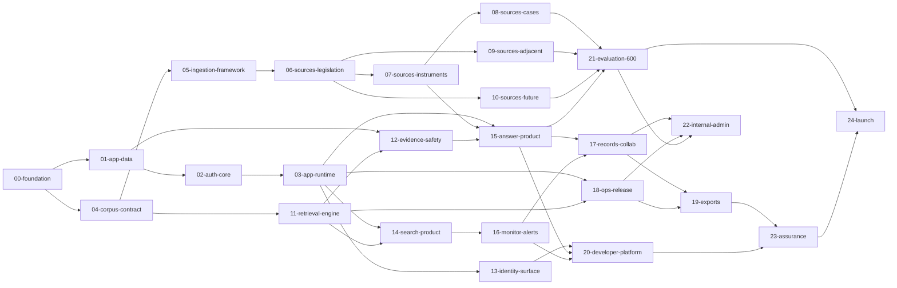

# AustraliaEmploymentRAG — PRD breakdown plan (phase 1)

> Planning artifact. It defines the **module cut, file ownership and ticket DAG**. The sub-PRDs and
> ticket files authored from it are the executable spec; once a ticket exists, the ticket wins on any
> disagreement with this plan (CLAUDE.md, issue #53).

## 1. Header

| Field | Value |
|---|---|
| PRD decomposed | `docs/PRD.md` — AustraliaEmploymentRAG MVP v1.0, document revision 2.0, dated 3 August 2026 |
| Decomposition phase | **First** (`prd-phase.mjs context` → `phase: 1`, `append: false`, `usedIds: []`, `existingFiles: ['.gitkeep']`) |
| Plan date | 2026-08-03 |
| Modules | **25** |
| Tickets | **237** |
| Module prefix range | `00` … `24` (`nextPrefix: "00"`) |
| ADRs available | none — `docs/adr/` is empty, so every ticket cites the PRD directly |
| Graph validated with | `.claude/scripts/dag-core.mjs` (`buildPlan`, `intraModuleDeps`, `laneProfile`, `globalSchedule`) over a generated fixture tree: no duplicate ids, no dangling `blocked_by`, no module cycle, no intra-module cycle, **no fully-serial module** |

### 1.1 Conventions binding on wave B

| Convention | Rule |
|---|---|
| Ticket id | `<MODSHORT>-<NN>`, zero-padded (`FND-01`, `SLEG-07`, `GOLD-14`). `MODSHORT` is fixed per module in §3 and is deliberately distinct from every PRD §30.1 requirement-ID family (`AUTH- SRCH- ANS- COV- CMP- REC- MON- EXP- DEV- ADM- COR- PII- SEC- OPS- EVAL-`), so a ticket id can never be read as a requirement id. Globally unique and stable; never reused. |
| `lane` | Always the module directory name. Modules own disjoint trees (§4), so two lanes are always safe to run concurrently. Stated per module in §5. |
| `agent` | `builder` for all 237 tickets. Standing "Why `builder`" line: *"a bounded change inside one module's declared file-scope against a fixed contract — not a new subsystem decision."* |
| `status` / `date` | `draft` / `2026-08-03`. |
| `blocked_by` / `blocks` | Exactly the edges in §5; `blocks` is the inverse and must be filled (`publish-tickets.mjs` renders both onto the issue, issue #52). |
| ADR reference form | Use the template's no-ADR form: **"No ADR — the decision is already made in PRD §X; this is build ticket n of m against it."** Where §8's decision register already settles the choice, cite the register entry (`Q1`…`Q14`) and the ticket named there as carrying the ADR decision input. A ticket that hits a genuinely new hard-to-reverse choice raises it as a new §8 register entry instead of inventing the decision locally. |
| Acceptance tags | Template defaults (CLAUDE.md defines no custom vocabulary): `[machine]` runnable code/logic check · `[fixture]` replay of recorded data · `[human]` irreducibly human judgment. **Mapping:** PRD §20.3 CI gates and unit/integration assertions → `[machine]`; PRD §40.8 adapter fixtures and PRD §14/§43 evaluation replays → `[fixture]`; PRD §41.2 `UAT-*` scripts, PRD §43.4 founder review and the Gate 2 smoke test → `[human]`. Every ticket carries the standing `[machine] pnpm test` item (plus `cargo test --workspace` / `uv run pytest` where it touches Rust or Python, PRD §45.3) and explicitly declares absent classes. |
| Package manifests | `FND-01` creates the empty workspace-member skeleton (manifest + tsconfig/`Cargo.toml`/`pyproject.toml` for every member in PRD §20.1). Thereafter each **module** owns its members' manifests; within a module a manifest is append-only shared, and conflicts resolve by re-running the package manager — the same rule PRD §44.3 imposes on root lockfiles. |
| Tests | Unit/integration tests live inside the owning package or app and belong to that module's tickets. Only the PRD §20.1 cross-boundary suites (`tests/{integration,tenant-isolation,security,e2e}`) belong to `23-assurance`. A ticket never writes into another module's tree to satisfy its own acceptance. |
| Generated artifacts | PRD §20.1 forbids hand-editing generated OpenAPI/SDK/event/manifest bindings; any ticket touching one regenerates it (`pnpm generate && pnpm generated:check`, §45.3). |
| PR contract | Acceptance includes the applicable PRD §45.4 items (requirement + UAT ids, schema/API/event compatibility, tenant/PII/security impact, source/licence impact, cost/memory/latency impact, rollback path, known gaps). |

## 2. Decomposition principle

**The cut is file ownership, not feature narrative.** `/start-all` runs independent tickets as
parallel lanes in isolated worktrees with delivery serialised (CLAUDE.md); the only thing that makes
that safe is that two concurrently-running tickets never write the same path. The module boundary is
drawn wherever the write-set is genuinely disjoint, and nowhere else.

1. **A foundation module is built first and owns everything shared.** PRD §20.1 requires contracts
   and framework-independent domain rules to be centralised and names "Lockfiles, canonical enums,
   OpenAPI roots, migration sequence, corpus manifest schema and production deployment files" as
   requiring serialised ownership; PRD §44.3 repeats the list. Those artifacts are concentrated in
   `00-foundation`, plus three single-owner extensions where the artifact is inseparable from its
   producer — app migration order (`01-app-data`), corpus schema/manifest (`04-corpus-contract`),
   production deployment/promotion files (`18-ops-release`). Nothing shared is duplicated.
2. **The apps are cut vertically.** `apps/api`, `apps/worker` and `apps/web` each have exactly one
   *shell* owner (`03-app-runtime`), and every product surface owns its own `routes/<area>/**`,
   `handlers/<area>/**` and `features/<area>/**` subtree. A horizontal cut (one module per app)
   would funnel all fourteen PRD §5 surfaces through one write-set and produce one huge serial lane.
3. **One ticket per PRD §40 source group.** PRD §44.3 names "individual source adapters" as the
   canonical safe parallel unit and PRD §44.4 forbids calling an unimplemented source category
   covered. All 52 mandatory groups in PRD §40.2–40.6 get their own ticket and their own
   `pipelines/adapters/<group-id>/**` directory, grouped into five modules along the PRD §7 waves —
   which is also the dependency structure PRD §44.2 gives for `E09`–`E16`.

### 2.1 Decomposition-critical decisions (ADR candidates)

Hard-to-reverse choices the cut depends on. `docs/adr/` is empty, so they are flagged here, not
buried. The named ticket records the decision (an ADR under `docs/adr/NNNN-<slug>.md` if durable,
PRD §45.5 "Architecture decision"). If a Builder falsifies one, the writeback target is this plan
plus the affected sub-PRDs — never a silent local fix.

| # | Decision | Why the decomposition needs it | Recorded by | PRD basis |
|---|---|---|---|---|
| A1 | `apps/api`, `apps/worker`, `apps/web` register routes/handlers/features by **directory convention** (autoload), never a shared central manifest. | Without it every product module edits one `routes/index.ts` and the vertical cut collapses. | `RUNT-01`, `RUNT-04`, `RUNT-05` | §20.1, §39.1 |
| A2 | The Source Coverage Registry is **composed at build time from per-adapter files** (`pipelines/adapters/<group>/registry.yaml` + licence snapshot + URL allowlist), never one shared document. | PRD §40.8 makes a registry row part of every adapter's DoD; one shared file would serialise all 52 adapter tickets. | `INGF-07` | §6.1, §12.1, §40.8 |
| A3 | **`packages/database` owns every app table and repository**; product modules own routes/handlers/screens only. | Removes the otherwise-real `15-answer-product` ↔ `17-records-collab` module cycle (PRD §34.3 puts record creation inside the answer-admission transaction, while records display answers). Matches PRD §45.2 verbatim. | `DATA-01`, `DATA-02` | §45.2, §35.4–35.6, §34.3 |
| A4 | The corpus builder consumes the **versioned intermediate normalised-record contract**, never adapter code; it is testable from contract fixtures alone. | Makes `04-corpus-contract` a dependency *of* ingestion rather than mutual, and lets `RETR-01` start from a synthetic signed fixture release (`CRPS-08`) long before 52 adapters land. | `CRPS-01`, `CRPS-08` | §40.7 ("The adapter never writes active corpus tables directly"), §18.4 |
| A5 | App migrations are **timestamp-prefixed and expand-only**; independent table groups may be authored concurrently, and a group with a cross-group FK is `blocked_by` the group it references. | Keeps PRD §44.3's single serial owner for "app migration order" without turning four table-group tickets into a chain. | `DATA-01` | §20.4, §35.1, §44.3 |
| A6 | The shared **evidence/source panel and async-state components live in `packages/ui`**. | PRD §32.1 (detail panel), §32.3 (claim→citation) and §32.4 (evidence panel) are the same component in three surfaces; without this `14` and `15` import each other. | `RUNT-06` | §13.1, §31.3, §32.1/3/4, §41.1 |
| A7 | Local Compose is **development/CI only** (`03-app-runtime`); the *production* deployment configuration PRD §44.3 calls serial-owned is systemd/release material (`18-ops-release`). | Two different artifacts share one phrase in §44.3; PRD §39.2 settles it. | `RUNT-09` / `RLSE-02` | §39.2, §44.3 |
| A8 | **Confirmed architecture decision (§8, Q8).** The public marketing/status site is a separately built static bundle at `apps/web/public-site/**`, built by a self-contained Node build script into `apps/web/public-site/dist/` and deployed to Cloudflare Pages: not a pnpm workspace member, no npm runtime or build dependencies by default, a status feed independent of the origin server, and no public Research/Search/Ask/customer-data/account-creation surface. | PRD §5.14 requires the surface and §19.1 the edge but names no path, so this plan fixed the placement — and that placement is now an accepted decision rather than an open one. `LNCH-03` carries the ADR decision input. | `LNCH-03` | §5.14, §19.1, §45.5 |
| A9 | `docs/adr/**` is the **only shared-additive directory**: ownership is per *file*, claimed by the ticket that creates `NNNN-<slug>.md`. | ADRs can arise anywhere; a single module owner would either block them or centralise unrelated decisions. | any ticket | §45.5 |

## 3. Module table

Numbering is a valid topological order of the module DAG (§6.1): every module depends only on
lower-numbered modules, which keeps `dag-core.buildPlan`'s module-level `topoSort` cycle-free
(`dag-scan.mjs` exits 1 on a module cycle, so this is a hard requirement, not a preference).

| Module | Short | Purpose | PRD epics | Requirement families | Tickets | Depends on |
|---|---|---|---|---|---:|---|
| `00-foundation` | `FND` | Monorepo skeleton, pinned toolchains, CI gates, canonical enums/IDs, OpenAPI + event schema roots, framework-free domain rules | E01–E03 | DEV-001; underpins all | 11 | — |
| `01-app-data` | `DATA` | `app.sqlite`/`ephemeral.sqlite` schema, migration order, TenantContext repositories, field encryption, job/outbox/usage/audit tables, `packages/jobs` | E04 | SEC-001, REC-001, ANS-003/004, OPS-003 | 9 | 00 |
| `02-auth-core` | `AUTC` | `packages/auth`: Better Auth adapter, session/cookie policy, MFA, SSO connectors, machine-credential and widget-token primitives | E05, E28 | AUTH-001…006, DEV-002 | 5 | 01 |
| `03-app-runtime` | `RUNT` | The three process shells (Fastify bootstrap + admission middleware + SSE; worker lease loops; web app shell), `packages/ui`, `packages/observability`, local Compose | E06, E30 (obs) | SEC-001, OPS-002, ANS-003 | 9 | 00, 01, 02 |
| `04-corpus-contract` | `CRPS` | `corpus.sqlite` schema, intermediate record contract, chunker, index tiering, embedding build, CorpusRelease manifest/signing/build/publish | E07, E17 (build) | ADM-002, SRCH-003 | 8 | 00 |
| `05-ingestion-framework` | `INGF` | Adapter interface, SSRF-safe fetcher, artifact store, licence registry, quarantine/run accounting, isolated parser/OCR, coverage registry, discovery scheduler, conformance kit | E08 | SEC-002, ADM-001 | 9 | 04 |
| `06-sources-legislation` | `SLEG` | PRD §40.2 wave 1 — nine legislation registers plus shared point-in-time/commencement primitives | E09, E10 | SRCH-002/003/005 | 10 | 05 |
| `07-sources-instruments` | `SINS` | PRD §40.3 wave 2 — FWC docs/awards/agreements, FWO, ATO, eight payroll-tax authorities, shared date-versioned rate model | E11–E13 | COV-003, SRCH-004 | 14 | 05, 06 |
| `08-sources-cases` | `SCAS` | PRD §40.4 wave 3 — HCA, FCA, FCFCOA, FWC and eight state/territory decision collections plus case-treatment primitives | E14 | SRCH-004/005 | 13 | 05, 07 |
| `09-sources-adjacent` | `SADJ` | PRD §40.5 wave 4 — nine employment-adjacent regulator/legislation groups, each including its registry decomposition | E15 | SRCH-002, ADM-001 | 9 | 05, 06 |
| `10-sources-future` | `SFUT` | PRD §40.6 wave 5 — nine bills/consultation/commencement groups plus the current-vs-future separation model | E16 | SRCH-002 | 10 | 05, 06 |
| `11-retrieval-engine` | `RETR` | `services/search-rs` (bundle load, Tantivy, exact identifiers, hard filters, USearch, fusion/ranking, local rerank, evidence assembly, benchmarks) and `packages/retrieval-client` | E17 | SRCH-001…005 | 10 | 00, 04 |
| `12-evidence-safety` | `EVID` | `packages/pii`, `packages/citations` (evidence pack, deterministic validator, licence limits, sanitisation), `packages/model-gateway` (profiles, budget, BYOK) | E19, E20, E21 (validator) | PII-001/002, SEC-003, ANS-005/007, OPS-003 | 10 | 00, 01, 11 |
| `13-identity-surface` | `IDNT` | Auth/invitation/member/MFA/SSO/service-account/widget-session routes and the `/settings/*` screens | E05, E28 | AUTH-001…006, DEV-002 | 9 | 01, 02, 03 |
| `14-search-product` | `FIND` | `POST /v1/search`, document/version/node/timeline/relation endpoints, Simple + Advanced Search and source screens, latency benchmark | E18 | SRCH-001…005 | 6 | 03, 11 |
| `15-answer-product` | `ASK` | Answer admission transaction, Quick workflow, clarification, snapshot contract, SSE stages, Ask/result screens, Coverage Navigator, Deep Research, Compare | E21–E23 | ANS-001…007, COV-001…004, CMP-001/002 | 12 | 01, 03, 07, 11, 12 |
| `16-monitor-alerts` | `WTCH` | Watchlists, change matching and fan-out, alerts and impact marking, email/webhook/digest delivery, monitor screens | E25 | MON-001…004 | 9 | 00, 01, 03, 04, 14 |
| `17-records-collab` | `RCRD` | Research Records, immutable turns, answer linkage/rerun/diff, review actions, comments, issue reports, corrections, record screens | E24 | REC-001…004, COR-001/002 | 9 | 00, 01, 03, 14, 15, 16 |
| `18-ops-release` | `RLSE` | Release archive/signing, host baseline, Cloudflare edge, S3 prefixes, Litestream, deploy/rollback, corpus promotion, alerting, restore drills, runbooks, 2 GB benchmark | E06 (deploy), E30, E32 (bench), E33 (drill) | OPS-001/002/003, ADM-002 | 11 | 00, 01, 03, 04, 11 |
| `19-exports` | `XPRT` | Export jobs, S3 Sydney artifact lifecycle and signed URLs, PDF/DOCX/JSON renderers, export UI | E26 | EXP-001/002 | 5 | 01, 03, 12, 17, 18 |
| `20-developer-platform` | `PLTF` | Developer portal + API reference, TypeScript and Python SDKs, sandbox organisation, widget loader/iframe + React wrapper, developer and usage screens, usage/audit endpoints | E27 | DEV-001/002/003, AUTH-006 | 9 | 00, 01, 03, 13, 14, 15, 16 |
| `21-evaluation-600` | `GOLD` | Case schema/splits/blind protection, runner + metrics, gate enforcement, judge harness, ten case-category authoring tickets, profile promotion, roster reconciliation, RC run | E31–E33 | EVAL-001/002 | 17 | 00, 04, 05, 06, 07, 08, 09, 10, 11, 12, 15 |
| `22-internal-admin` | `INTL` | `/internal/v1` + `apps/admin`: source health, quarantine, releases, licensing, evaluation runs, cost, issue/correction triage, incidents and kill switches, operator overview | E29 | ADM-001/002/003, COR-002, OPS-002 | 10 | 01, 02, 03, 05, 12, 17, 18, 21 |
| `23-assurance` | `ASSR` | The PRD §20.1 cross-boundary suites: tenant isolation, security, PII no-leak, citation/refusal, integration, E2E UAT automation, accessibility, restore/DR | E28 (threat), E34 (closure) | SEC-001/002/003, PII-001/002, all UAT | 8 | 01, 05, 12, 13, 14, 15, 16, 17, 18, 19, 20 |
| `24-launch` | `LNCH` | Policies/disclaimers and in-product legal surfaces, public marketing/status site, paid-pilot onboarding + demo script, Definition-of-Done closure and release evidence assembly | E34 | §26 closure across all | 5 | 00, 03, 18, 19, 20, 21, 23 |

**Epic coverage.** Every PRD §44.2 epic has an owner: E01–E03→00; E04→01; E05→02+13; E06→03+18;
E07→04; E08→05; E09/E10→06; E11–E13→07; E14→08; E15→09; E16→10; E17→11+04; E18→14; E19/E20→12;
E21→15+12; E22/E23→15; E24→17; E25→16; E26→19; E27→20; E28→02+13+23; E29→22; E30→18+03; E31→21;
E32→21 (`GOLD-16`) + 18 (`RLSE-11`); E33→21 (`GOLD-15`) + 18 (`RLSE-06`/`RLSE-07`); E34→24+23.

## 4. File-scope allocation

Every path in the PRD §20.1 layout is write-owned by **exactly one** module. No two rows overlap.
Read access is unrestricted; only writes are allocated.

| Module | Write-owns |
|---|---|
| `00-foundation` | Root manifests/lockfiles (`package.json`, `pnpm-workspace.yaml`, `pnpm-lock.yaml`, `.npmrc`, `.node-version`, `tsconfig.base.json`, `Cargo.toml`, `Cargo.lock`, `rust-toolchain.toml`, `pyproject.toml`, `uv.lock`, `.editorconfig`, `README.md`, `.gitignore`) · `tools/**` · `.github/workflows/**` · `packages/contracts/**` · `packages/domain/**` · `schemas/openapi/**` · `schemas/events/**` |
| `01-app-data` | `packages/database/**` (schema, `migrations/**`, tenant repositories, encryption, ephemeral store, invariants) · `packages/jobs/**` |
| `02-auth-core` | `packages/auth/**` |
| `03-app-runtime` | `apps/api/{package.json,tsconfig.json}`, `apps/api/src/{server.ts,app.ts,bootstrap,plugins,middleware,errors,sse}/**`, `apps/api/src/routes/{health,system-status}/**` · `apps/worker/{package.json,tsconfig.json}`, `apps/worker/src/{main.ts,runtime,queues}/**`, `apps/worker/src/handlers/maintenance/**` · `apps/web/{package.json,tsconfig.json,index.html,vite.config.ts}`, `apps/web/src/{app,shell,lib}/**`, `apps/web/src/features/home/**` · `packages/ui/**` · `packages/observability/**` · `infra/compose/**` |
| `04-corpus-contract` | `pipelines/corpus-builder/**` · `pipelines/embeddings/**` · `schemas/corpus-manifest/**` |
| `05-ingestion-framework` | `pipelines/ingestion/**` |
| `06-sources-legislation` | `pipelines/adapters/_shared/legislation/**` · `pipelines/adapters/leg-{cth,nsw,vic,qld,wa,sa,tas,act,nt}/**` |
| `07-sources-instruments` | `pipelines/adapters/_shared/rates/**` · `pipelines/adapters/{fwc-docs,fwc-awards,fwc-agreements,fwo-guidance,ato-employment}/**` · `pipelines/adapters/pt-{nsw,vic,qld,wa,sa,tas,act,nt}/**` |
| `08-sources-cases` | `pipelines/adapters/_shared/caselaw/**` · `pipelines/adapters/case-{hca,fca,fcfcoa,fwc,nsw,vic,qld,wa,sa,tas,act,nt}/**` |
| `09-sources-adjacent` | `pipelines/adapters/adj-{cth,nsw,vic,qld,wa,sa,tas,act,nt}/**` |
| `10-sources-future` | `pipelines/adapters/_shared/future/**` · `pipelines/adapters/future-{cth,nsw,vic,qld,wa,sa,tas,act,nt}/**` |
| `11-retrieval-engine` | `services/search-rs/**` · `packages/retrieval-client/**` |
| `12-evidence-safety` | `packages/pii/**` · `packages/citations/**` · `packages/model-gateway/**` |
| `13-identity-surface` | `apps/api/src/routes/{auth,invitations,members,mfa,sso,service-accounts,widget-sessions}/**` · `apps/web/src/features/{auth,settings}/**` |
| `14-search-product` | `apps/api/src/routes/{search,documents,document-versions,nodes,node-versions}/**` · `apps/api/bench/search/**` · `apps/web/src/features/{search,sources}/**` |
| `15-answer-product` | `apps/api/src/routes/{answers,answer-jobs,answer-snapshots,coverage-assessments,comparisons}/**` · `apps/worker/src/handlers/{answer,deep,coverage,comparison}/**` · `apps/web/src/features/{ask,answers,coverage,compare}/**` |
| `16-monitor-alerts` | `apps/api/src/routes/{watchlists,alerts,webhook-subscriptions}/**` · `apps/worker/src/handlers/{change-matching,alerts,notifications}/**` · `apps/web/src/features/monitor/**` |
| `17-records-collab` | `apps/api/src/routes/{research-records,research-turns,record-answers,review-actions,comments,issues,corrections}/**` · `apps/worker/src/handlers/{rerun,correction}/**` · `apps/web/src/features/records/**` |
| `18-ops-release` | `infra/deploy/**` · `infra/cloudflare/**` · `infra/aws/**` · `infra/backup/**` · `infra/recovery/**` · `docs/runbooks/**` |
| `19-exports` | `apps/api/src/routes/exports/**` · `apps/worker/src/handlers/export/**` · `apps/web/src/features/exports/**` |
| `20-developer-platform` | `packages/sdk-typescript/**` · `sdk/python/**` · `apps/widget/**` · `apps/api/src/routes/{sandbox,usage,audit-events}/**` · `apps/web/src/features/{developer,usage}/**` · `docs/api/**` |
| `21-evaluation-600` | `pipelines/evaluation/**` · `evals/**` (`cases`, `gold`, `splits`, `reports`) · `schemas/evaluation/**` |
| `22-internal-admin` | `apps/api/src/routes/internal/**` · `apps/admin/**` |
| `23-assurance` | `tests/**` (`integration`, `tenant-isolation`, `security`, `e2e`) |
| `24-launch` | `docs/policies/**` · `docs/onboarding/**` · `docs/release/**` · `apps/web/src/features/legal/**` · `apps/web/public-site/**` |
| *(frozen — no module writes)* | `docs/PRD.md`, `docs/discovery/**`, `docs/archive/**`, the two pre-existing `tools/*.ps1`, `templates/**`, `CLAUDE.md`, `.claude/**` |
| *(shared-additive, per-file ownership — A9)* | `docs/adr/NNNN-<slug>.md`, claimed by the creating ticket |
| *(planning artifacts)* | `docs/prd/**` (wave B) · `docs/plans/**` (Architect; git-ignored per CLAUDE.md) |

### 4.1 The PRD §44.3 serial-owned artifacts

PRD §44.3: *"Serial owners are required for root lockfiles, canonical enums, OpenAPI root, app
migration order, corpus schema/manifest, active release/promotion files and production
Compose/deployment configuration."* Each has exactly one owner:

| Serial-owned artifact | Path(s) | Module | Ticket | Note |
|---|---|---|---|---|
| Root lockfiles | `pnpm-lock.yaml`, `Cargo.lock`, `uv.lock` | `00-foundation` | `FND-01` | Owns the **pins**. Any ticket adding a declared dependency regenerates the lockfile as a build artifact; conflicts resolve by re-running the package manager, never hand-merge. `/start-all` serialises delivery, so regenerations land one at a time. |
| Canonical enums | `packages/contracts/src/enums/**` | `00-foundation` | `FND-03` | PRD §35.1: SQLite checked text values are generated from `packages/contracts`. |
| OpenAPI root | `schemas/openapi/openapi.yaml` + `packages/contracts/src/generated/**` | `00-foundation` | `FND-04` | PRD §34 "the generated-code source of truth"; DEV-001 requires a clean generated-client diff in CI. |
| Event/webhook schema root | `schemas/events/**` | `00-foundation` | `FND-05` | PRD §16.1: webhooks carry their own schema version. |
| App migration order | `packages/database/migrations/**` + runner | `01-app-data` | `DATA-01` | Timestamp-prefixed, expand-only (A5, PRD §20.4). |
| Corpus schema + release manifest | `pipelines/corpus-builder/schema/**`, `schemas/corpus-manifest/**` | `04-corpus-contract` | `CRPS-01`, `CRPS-02` | PRD §18.4 bundle contract; immutable after signing (§35.3). |
| Active release / promotion files | `infra/deploy/promote/**`, `infra/deploy/corpus/**` | `18-ops-release` | `RLSE-06`, `RLSE-07` | PRD §18.4 "Active data MUST never be rebuilt or mutated in place"; ADM-002. |
| Production deployment configuration | `infra/deploy/host/**`, `infra/cloudflare/**`, `infra/aws/**` | `18-ops-release` | `RLSE-02`, `RLSE-03`, `RLSE-04` | A7: production is systemd + immutable release archive (§39.2). |
| Local/CI Compose | `infra/compose/**` | `03-app-runtime` | `RUNT-09` | PRD §39.2 explicitly separates this from production. |

### 4.2 Paths two modules would otherwise have shared

Each was pulled into a single owner rather than duplicated; the dependent module reads it and
declares a `blocked_by` edge on the owner's ticket.

| Contested path | Sole owner | Would have been shared with | Basis |
|---|---|---|---|
| Canonical enums | `00` (`FND-03`) | everything | §20.1/§44.3; §35.1 generates DB check constraints from it |
| App tables + repositories | `01` | 15, 16, 17, 19, 20, 22 | A3; §45.2 gives `packages/database` exactly this scope and forbids it to others |
| Route registration | none — directory autoload | every module owning `apps/api/src/routes/*` | A1 |
| `packages/ui` evidence panel + async-state components | `03` (`RUNT-06`) | 14, 15, 17 | A6; §31.3 mandates the same ten async states on every job-driven screen |
| "Create record from search selection" | `17` (`RCRD-09`) | would put record writes in `14` | §33.1 step 6 |
| "Create watch target from search/source" | `16` (`WTCH-07`) | would put watch writes in `14` | §33.1 step 7 |
| S3 bucket, prefixes, least-privilege credentials | `18` (`RLSE-04`) | `19` needs the export prefix | §19.2 requires separate least-privilege permissions per prefix — one owner defines both |
| Corpus manifest schema | `04` (`CRPS-02`) | 11, 18 (promotion verifier) | §44.3; §18.4 lists required manifest fields |
| `evals/gold/**` | `21` | `23` would have wanted fixtures | §14.3/§43.1: blind gold stays outside ordinary coding-agent context — assurance uses its own synthetic fixtures |

## 5. Ticket inventory

237 tickets. For every module below: **`lane` = the module directory name, `agent` = `builder`** for
all of its tickets (§1.1). File-scopes are write-owns and are disjoint from sibling tickets except
where a `blocked_by` edge orders them. "PRD refs" are mandatory reading for the ticket author.

### 5.1 `00-foundation` — lane `00-foundation` · agent `builder` · 11 tickets

| id | title | size | file-scope (write-owns) | blocked_by | PRD refs | goal |
|---|---|---|---|---|---|---|
| FND-01 | Monorepo bootstrap, pinned toolchains, workspace skeleton | L | root manifests + lockfiles, `tools/**`, `README.md` | — | §20.1, §18.2, §45.3, E01 | Clean bootstrap; every §45.3 entry command exists and runs. |
| FND-02 | CI gate pipeline | M | `.github/workflows/**` | FND-01 | §20.3, §45.3, §45.4, E01 | All PRD §20.3 gates run on every PR. |
| FND-03 | Canonical enums and opaque ID conventions | M | `packages/contracts/src/{enums,ids}/**` | FND-01 | §6.7, §8.4, §8.5, §11.1, §15.5, §17.2, §34.1, §35.1, §44.3, E02 | One generated source for every controlled value in the product. |
| FND-04 | OpenAPI root and generated TypeScript bindings | L | `schemas/openapi/**`, `packages/contracts/src/{openapi,generated}/**` | FND-03 | §16.1–16.5, §34.1–34.9, DEV-001, E02 | `/v1` contract exists; `pnpm generated:check` is clean. |
| FND-05 | Event and webhook schema root | M | `schemas/events/**`, `packages/contracts/src/events/**` | FND-03 | §16.1, §34.8, §8.8, MON-004, E02 | Versioned signed-webhook envelopes usable by SDKs and worker. |
| FND-06 | Domain: role/permission matrix and resource membership | M | `packages/domain/src/access/**` | FND-03 | §38.1, §16.5, §21.2, AUTH-003, SEC-001, E03 | Framework-free permission decisions with property tests. |
| FND-07 | Domain: answer status, claim support, citation role, refusal table | M | `packages/domain/src/answers/**` | FND-03 | §8.4, §9.1, §15.5, §36.8, ANS-005, E03 | Status/refusal logic decided in pure code, not prompts. |
| FND-08 | Domain: record workflow state machine and ETag rules | M | `packages/domain/src/workflow/**` | FND-03 | §8.7, §32.6, §34.1, REC-004, E03 | Only PRD §32.6 transitions are representable. |
| FND-09 | Domain: budget, quota and funding-ledger rules | M | `packages/domain/src/budget/**` | FND-03 | §24.1, §24.4, §38.5, §42.6, OPS-003, E03 | Admission arithmetic that stops before the A$50 ceiling. |
| FND-10 | Domain: temporal applicability and authority hierarchy | M | `packages/domain/src/legal/**` | FND-03 | §6.6, §6.7, §9.1, §15.2, §36.2, §36.3, E03 | The §36.2 eligibility predicate as pure, tested code. |
| FND-11 | Repair the repo-wide frozen-path guard | S | `tools/tests/frozen-paths.test.mjs` | FND-01 | §20.3, §44.3, §45.3, plan §4, E01 | The guard enforces plan §4 on every branch: it fails only on frozen or unallocated paths, never on a module's own allocated ones. |

### 5.2 `01-app-data` — lane `01-app-data` · agent `builder` · 9 tickets

| id | title | size | file-scope | blocked_by | PRD refs | goal |
|---|---|---|---|---|---|---|
| DATA-01 | Migration framework, expand/contract policy, ordering | M | `packages/database/src/migrate/**`, `packages/database/migrations/0001_*` | FND-03 | §20.4, §35.1, §44.3, E04 | Single serial migration order; expand-only by construction. |
| DATA-02 | TenantContext repository layer + unscoped-import architecture test | L | `packages/database/src/tenant/**`, `packages/database/test/architecture/**` | DATA-01, FND-06 | §16.5, §21.2, §35.1, SEC-001, E04 | No business module can obtain an unscoped connection. |
| DATA-03 | Field-level envelope encryption for customer text | M | `packages/database/src/crypto/**` | DATA-01 | §35.1, §10.3, §23.1, §39.6, E04 | Ciphertext columns with a rotatable key path. |
| DATA-04 | Tenancy and identity tables/repositories | L | `packages/database/src/schema/tenancy.ts`, `src/repos/tenancy/**`, `migrations/*_tenancy.sql` | DATA-02, DATA-03 | §15.4, §35.4, AUTH-002/003/006, E04 | PRD §35.4 tables with composite tenant keys. |
| DATA-05 | Execution tables + `packages/jobs` lease primitives | L | `src/schema/execution.ts`, `src/repos/execution/**`, `migrations/*_execution.sql`, `packages/jobs/**` | DATA-04 | §15.6, §35.6, §18.1, §18.5, §39.5, ANS-003, E04 | Durable jobs, job events and transactional outbox. |
| DATA-06 | Research and evidence tables (immutable) | L | `src/schema/research.ts`, `src/repos/research/**`, `migrations/*_research.sql` | DATA-05 | §15.5, §35.5, REC-001, ANS-004, E04 | Append-only snapshots with no UPDATE/DELETE path. |
| DATA-07 | Usage, monitor, issue/correction, audit, incident tables | L | `src/schema/operations.ts`, `src/repos/operations/**`, `migrations/*_operations.sql` | DATA-05 | §15.6, §35.6, §24.4, MON-001, COR-001/002, ADM-003, OPS-003, E04 | Ledger, watch, alert, audit and kill-switch persistence. |
| DATA-08 | `ephemeral.sqlite` store, expiry sweeper, backup exclusion | M | `packages/database/src/ephemeral/**` | DATA-03 | §10.4, §35.7, §39.3, E04 | Ephemeral content that cannot reach Litestream or backups. |
| DATA-09 | The eight database invariants + property tests | M | `packages/database/src/invariants/**`, `packages/database/test/invariants/**` | DATA-06, DATA-07 | §35.8, §15.3, §15.4, E04 | Each §35.8 invariant is mechanically enforced. |

### 5.3 `02-auth-core` — lane `02-auth-core` · agent `builder` · 5 tickets

| id | title | size | file-scope | blocked_by | PRD refs | goal |
|---|---|---|---|---|---|---|
| AUTC-01 | Better Auth adapter, session and cookie policy | L | `packages/auth/src/core/**` | DATA-04 | §18.2, §38.2, §21.1, AUTH-001, E05 | Self-hosted sessions on `app.sqlite` with §38.2 defaults. |
| AUTC-02 | MFA: TOTP, passkey, recovery codes, recent-auth assertion | M | `packages/auth/src/mfa/**` | AUTC-01 | §38.2, §16.3, AUTH-004, E05 | Recent-auth is a callable assertion, not a per-route guess. |
| AUTC-03 | SSO connectors and lifecycle state machine with break-glass | L | `packages/auth/src/sso/**` | AUTC-01 | §38.3, §16.3, AUTH-005, E28 | Enforcement impossible before a successful test. |
| AUTC-04 | Machine credentials: hashing, scopes, rotation, expiry | M | `packages/auth/src/credentials/**` | AUTC-01 | §38.4, §16.3, AUTH-006, E28 | Prefix + ≥256-bit secret, verifier-only storage. |
| AUTC-05 | Widget session token signing and origin binding | M | `packages/auth/src/widget/**` | AUTC-04 | §38.4, §33.5, DEV-002, E27 | ≤15-minute opaque token bound to origin and features. |

### 5.4 `03-app-runtime` — lane `03-app-runtime` · agent `builder` · 9 tickets

| id | title | size | file-scope | blocked_by | PRD refs | goal |
|---|---|---|---|---|---|---|
| RUNT-01 | Fastify skeleton: autoloaded routes, uniform errors, request_id | M | `apps/api/src/{server.ts,app.ts,bootstrap,errors}/**` | FND-04 | §16.1, §34.9, §39.1, A1, E06 | Route directories self-register; every response carries `request_id`. |
| RUNT-02 | Admission middleware chain | L | `apps/api/src/{plugins,middleware}/**` | RUNT-01, AUTC-01, AUTC-04, FND-06, FND-09, DATA-02 | §16.5, §18.5, §34.1, §38.5, SEC-001, E06 | authn → tenant → permission → rate/quota → idempotency, once. |
| RUNT-03 | SSE transport with persisted replay | M | `apps/api/src/sse/**` | RUNT-01, DATA-05 | §34.4, §18.5, §16.2, ANS-003, E06 | `Last-Event-ID` resume with events stored before emission. |
| RUNT-04 | Worker runtime: queue classes, leases, fairness, checkpoints | L | `apps/worker/src/{main.ts,runtime,queues}/**`, `apps/worker/src/handlers/maintenance/**` | DATA-05 | §39.5, §18.1, §18.5, A1, E06 | The five §39.5 queue classes with independent limits. |
| RUNT-05 | Web app shell: navigation, org switcher, status badges | L | `apps/web/{index.html,vite.config.ts}`, `apps/web/src/{app,shell,lib}/**`, `src/features/home/**` | FND-04 | §31.1, §31.2, §13.1, A1, E06 | Shell always shows org, environment, release and degraded state. |
| RUNT-06 | `packages/ui`: accessible primitives, async states, evidence panel | L | `packages/ui/**` | FND-03 | §13.1, §31.3, §32.1, §32.3, §32.4, §41.1, A6, E06 | One shared component set for all ten async states. |
| RUNT-07 | `packages/observability`: bounded logs and metrics | M | `packages/observability/**` | FND-03 | §22, OPS-002, E30 | Correlated JSON logs that cannot carry research content. |
| RUNT-08 | Health, readiness and `/v1/system-status` | M | `apps/api/src/routes/{health,system-status}/**` | RUNT-01, RUNT-07 | §42.1, §22, OPS-002, E06 | Readiness fails on incompatible app/corpus/schema state. |
| RUNT-09 | Local Compose stack and `pnpm stack:up/down` | M | `infra/compose/**` | RUNT-01, RUNT-04 | §20.2, §39.2, §45.3, A7, E06 | A complete local environment; explicitly not production. |

### 5.5 `04-corpus-contract` — lane `04-corpus-contract` · agent `builder` · 8 tickets

| id | title | size | file-scope | blocked_by | PRD refs | goal |
|---|---|---|---|---|---|---|
| CRPS-01 | `corpus.sqlite` schema + intermediate normalised-record contract | L | `pipelines/corpus-builder/schema/**`, `src/contracts/**` | FND-03 | §15.1–15.3, §18.3, §35.2, §35.3, §40.7, A4, E07 | The corpus contract adapters emit into and search reads from. |
| CRPS-02 | CorpusRelease manifest schema, signing and verification | M | `schemas/corpus-manifest/**`, `src/manifest/**` | CRPS-01 | §18.4, §35.3, §44.3, ADM-002, E07 | Every §18.4 manifest field present, signed and verifiable. |
| CRPS-03 | Chunker and SearchChunk node-boundary rules | M | `src/chunking/**` | CRPS-01 | §15.3, §17.2, §35.3, E07 | Chunks never cross independent legal nodes. |
| CRPS-04 | Index-tier assignment policy | M | `src/tiering/**` | CRPS-01 | §17.2, §40.1, §11.1, E17 | T1/T2/T3/excluded/quarantined assigned from evidence, not guesswork. |
| CRPS-05 | Embedding build pipeline and embedding manifest | L | `pipelines/embeddings/**` | CRPS-03, CRPS-04 | §17.2, §17.3, §14.4, §18.4, E17 | Offline embeddings with an exact reproducible profile. |
| CRPS-06 | Candidate release build and validation gates | L | `src/{build,validation}/**` | CRPS-02, CRPS-05 | §12.2, §18.4, §40.9, ADM-002, E07 | Failed candidates cannot touch active production data. |
| CRPS-07 | Release staging upload to R2 with hash/coverage report | M | `src/publish/**` | CRPS-06 | §18.4, §19.2, §24.1, E07 | Immutable public bundle retrievable by the promotion tool. |
| CRPS-08 | Signed synthetic corpus fixture release | M | `pipelines/corpus-builder/fixtures/**` | CRPS-02 | §18.4, §20.3, §40.8, A4, E07 | Downstream modules start before real adapters exist. |

### 5.6 `05-ingestion-framework` — lane `05-ingestion-framework` · agent `builder` · 9 tickets

| id | title | size | file-scope | blocked_by | PRD refs | goal |
|---|---|---|---|---|---|---|
| INGF-01 | Adapter interface and versioned intermediate records | M | `pipelines/ingestion/src/adapter/**` | CRPS-01 | §40.7, §40.8, E08 | The eight §40.7 boundaries as one enforced contract. |
| INGF-02 | Safe fetcher (allowlist, DNS/IP denial, redirect/type/size/time) | L | `src/fetch/**` | INGF-01 | §37.4, §21.1, SEC-002, E08 | Adapters cannot make arbitrary HTTP calls. |
| INGF-03 | Immutable artifact store with hashing and R2 keys | M | `src/artifacts/**` | INGF-02 | §35.3, §19.2, §10.3, E08 | Every fetch is reproducible from a hashed artifact. |
| INGF-04 | Licence snapshot/assessment registry and permitted-use gate | L | `src/licensing/**` | INGF-03 | §11.1, §35.3, §6.1, E08 | Unclear rights default to metadata/link-only. |
| INGF-05 | Quarantine, ingestion-run accounting and anomaly rules | M | `src/{quarantine,runs}/**` | INGF-03 | §12.2, §35.3, §40.9, E08 | Open quarantine blocks promotion; §40.9 anomalies flagged. |
| INGF-06 | Isolated parser/OCR subprocess harness | L | `src/parsing/**` | INGF-02 | §37.4, §21.1, SEC-002, E08 | Parsing runs with no credentials and bounded resources. |
| INGF-07 | Source Coverage Registry composition and freshness fields | M | `src/registry/**` | INGF-04 | §6.1, §12.1, §7, ADM-001, A2, E08 | Registry built from per-adapter files; §12.1 five dates separated. |
| INGF-08 | Discovery / change-detection scheduler | M | `src/discovery/**` | INGF-05, INGF-07 | §12.1, §33.4, §19.3, E08 | Conditional-request discovery on the §12.1 cadences. |
| INGF-09 | Adapter conformance kit (the twelve-item DoD) | L | `src/conformance/**` | INGF-05, INGF-06 | §40.8, §45.4, E08 | One harness proves all 52 adapters the same way. |

### 5.7 `06-sources-legislation` — lane `06-sources-legislation` · agent `builder` · 10 tickets

All nine register tickets share the shape: adapter + per-group registry row, URL allowlist, licence
snapshot/assessment, fixtures, parser/node round-trip, three-time-point history, incremental
change/removal/failure tests, count/hash baseline, freshness schedule, quarantine cases, evaluation
subset and measured storage/time/memory (PRD §40.8, all twelve items).

| id | title | size | file-scope | blocked_by | PRD refs | goal |
|---|---|---|---|---|---|---|
| SLEG-01 | Legislation adapter primitives (point-in-time, events, title allowlist) | L | `pipelines/adapters/_shared/legislation/**` | INGF-09 | §40.2, §6.6, §15.2, §35.2, E09 | Shared version/commencement/repeal machinery for nine registers. |
| SLEG-02 | `LEG-CTH` — Federal Register of Legislation | L | `pipelines/adapters/leg-cth/**` | SLEG-01 | §40.2, §6.2, §40.8, E09 | Federal employment titles with versions, nodes and events. |
| SLEG-03 | `LEG-NSW` | L | `.../leg-nsw/**` | SLEG-01 | §40.2, §6.3, §40.8, E10 | NSW point-in-time Acts/instruments and commencement tables. |
| SLEG-04 | `LEG-VIC` | L | `.../leg-vic/**` | SLEG-01 | §40.2, §6.3, §40.8, E10 | Victorian authorised versions and history. |
| SLEG-05 | `LEG-QLD` | L | `.../leg-qld/**` | SLEG-01 | §40.2, §6.3, §40.8, E10 | Queensland reprints and future annotations. |
| SLEG-06 | `LEG-WA` | L | `.../leg-wa/**` | SLEG-01 | §40.2, §6.3, §40.8, E10 | WA Acts/subsidiary legislation with stable identity. |
| SLEG-07 | `LEG-SA` | L | `.../leg-sa/**` | SLEG-01 | §40.2, §6.3, §40.8, E10 | SA versions plus proclamation events. |
| SLEG-08 | `LEG-TAS` | L | `.../leg-tas/**` | SLEG-01 | §40.2, §6.3, §40.8, E10 | Tasmanian point-in-time extraction and events. |
| SLEG-09 | `LEG-ACT` | L | `.../leg-act/**` | SLEG-01 | §40.2, §6.3, §40.8, E10 | ACT register events, republications, instrument relations. |
| SLEG-10 | `LEG-NT` | L | `.../leg-nt/**` | SLEG-01 | §40.2, §6.3, §40.8, E10 | NT in-force/historical law with versions and events. |

### 5.8 `07-sources-instruments` — lane `07-sources-instruments` · agent `builder` · 14 tickets

| id | title | size | file-scope | blocked_by | PRD refs | goal |
|---|---|---|---|---|---|---|
| SINS-01 | Date-versioned rate/threshold fact model | M | `pipelines/adapters/_shared/rates/**` | SLEG-01 | §40.3, §35.2, §15.2, E13 | Rates are dated legal facts with a citable source, never mutable fields. |
| SINS-02 | `FWC-DOCS` — FWC Document Search | L | `.../fwc-docs/**` | INGF-09 | §40.3, §6.2, §6.4, §40.8, E11 | Decisions, orders, awards and agreements discovery with exact IDs. |
| SINS-03 | `FWC-AWARDS` — awards, variation history, pay data | L | `.../fwc-awards/**` | SINS-01 | §40.3, §8.5, §40.8, COV-001, E11 | Award version chains and classification structures. |
| SINS-04 | `FWC-AGREEMENTS` — agreement lifecycle | L | `.../fwc-agreements/**` | SINS-02 | §40.3, §8.5, §40.8, COV-003, E11 | Approval/variation/replacement/termination evidence chains. |
| SINS-05 | `FWO-GUIDANCE` | M | `.../fwo-guidance/**` | INGF-09 | §40.3, §9.1, §6.2, §40.8, E12 | Guidance captured as subordinate authority, never overriding law. |
| SINS-06 | `ATO-EMPLOYMENT` | L | `.../ato-employment/**` | SINS-01 | §40.3, §6.2, §11.1, §40.8, E12 | PAYG/STP/super/FBT employer material with licence control. |
| SINS-07 | `PT-NSW` payroll tax | M | `.../pt-nsw/**` | SINS-01, SLEG-03 | §40.3, §6.3, §40.8, E13 | Dated NSW rates, thresholds, rulings and guidance. |
| SINS-08 | `PT-VIC` payroll tax | M | `.../pt-vic/**` | SINS-01, SLEG-04 | §40.3, §6.3, §40.8, E13 | Dated Victorian rates and rulings. |
| SINS-09 | `PT-QLD` payroll tax | M | `.../pt-qld/**` | SINS-01, SLEG-05 | §40.3, §6.3, §40.8, E13 | Dated Queensland rates, levy and rulings. |
| SINS-10 | `PT-WA` payroll tax | M | `.../pt-wa/**` | SINS-01, SLEG-06 | §40.3, §6.3, §40.8, E13 | Dated WA rates, employer guide and rulings. |
| SINS-11 | `PT-SA` payroll tax | M | `.../pt-sa/**` | SINS-01, SLEG-07 | §40.3, §6.3, §40.8, E13 | Dated SA rates, guides and circulars. |
| SINS-12 | `PT-TAS` payroll tax | M | `.../pt-tas/**` | SINS-01, SLEG-08 | §40.3, §6.3, §40.8, E13 | Dated Tasmanian rates and rulings. |
| SINS-13 | `PT-ACT` payroll tax | M | `.../pt-act/**` | SINS-01, SLEG-09 | §40.3, §6.3, §40.8, E13 | Dated ACT rates, circulars and guidance. |
| SINS-14 | `PT-NT` payroll tax | M | `.../pt-nt/**` | SINS-01, SLEG-10 | §40.3, §6.3, §40.8, E13 | Dated NT rates, rulings and guides. |

### 5.9 `08-sources-cases` — lane `08-sources-cases` · agent `builder` · 13 tickets

| id | title | size | file-scope | blocked_by | PRD refs | goal |
|---|---|---|---|---|---|---|
| SCAS-01 | Case-law primitives: citation, level, paragraph identity, treatment | L | `pipelines/adapters/_shared/caselaw/**` | INGF-09 | §9.2, §9.3, §35.2, §40.4, E14 | Treatment asserted only with evidence; `TREATMENT_NOT_CONFIRMED` by default. |
| SCAS-02 | `CASE-HCA` | L | `.../case-hca/**` | SCAS-01 | §40.4, §6.4, §9.2, §40.8, E14 | High Court judgments with paragraph-exact citations. |
| SCAS-03 | `CASE-FCA` | L | `.../case-fca/**` | SCAS-01 | §40.4, §6.4, §40.8, E14 | FCA and FCAFC judgments and metadata. |
| SCAS-04 | `CASE-FCFCOA` | L | `.../case-fcfcoa/**` | SCAS-01 | §40.4, §6.4, §40.8, E14 | Fair-work-relevant federal circuit judgments. |
| SCAS-05 | `CASE-FWC` | L | `.../case-fwc/**` | SCAS-01, SINS-02 | §40.4, §6.4, §40.8, E14 | FWC/FWCFB/FWCA decisions with bench and matter metadata. |
| SCAS-06 | `CASE-NSW` | L | `.../case-nsw/**` | SCAS-01 | §40.4, §6.4, §40.8, E14 | NSW Caselaw and IRC collections decomposed to exact endpoints. |
| SCAS-07 | `CASE-VIC` | L | `.../case-vic/**` | SCAS-01 | §40.4, §6.4, §40.8, E14 | Victorian court/VCAT employment-relevant decisions. |
| SCAS-08 | `CASE-QLD` | L | `.../case-qld/**` | SCAS-01 | §40.4, §6.4, §40.8, E14 | QIRC/Industrial Court decisions and operative instruments. |
| SCAS-09 | `CASE-WA` | L | `.../case-wa/**` | SCAS-01 | §40.4, §6.4, §40.8, E14 | WAIRC decisions, orders, awards and agreements. |
| SCAS-10 | `CASE-SA` | L | `.../case-sa/**` | SCAS-01 | §40.4, §6.4, §40.8, E14 | SAET and Employment Court decisions. |
| SCAS-11 | `CASE-TAS` | L | `.../case-tas/**` | SCAS-01 | §40.4, §6.4, §40.8, E14 | Tasmanian court/TASCAT decisions and instruments. |
| SCAS-12 | `CASE-ACT` | L | `.../case-act/**` | SCAS-01 | §40.4, §6.4, §40.8, E14 | ACT court and ACAT decisions. |
| SCAS-13 | `CASE-NT` | L | `.../case-nt/**` | SCAS-01 | §40.4, §6.4, §40.8, E14 | NT court and NTCAT decisions. |

### 5.10 `09-sources-adjacent` — lane `09-sources-adjacent` · agent `builder` · 9 tickets

Each ticket includes the PRD §40.5 registry decomposition — exact official pages/collections per
named authority and the law/instrument/decision/code/guidance/policy/news classification — because
"An authority name in this planning row is not enough for release" (§40.5).

| id | title | size | file-scope | blocked_by | PRD refs | goal |
|---|---|---|---|---|---|---|
| SADJ-01 | `ADJ-CTH` (Home Affairs, OAIC, AHRC, Comcare, DEWR…) | L | `pipelines/adapters/adj-cth/**` | INGF-09, SLEG-02 | §40.5, §6.2, §7, §40.8, E15 | Commonwealth adjacent regimes decomposed and ingested. |
| SADJ-02 | `ADJ-NSW` | L | `.../adj-nsw/**` | INGF-09, SLEG-03 | §40.5, §6.3, §40.8, E15 | NSW WHS/discrimination/compensation/LSL/surveillance material. |
| SADJ-03 | `ADJ-VIC` | L | `.../adj-vic/**` | INGF-09, SLEG-04 | §40.5, §6.3, §40.8, E15 | Victorian OHS/labour hire/portable LSL/wage inspectorate material. |
| SADJ-04 | `ADJ-QLD` | L | `.../adj-qld/**` | INGF-09, SLEG-05 | §40.5, §6.3, §40.8, E15 | Queensland WHS/QHRC/WorkCover/labour hire/QLeave material. |
| SADJ-05 | `ADJ-WA` | L | `.../adj-wa/**` | INGF-09, SLEG-06 | §40.5, §6.3, §40.8, E15 | WA regimes, limited to those actually applicable. |
| SADJ-06 | `ADJ-SA` | L | `.../adj-sa/**` | INGF-09, SLEG-07 | §40.5, §6.3, §40.8, E15 | SA WHS/EO/RTWSA/labour hire/portable LSL material. |
| SADJ-07 | `ADJ-TAS` | L | `.../adj-tas/**` | INGF-09, SLEG-08 | §40.5, §6.3, §40.8, E15 | Tasmanian WHS/EO/compensation/portable LSL material. |
| SADJ-08 | `ADJ-ACT` | L | `.../adj-act/**` | INGF-09, SLEG-09 | §40.5, §6.3, §40.8, E15 | ACT WorkSafe/HRC/LSL Authority material. |
| SADJ-09 | `ADJ-NT` | L | `.../adj-nt/**` | INGF-09, SLEG-10 | §40.5, §6.3, §40.8, E15 | NT WorkSafe/ADC/portable LSL material. |

### 5.11 `10-sources-future` — lane `10-sources-future` · agent `builder` · 10 tickets

| id | title | size | file-scope | blocked_by | PRD refs | goal |
|---|---|---|---|---|---|---|
| SFUT-01 | Future-status event model and current/future separation | M | `pipelines/adapters/_shared/future/**` | SLEG-01 | §6.5, §6.7, §40.6, §36.2, E16 | Future material is searchable, labelled and never current law. |
| SFUT-02 | `FUTURE-CTH` | M | `.../future-cth/**` | SFUT-01, SLEG-02 | §40.6, §6.5, §40.8, E16 | Bills, assent, enacted-not-commenced, disallowance, EMs. |
| SFUT-03 | `FUTURE-NSW` | M | `.../future-nsw/**` | SFUT-01, SLEG-03 | §40.6, §6.5, §40.8, E16 | NSW bill/draft/proclamation status events. |
| SFUT-04 | `FUTURE-VIC` | M | `.../future-vic/**` | SFUT-01, SLEG-04 | §40.6, §6.5, §40.8, E16 | Victorian future-status events. |
| SFUT-05 | `FUTURE-QLD` | M | `.../future-qld/**` | SFUT-01, SLEG-05 | §40.6, §6.5, §40.8, E16 | Queensland future-status events. |
| SFUT-06 | `FUTURE-WA` | M | `.../future-wa/**` | SFUT-01, SLEG-06 | §40.6, §6.5, §40.8, E16 | WA future-status events. |
| SFUT-07 | `FUTURE-SA` | M | `.../future-sa/**` | SFUT-01, SLEG-07 | §40.6, §6.5, §40.8, E16 | SA future-status events. |
| SFUT-08 | `FUTURE-TAS` | M | `.../future-tas/**` | SFUT-01, SLEG-08 | §40.6, §6.5, §40.8, E16 | Tasmanian future-status events. |
| SFUT-09 | `FUTURE-ACT` | M | `.../future-act/**` | SFUT-01, SLEG-09 | §40.6, §6.5, §40.8, E16 | ACT future-status events. |
| SFUT-10 | `FUTURE-NT` | M | `.../future-nt/**` | SFUT-01, SLEG-10 | §40.6, §6.5, §40.8, E16 | NT future-status events. |

### 5.12 `11-retrieval-engine` — lane `11-retrieval-engine` · agent `builder` · 10 tickets

| id | title | size | file-scope | blocked_by | PRD refs | goal |
|---|---|---|---|---|---|---|
| RETR-01 | search-rs skeleton: read-only bundle, release pinning, localhost API | L | `services/search-rs/src/{main.rs,service}/**` | CRPS-08 | §18.3, §39.1, §39.2, §39.4, E17 | Search reads only a pinned corpus bundle; no app DB path exists. |
| RETR-02 | Tantivy lexical/field/citation index | L | `src/lexical/**` | RETR-01 | §17.1, §18.2, SRCH-001, E17 | Full-corpus BM25 and field search over eligible material. |
| RETR-03 | Exact-identifier retrieval | M | `src/exact/**` | RETR-02 | §17.1, §36.1, SRCH-004, E17 | Provisions, neutral citations, award/agreement IDs and ABNs win. |
| RETR-04 | Hard legal filters (pre-scoring and pre-pack) | L | `src/filters/**` | RETR-02 | §36.2, §17.1, SRCH-002, E17 | The §36.2 eligibility predicate applied twice, identically. |
| RETR-05 | USearch dense index, tiering, quantisation, semantic cache | L | `src/dense/**` | RETR-01, CRPS-05 | §17.2, §18.2, §39.2, E17 | Memory-mapped vectors within the search memory budget. |
| RETR-06 | Rank fusion and ranking feature order | L | `src/ranking/**` | RETR-03, RETR-04, RETR-05 | §17.1, §36.2, §36.3, SRCH-004, E17 | Reciprocal-rank fusion; no learned score reinstates a filtered item. |
| RETR-07 | Local query-embedding and rerank runtime | L | `src/localmodel/**` | RETR-05 | §17.3, §14.4, §39.2, E17 | Online local models inside the search boundary only. |
| RETR-08 | Evidence sufficiency and evidence-pack candidate assembly | M | `src/evidence/**` | RETR-06 | §17.1, §36.2, §36.4, E17 | Bounded, applicable candidate sets for Quick and Deep. |
| RETR-09 | `packages/retrieval-client` typed client | M | `packages/retrieval-client/**` | RETR-01, FND-04 | §39.1, §16.2, E17 | The only way app/worker talk to search. |
| RETR-10 | Retrieval benchmark harness (recall@10, memory, startup, p95) | M | `services/search-rs/{benches,src/bench}/**` | RETR-07, RETR-08 | §13.2, §17.2, §39.2, §43.3, E17 | Measured numbers that feed the §14.2 gates and §39.2 limits. |

### 5.13 `12-evidence-safety` — lane `12-evidence-safety` · agent `builder` · 10 tickets

| id | title | size | file-scope | blocked_by | PRD refs | goal |
|---|---|---|---|---|---|---|
| EVID-01 | PII deterministic patterns/checksums and admission contract | L | `packages/pii/src/{deterministic,contract}/**` | FND-03 | §10.1, §37.1, §37.2, PII-001, E19 | Server-side authoritative boundary before logs, storage or providers. |
| EVID-02 | Local NER, public-entity context rules, combination risk | L | `packages/pii/src/{entity,context}/**` | EVID-01 | §10.1, §37.2, PII-001, E19 | Employer/ABN/public-party allowed only via structured fields. |
| EVID-03 | PII availability split (search continues, research fails closed) | M | `packages/pii/src/availability/**` | EVID-02 | §10.1, PII-002, E19 | Detector outage degrades exactly as §10.1 requires. |
| EVID-04 | Evidence-pack construction and untrusted-content delimitation | L | `packages/citations/src/pack/**` | FND-07, RETR-09 | §36.4, §37.5, §21.1, E21 | Source text is data; it cannot change date, tools, URLs or policy. |
| EVID-05 | Deterministic claim/citation validator and bounded repair | L | `packages/citations/src/validator/**` | EVID-04, FND-10 | §9.4, §36.5, §36.6, ANS-005, SEC-003, E21 | All twelve §36.6 checks with the stated failure consequences. |
| EVID-06 | Licence-aware quotation, display and export limits | M | `packages/citations/src/licensing/**` | EVID-05 | §11.1, §36.6, §8.9, E21 | Quote limits enforced identically in UI and exports. |
| EVID-07 | Model gateway: profiles, providers, schema enforcement | L | `packages/model-gateway/src/{profiles,providers,schema}/**` | FND-03, DATA-02 | §14.4, §17.3, §37.5, ANS-007, E20 | Six approved profiles; no shell/web/DB/tool surface. |
| EVID-08 | Budget reservation/settlement and hard circuit breaker | L | `packages/model-gateway/src/budget/**` | EVID-07, FND-09, DATA-07 | §24.1, §24.4, §42.6, ANS-007, OPS-003, E20 | Admission stops before founder liability; no unvalidated fallback. |
| EVID-09 | BYOK encrypted credentials and funding-ledger routing | M | `packages/model-gateway/src/byok/**` | EVID-08, DATA-03 | §16.4, §24.4, E20 | Keys decrypt only inside the gateway; no arbitrary base URLs. |
| EVID-10 | Output sanitisation: code-generated URLs, Markdown/HTML allowlist | M | `packages/citations/src/render/**` | EVID-05 | §36.6, §37.5, §21.1, SEC-003, E21 | Model output can never emit an executable or unknown link. |

### 5.14 `13-identity-surface` — lane `13-identity-surface` · agent `builder` · 9 tickets

| id | title | size | file-scope | blocked_by | PRD refs | goal |
|---|---|---|---|---|---|---|
| IDNT-01 | Auth/session routes and organisation-switch context | M | `apps/api/src/routes/auth/**` | RUNT-02 | §16.3, §38.2, AUTH-002, E05 | Switching organisation leaks no state. |
| IDNT-02 | Invitation lifecycle routes | M | `.../routes/invitations/**` | IDNT-01, DATA-04 | §8.1, §35.4, §38.2, AUTH-001, E05 | Invite-only access; expired/reused/wrong-email invites fail. |
| IDNT-03 | Membership and role routes with the last-Owner invariant | M | `.../routes/members/**` | IDNT-01 | §8.1, §38.1, AUTH-003, E05 | The §38.1 permission matrix passes end to end. |
| IDNT-04 | MFA and recent-auth routes | M | `.../routes/mfa/**` | IDNT-01, AUTC-02 | §16.3, §38.2, AUTH-004, E05 | Protected actions fail without MFA and recent auth. |
| IDNT-05 | SSO connection routes (draft/test/activate/disable) | L | `.../routes/sso/**` | IDNT-01, AUTC-03 | §16.3, §38.3, AUTH-005, E28 | A failed IdP test cannot lock out the organisation. |
| IDNT-06 | Service-account and credential routes | M | `.../routes/service-accounts/**` | IDNT-01, AUTC-04 | §16.3, §38.4, AUTH-006, E28 | Secret shown once; rotation revokes immediately. |
| IDNT-07 | Widget-session creation endpoint | M | `.../routes/widget-sessions/**` | IDNT-06, AUTC-05 | §8.10, §33.5, §38.4, DEV-002, E27 | Only a customer backend can mint a widget session. |
| IDNT-08 | Members and security settings screens | L | `apps/web/src/features/settings/{members,security}/**` | RUNT-05, IDNT-02, IDNT-03, IDNT-04 | §31.2, §32.8, §41.1, AUTH-003/004, E05 | Last-Owner invariant and MFA gate visible in UI. |
| IDNT-09 | SSO and data/retention settings screens | M | `apps/web/src/features/settings/{sso,data}/**` | RUNT-05, IDNT-05 | §31.2, §10.3, §41.1, AUTH-005, E28 | Exact deletion and backup-ageing behaviour shown. |

### 5.15 `14-search-product` — lane `14-search-product` · agent `builder` · 6 tickets

| id | title | size | file-scope | blocked_by | PRD refs | goal |
|---|---|---|---|---|---|---|
| FIND-01 | `POST /v1/search` route and response contract | L | `apps/api/src/routes/search/**` | RUNT-02, RETR-09 | §16.2, §34.2, SRCH-001/002/003, E18 | Exact §34.2 payloads with `search_execution_id`; no generation credit. |
| FIND-02 | Document, version, node, timeline and relation endpoints | L | `.../routes/{documents,document-versions,nodes,node-versions}/**` | RUNT-02, RETR-09 | §16.2, SRCH-005, §15.3, E18 | Stable historical links that survive later releases. |
| FIND-03 | Simple Search screen | M | `apps/web/src/features/search/simple/**` | RUNT-05, RUNT-06, FIND-01 | §32.1, §31.2, §41.1, SRCH-001, E18 | Usable with the model gateway disabled. |
| FIND-04 | Advanced Search screen (filters, sort, no-results taxonomy) | L | `apps/web/src/features/search/advanced/**` | FIND-03 | §32.1, §41.1, SRCH-002/004, E18 | The five distinct no-results states, not one empty list. |
| FIND-05 | Document / version / node timeline screens | L | `apps/web/src/features/sources/**` | RUNT-05, FIND-02 | §31.2, §32.1, SRCH-005, E18 | Version timeline and relationship limits shown without generation. |
| FIND-06 | Search latency and exact-match regression benchmark | M | `apps/api/bench/search/**` | FIND-01, RETR-10 | §13.2, SRCH-004, §43.3, E18 | p95 ≤ 2 s gate and the exact-match regression set. |

### 5.16 `15-answer-product` — lane `15-answer-product` · agent `builder` · 12 tickets

| id | title | size | file-scope | blocked_by | PRD refs | goal |
|---|---|---|---|---|---|---|
| ASK-01 | Answer job admission and transaction boundary | L | `apps/api/src/routes/answers/**` | RUNT-02, RUNT-03, DATA-06, EVID-03, EVID-08 | §18.5, §33.2, §34.3, §34.9, ANS-001/003/004, E21 | One transaction reserves credit, creates job, pins release, writes outbox. |
| ASK-02 | Quick workflow in worker (retrieve→pack→gateway→validate→commit) | L | `apps/worker/src/handlers/answer/**` | RUNT-04, RETR-08, EVID-05, EVID-07, ASK-01 | §9.4, §18.5, §36.7, ANS-004/005, E21 | At-least-once execution yields one answer and one charge. |
| ASK-03 | Clarification rounds | M | `apps/api/src/routes/answer-jobs/**` | ASK-02 | §33.3, §34.3, ANS-001, E21 | 1–5 questions naming the decision affected; stale round → 409. |
| ASK-04 | Answer snapshot read contract and rerun endpoint | M | `.../routes/answer-snapshots/**` | ASK-02 | §34.5, ANS-006, REC-002, E21 | Immutable snapshot exactly as §34.5 specifies. |
| ASK-05 | Answer SSE stage events | M | `apps/worker/src/handlers/answer/events/**` | ASK-02 | §32.3, §34.4, ANS-003, E21 | User-readable stages only; no hidden reasoning or provider payloads. |
| ASK-06 | Ask form screen | L | `apps/web/src/features/ask/**` | RUNT-05, RUNT-06, ASK-01, EVID-01 | §32.2, §37.1, ANS-001/002, E21 | Never requests identifying data; shows lifecycle before submit. |
| ASK-07 | Answer progress and result screens | L | `apps/web/src/features/answers/**` | ASK-04, ASK-05, ASK-06 | §32.3, §31.3, §41.1, ANS-006, E21 | The fixed eight-part result order with claim↔citation interaction. |
| ASK-08 | Coverage Navigator workflow (seven ordered stages) | L | `apps/worker/src/handlers/coverage/**`, `apps/api/src/routes/coverage-assessments/**` | ASK-02, SINS-03, SINS-04 | §8.5, §34.6, COV-001…004, E22 | Job title alone can never confirm a classification. |
| ASK-09 | Coverage screens | L | `apps/web/src/features/coverage/**` | ASK-08, ASK-07 | §32.4, §41.1, COV-001/002, E22 | Multiple candidates read as normal, not as an error. |
| ASK-10 | Deep Research bounded workflow | L | `apps/worker/src/handlers/deep/**` | ASK-02 | §8.3, §17.4, §36.7, E23 | Hard caps on subquestions, rounds, calls, tokens, cost and time. |
| ASK-11 | Compare workflow (TIME / JURISDICTION / AUTHORITY_OR_INSTRUMENT) | L | `apps/worker/src/handlers/comparison/**`, `apps/api/src/routes/comparisons/**` | ASK-02 | §8.6, §32.5, §34.6, CMP-001/002, E23 | Per-dimension filters and citations; no fabricated symmetry. |
| ASK-12 | Compare screens | M | `apps/web/src/features/compare/**` | ASK-11, ASK-07 | §32.5, §41.1, CMP-002, E23 | A missing column is visibly unavailable. |

### 5.17 `16-monitor-alerts` — lane `16-monitor-alerts` · agent `builder` · 9 tickets

`WTCH-04` and `WTCH-09` split the email tree along the `EmailTransport` port (§8, Q14): `WTCH-04` owns
the provider-neutral channel, the port and the transports; `WTCH-09` owns only the Resend adapter
subpath under it. The two write-sets are disjoint, and the `blocked_by` edge orders them.

| id | title | size | file-scope | blocked_by | PRD refs | goal |
|---|---|---|---|---|---|---|
| WTCH-01 | Watchlist and watch-target routes with typed normalisation | M | `apps/api/src/routes/watchlists/**` | RUNT-02, DATA-07 | §8.8, §32.7, MON-001, E25 | All six §8.8 target kinds, tenant-isolated. |
| WTCH-02 | Detected-change matcher and single-crawl fan-out | L | `apps/worker/src/handlers/change-matching/**` | RUNT-04, DATA-07, CRPS-06 | §12.1, §33.4, MON-002, E25 | One `DetectedChange` fans out; N tenants never mean N crawls. |
| WTCH-03 | Alert creation, impact marking and alert routes | L | `apps/api/src/routes/alerts/**`, `apps/worker/src/handlers/alerts/**` | WTCH-02, FND-08 | §8.8, §32.7, §33.4, MON-003, E25 | Structured change types; affected records become `REVIEW_REQUIRED`. |
| WTCH-04 | Email delivery channel | M | `apps/worker/src/handlers/notifications/email/**` (except `providers/resend/**`) | WTCH-03 | §8.8, §16.2, MON-004, E25 | Idempotent, provider-neutral outbox delivery through the `EmailTransport` port, without research content. |
| WTCH-05 | Signed webhook delivery and subscription routes | L | `apps/api/src/routes/webhook-subscriptions/**`, `apps/worker/src/handlers/notifications/webhook/**` | WTCH-03, FND-05 | §8.8, §34.8, §37.4, MON-004, E25 | HMAC, timestamps, rotation, bounded retry, dead-letter. |
| WTCH-06 | Daily digest and delivery-mode selection | M | `apps/worker/src/handlers/notifications/digest/**` | WTCH-04 | §32.7, §8.8, MON-004, E25 | `IMMEDIATE` vs `DAILY_DIGEST` honoured per watchlist. |
| WTCH-07 | Watchlist screens and create-watch-from-source | M | `apps/web/src/features/monitor/watchlists/**` | RUNT-05, WTCH-01, FIND-05 | §32.7, §33.1, §41.1, MON-001, E25 | Watch creation from a search result or source page. |
| WTCH-08 | Alerts list and alert detail screens | M | `apps/web/src/features/monitor/alerts/**` | WTCH-03, WTCH-07 | §32.7, §41.1, MON-003, E25 | Useful with generated summaries disabled. |
| WTCH-09 | Resend transactional-email provider adapter | M | `apps/worker/src/handlers/notifications/email/providers/resend/**` — the Resend adapter behind the existing `EmailTransport` port; a subpath disjoint from `WTCH-04`'s remaining scope, and `WTCH-04` keeps the provider-neutral channel, the port and the transports | WTCH-04 | §8.8, §24.1, §39.6, MON-003 | A typed HTTPS Resend adapter with native idempotency keys, sealed-secret key handling and a verified sending domain, behind the existing port. |

### 5.18 `17-records-collab` — lane `17-records-collab` · agent `builder` · 9 tickets

| id | title | size | file-scope | blocked_by | PRD refs | goal |
|---|---|---|---|---|---|---|
| RCRD-01 | Research-record CRUD with ETag / `If-Match` | M | `apps/api/src/routes/research-records/**` | RUNT-02, DATA-06 | §8.7, §16.2, §34.7, REC-004, E24 | Stale ETag returns `409 CONCURRENT_MODIFICATION`. |
| RCRD-02 | Immutable turns with supersede semantics | M | `.../routes/research-turns/**` | RCRD-01 | §8.7, §34.7, REC-001, E24 | Corrections supersede; originals are never edited. |
| RCRD-03 | Record↔answer linkage, rerun under current law, version diff | L | `.../routes/record-answers/**`, `apps/worker/src/handlers/rerun/**` | RCRD-01, ASK-04 | §8.7, §32.6, REC-002, E24 | Rerun creates a new version; the original stays byte-identical. |
| RCRD-04 | Review actions and workflow transitions | M | `.../routes/review-actions/**` | RCRD-01, FND-08 | §8.7, §32.6, §35.8, REC-004, E24 | `CUSTOMER_REVIEWED` reachable only through a ReviewAction. |
| RCRD-05 | Comments on record, answer, claim or citation | M | `.../routes/comments/**` | RCRD-01 | §8.7, §16.2, REC-003, E24 | Target and role validation inside one tenant. |
| RCRD-06 | Issue reports at answer/claim/citation/source level | M | `.../routes/issues/**` | RCRD-01 | §12.3, §16.2, COR-001, E24 | Reports carry stable target IDs, not copied content. |
| RCRD-07 | Corrections: preserve original, link replacement, impact analysis | L | `.../routes/corrections/**`, `apps/worker/src/handlers/correction/**` | RCRD-06, RCRD-03 | §12.3, COR-002, E24 | Affected records become reviewable and notifiable. |
| RCRD-08 | Records list and record detail screens (six tabs) | L | `apps/web/src/features/records/**` (except `from-search/**`) | RUNT-05, RCRD-02, RCRD-04, RCRD-05, WTCH-01 | §31.2, §32.6, §41.1, REC-001/003/004, E24 | Append-only timeline, correction badge, audit tab. |
| RCRD-09 | Create record from search selection | M | `apps/web/src/features/records/from-search/**` | RCRD-08, FIND-04 | §33.1, REC-001, E24 | Writes only selected stable IDs and anonymous notes. |

### 5.19 `18-ops-release` — lane `18-ops-release` · agent `builder` · 11 tickets

| id | title | size | file-scope | blocked_by | PRD refs | goal |
|---|---|---|---|---|---|---|
| RLSE-01 | Immutable release archive: build, checksums, signature, SBOM | L | `infra/deploy/release/**` | FND-02, RUNT-01, RUNT-04, RETR-01 | §20.3, §20.4, §21.1, §39.7, E30 | One artifact with web/server/worker/search/migrations/OpenAPI/SBOM. |
| RLSE-02 | Production host baseline (systemd, cgroups, filesystem layout) | L | `infra/deploy/host/**` | RLSE-01 | §19.1, §39.2, §39.3, A7, E30 | The §39.2 memory limits and §39.3 paths, enforced. |
| RLSE-03 | Cloudflare edge: tunnel, DNS/TLS, Pages, origin protection | M | `infra/cloudflare/**` | RLSE-02 | §19.1, §21.1, §39.4, E30 | Tunnel is the only public route; origin ports hidden. |
| RLSE-04 | S3 Sydney backup and export prefixes with least privilege | M | `infra/aws/**` | RLSE-01 | §19.2, §23.1, §10.3, EXP-002, E30 | Two prefixes, two credentials, seven-day export lifecycle. |
| RLSE-05 | Litestream replication and recovery-point validation | M | `infra/backup/**` | RLSE-04, DATA-01 | §23.1, §42.2, §42.3, OPS-001, E30 | Lag under 15 minutes, validated by recovery point not process liveness. |
| RLSE-06 | App deploy and rollback tooling | L | `infra/deploy/promote/**` | RLSE-02, RLSE-05 | §20.4, §39.7, §44.3, ADM-002, E33 | The eight-step §39.7 sequence with a forced recovery point. |
| RLSE-07 | Corpus promotion and rollback tool | L | `infra/deploy/corpus/**` | RLSE-02, CRPS-07 | §18.4, §39.1, §44.3, ADM-002, E33 | Verify → shadow → atomic pointer; failure leaves active unchanged. |
| RLSE-08 | Alerting, external checks and status page | M | `infra/deploy/monitoring/**` | RLSE-03, RUNT-08 | §22, §42.1, §42.2, OPS-002, E30 | Every §42.2 threshold fires in a controlled drill. |
| RLSE-09 | Restore drill tooling and isolated recovery environment | L | `infra/recovery/**` | RLSE-05 | §23.2, §42.3, OPS-001, E30 | Monthly drill with email/webhook/provider/SSO disabled. |
| RLSE-10 | The ten runbook files | M | `docs/runbooks/**` | RLSE-06, RLSE-07, RLSE-09 | §42.7, §26, E30 | Each §42.7 file exists before the activity it gates. |
| RLSE-11 | Real-scale 2 GB benchmark and hot-dense-coverage decision | L | `infra/deploy/benchmark/**` | RLSE-02, RETR-10, CRPS-06 | §13.2, §17.2, §26, §39.2, §44.2 E32 | Pass, or safely reduce hot dense coverage before lexical scope. |

### 5.20 `19-exports` — lane `19-exports` · agent `builder` · 5 tickets

| id | title | size | file-scope | blocked_by | PRD refs | goal |
|---|---|---|---|---|---|---|
| XPRT-01 | Export job admission, S3 lifecycle and signed URLs | L | `apps/api/src/routes/exports/**`, `apps/worker/src/handlers/export/pipeline/**` | RUNT-02, RUNT-04, DATA-06, RLSE-04 | §8.9, §19.2, EXP-001/002, E26 | Short-lived signed URLs; artifacts deleted after seven days. |
| XPRT-02 | PDF renderer | M | `apps/worker/src/handlers/export/pdf/**` | XPRT-01, EVID-06 | §8.9, §11.2, EXP-001, E26 | Preserves legal date, release, claims, citations, correction state. |
| XPRT-03 | DOCX renderer | M | `.../export/docx/**` | XPRT-01, EVID-06 | §8.9, §11.2, EXP-001, E26 | Same fidelity and licence limits as PDF. |
| XPRT-04 | Versioned JSON export | M | `.../export/json/**` | XPRT-01 | §8.9, §34.5, EXP-001, E26 | Schema-versioned, hash-comparable to the snapshot. |
| XPRT-05 | Export UI: request, status, download, expiry | M | `apps/web/src/features/exports/**` | XPRT-02, XPRT-03, XPRT-04, RCRD-08 | §31.2, §31.3, §41.1, EXP-002, E26 | Expiry and other-tenant denial are visible, not surprising. |

### 5.21 `20-developer-platform` — lane `20-developer-platform` · agent `builder` · 9 tickets

| id | title | size | file-scope | blocked_by | PRD refs | goal |
|---|---|---|---|---|---|---|
| PLTF-01 | API reference and developer portal screens | M | `apps/web/src/features/developer/api/**`, `docs/api/**` | RUNT-05, FND-04 | §31.2, §32.8, DEV-001, E27 | Environment, base URL, version, scopes and copyable examples. |
| PLTF-02 | TypeScript SDK | L | `packages/sdk-typescript/**` | FND-04, FND-05 | §8.10, §16.1, DEV-001, E27 | Generated core, streaming, wait/cancel, typed errors, webhook verify. |
| PLTF-03 | Python SDK | L | `sdk/python/**` | FND-04, FND-05 | §8.10, DEV-001, E27 | Same generated core and surface parity; no research content in telemetry. |
| PLTF-04 | Sandbox organisation | M | `apps/api/src/routes/sandbox/**` | RUNT-02, IDNT-06 | §20.2, DEV-003, E27 | Isolated, low-quota, synthetic-by-default, clearly labelled. |
| PLTF-05 | Widget loader and sandboxed iframe | L | `apps/widget/**` (except `react/**`) | IDNT-07, FIND-01, ASK-01 | §8.10, §33.5, §38.4, DEV-002, E27 | Exact origin validation, typed events, no localStorage token. |
| PLTF-06 | React wrapper | M | `apps/widget/react/**` | PLTF-05 | §5, §8.10, DEV-002, E27 | Thin wrapper that cannot remove disclaimer or citations. |
| PLTF-07 | Service-account, webhook and widget developer screens | L | `apps/web/src/features/developer/{service-accounts,webhooks,widget}/**` | PLTF-01, IDNT-06, WTCH-05 | §31.2, §32.8, AUTH-006, DEV-002, E27 | One-time secret warning; signature verification example. |
| PLTF-08 | Usage and limits screens | M | `apps/web/src/features/usage/**` | PLTF-09, RUNT-05 | §31.2, §38.5, OPS-003, E27 | Search vs generation charging explained, ledgers kept separate. |
| PLTF-09 | Usage, limits and audit endpoints | M | `apps/api/src/routes/{usage,audit-events}/**` | RUNT-02, DATA-07 | §16.2, §38.5, §22, OPS-003, E27 | `/v1/usage/*` and `/v1/audit-events` with tenant scoping. |

### 5.22 `21-evaluation-600` — lane `21-evaluation-600` · agent `builder` · 17 tickets

Case counts are the PRD §43.1 primary allocation and must total exactly 600 (360/120/120).

| id | title | size | file-scope | blocked_by | PRD refs | goal |
|---|---|---|---|---|---|---|
| GOLD-01 | Case schema, splits, integrity and blind protection | M | `schemas/evaluation/**`, `evals/splits/**` | FND-03, CRPS-02 | §14.1, §43.2, §45.1, EVAL-001, E31 | Split integrity test; blind gold kept out of ordinary agent context. |
| GOLD-02 | Evaluation runner and metric implementations | L | `pipelines/evaluation/src/runner/**` | GOLD-01, ASK-02 | §14.3, §43.3, §43.4, E31 | All seven §43.3 metrics computed deterministically. |
| GOLD-03 | Release gate enforcement and release evidence pack | L | `pipelines/evaluation/src/gates/**`, `evals/reports/**` | GOLD-02 | §14.2, §43.5, EVAL-002, E31 | A deliberately failing metric blocks promotion. |
| GOLD-04 | Pinned LLM-judge harness (non-deciding) | M | `pipelines/evaluation/src/judge/**` | GOLD-02 | §14.3, §14.4, E31 | Judge assists clarity only; never decides legal correctness. |
| GOLD-05 | Cases: federal Fair Work/NES/core employment (80) | L | `evals/{cases,gold}/federal-core/**` | GOLD-01, SLEG-02 | §43.1, §14.1, E31 | 48/16/16 with gold authorities on real corpus IDs. |
| GOLD-06 | Cases: modern awards, coverage and classification (90) | L | `evals/{cases,gold}/awards-coverage/**` | GOLD-01, SINS-03 | §43.1, §8.5, COV-*, E31 | 54/18/18 including classification traps. |
| GOLD-07 | Cases: enterprise agreements and lifecycle (70) | L | `evals/{cases,gold}/agreements/**` | GOLD-01, SINS-04 | §43.1, §8.5, E31 | 42/14/14 across approval→termination chains. |
| GOLD-08 | Cases: PAYG/STP/super/FBT and eight payroll-tax regimes (70) | L | `evals/{cases,gold}/payroll/**` | GOLD-01, SINS-06, SINS-07…SINS-14 | §43.1, §40.3, E31 | 42/14/14 with ≥8 primary cases per jurisdiction. |
| GOLD-09 | Cases: state/territory employment and industrial law (64) | L | `evals/{cases,gold}/state-employment/**` | GOLD-01, SLEG-03…SLEG-10 | §43.1, §6.3, E31 | 38/13/13 covering all eight jurisdictions. |
| GOLD-10 | Cases: WHS/OHS and workers compensation (64) | L | `evals/{cases,gold}/whs-compensation/**` | GOLD-01, SADJ-01…SADJ-09 | §43.1, §6.3, E31 | 38/13/13 covering all eight jurisdictions. |
| GOLD-11 | Cases: discrimination, privacy/surveillance, labour hire, LSL, migration, child/public-sector/whistleblowing (60) | L | `evals/{cases,gold}/adjacent-regimes/**` | GOLD-01, SADJ-01…SADJ-09 | §43.1, §6.3, E31 | 36/12/12 across the adjacent regimes. |
| GOLD-12 | Cases: case authority, appeal and treatment (40) | L | `evals/{cases,gold}/case-treatment/**` | GOLD-01, SCAS-02, SCAS-03, SCAS-04, SCAS-05 | §43.1, §9.2, E31 | 24/8/8 with `TREATMENT_NOT_CONFIRMED` behaviour. |
| GOLD-13 | Cases: historical, future, commencement and transitional traps (30) | M | `evals/{cases,gold}/temporal-traps/**` | GOLD-01, SFUT-02 | §43.1, §6.5, §6.6, E31 | 18/6/6 temporal traps. |
| GOLD-14 | Cases: insufficient/conflicting evidence, PII, evasion, out-of-scope (32) | M | `evals/{cases,gold}/safety-refusal/**` | GOLD-01, EVID-03, EVID-05 | §43.1, §36.8, §9.5, E31 | 20/6/6 driving the ≥95% correct-refusal gate. |
| GOLD-15 | Model and retrieval profile promotion with non-regression report | L | `pipelines/evaluation/src/promotion/**` | GOLD-03, GOLD-04, RETR-10, EVID-07 | §14.4, §17.3, §36.2, §44.2 E33 | Resolves §8's benchmark-selected parameters Q1, Q2 and Q4. |
| GOLD-16 | Full-roster coverage, licence and freshness reconciliation | L | `pipelines/evaluation/src/coverage/**` | INGF-07, all 52 adapter tickets | §6.1, §7, §12.1, §26, §44.4, E32 | Every mandatory group is ACTIVE or explicitly limited — never silently omitted. |
| GOLD-17 | Release-candidate full-600 run, blind review, gate closure | L | `evals/reports/release-candidate/**` | GOLD-03, GOLD-05…GOLD-16 | §14.2, §43.5, §26, EVAL-002, E34 | The §14.2 thresholds pass on the actual candidate. |

### 5.23 `22-internal-admin` — lane `22-internal-admin` · agent `builder` · 10 tickets

| id | title | size | file-scope | blocked_by | PRD refs | goal |
|---|---|---|---|---|---|---|
| INTL-01 | `/internal/v1` separation, internal identity, admin shell | L | `apps/api/src/routes/internal/core/**`, `apps/admin/src/app/**` | RUNT-02, AUTC-02 | §8.11, §21.1, §38.2, ADM-001, E29 | Customer identity cannot call internal routes. |
| INTL-02 | Source and ingestion health console | M | `.../internal/sources/**`, `apps/admin/src/features/sources/**` | INTL-01, INGF-07 | §8.11, §12.1, ADM-001, E29 | The five §12.1 freshness dates surfaced separately. |
| INTL-03 | Quarantine console and operator recovery actions | M | `.../internal/quarantine/**`, `apps/admin/src/features/quarantine/**` | INTL-01, INGF-05 | §12.2, §40.8, ADM-001, E29 | Every quarantine reason has a defined operator action. |
| INTL-04 | Corpus release candidate and promotion console | L | `.../internal/releases/**`, `apps/admin/src/features/releases/**` | INTL-01, RLSE-07 | §18.4, §32.8, ADM-002, E29 | Recent MFA, typed confirmation, reason and immutable audit. |
| INTL-05 | Licensing review console | M | `.../internal/licensing/**`, `apps/admin/src/features/licensing/**` | INTL-01, INGF-04 | §11.1, ADM-001, E29 | Assessment states reviewable and revisable with history. |
| INTL-06 | Evaluation-run console | M | `.../internal/evaluation/**`, `apps/admin/src/features/evaluation/**` | INTL-01, GOLD-03 | §14, §43.5, ADM-001, EVAL-002, E29 | Promotion UI links one immutable release report. |
| INTL-07 | Global usage and cost console | M | `.../internal/cost/**`, `apps/admin/src/features/cost/**` | INTL-01, EVID-08 | §24, §42.6, OPS-003, E29 | Month-to-date spend and the 90%/100% breaker states. |
| INTL-08 | Issue triage and correction console | M | `.../internal/issues/**`, `apps/admin/src/features/issues/**` | INTL-01, RCRD-07 | §12.3, COR-002, E29 | Confirmed error → Correction → impact analysis → notification. |
| INTL-09 | Incidents and scoped kill switches | L | `.../internal/incidents/**`, `apps/admin/src/features/incidents/**` | INTL-01, DATA-07 | §12.4, §42.4, §42.5, ADM-003, E29 | Every §42.5 scope, with expiry/review and no data deletion. |
| INTL-10 | Single operator health overview | M | `apps/admin/src/features/overview/**` | INTL-02, INTL-04, INTL-07, INTL-09 | §32.8, §42.1, OPS-002, E29 | One screen: freshness, quarantine, releases, backup lag, queues, spend. |

### 5.24 `23-assurance` — lane `23-assurance` · agent `builder` · 8 tickets

| id | title | size | file-scope | blocked_by | PRD refs | goal |
|---|---|---|---|---|---|---|
| ASSR-01 | Tenant-isolation attack suite | L | `tests/tenant-isolation/**` | RCRD-08, XPRT-05, PLTF-09, DATA-02 | §21.2, §16.5, AUTH-002, SEC-001, UAT-AUTH-03 | Read/write/delete/export/download and queued-job tenant attacks. |
| ASSR-02 | Security suite: SSRF, decompression, injection, XSS, supply chain | L | `tests/security/{ssrf,injection,xss,supply-chain}/**` | INGF-02, EVID-10, RLSE-01 | §21.1, §37.4, SEC-002, SEC-003, UAT-ANS-04 | Source instructions never select tools, URLs, providers or scope. |
| ASSR-03 | PII no-leak suite with canaries | M | `tests/security/pii/**` | EVID-02, ASK-01 | §10.1, §37.2, §37.3, PII-001/002, UAT-PII-01/02 | Canary PII absent from DB, logs and provider fixture. |
| ASSR-04 | Citation-validation and refusal-behaviour suite | M | `tests/integration/citations/**` | EVID-05, ASK-02 | §36.6, §36.8, ANS-005, UAT-ANS-05 | Zero unsupported definitive claims; validator counters increment. |
| ASSR-05 | Integration suite: idempotency, SSE resume, cancel, charge invariants | L | `tests/integration/{jobs,sse,idempotency}/**` | ASK-03, ASK-05, XPRT-01, DATA-09 | §18.5, §33.2, §35.8, ANS-003, UAT-ANS-01/06/07 | One job, one snapshot, one charge under retry and reconnect. |
| ASSR-06 | E2E automation of the §41.2 manual acceptance scripts | L | `tests/e2e/uat/**` | FIND-04, ASK-09, ASK-12, RCRD-09, WTCH-08, XPRT-05, IDNT-08 | §41.1, §41.2 | Every automatable `UAT-*` row runs unattended. |
| ASSR-07 | Accessibility and responsive suite | M | `tests/e2e/accessibility/**` | ASSR-06 | §13.1, §41.1, §43.5 | WCAG 2.2 AA at 360/768/1280 px with the §41.1 rules. |
| ASSR-08 | Restore/DR and backup-exclusion assertions | M | `tests/integration/recovery/**` | RLSE-09, DATA-08 | §23.2, §39.3, §42.3, OPS-001, UAT-OPS-02 | Asserts `ephemeral.sqlite` and corpus files are absent from backups. |

### 5.25 `24-launch` — lane `24-launch` · agent `builder` · 5 tickets

| id | title | size | file-scope | blocked_by | PRD refs | goal |
|---|---|---|---|---|---|---|
| LNCH-01 | Terms, Privacy, AUP, disclaimer drafts and `LEGAL_REVIEW_PENDING` register | M | `docs/policies/**` | FND-01 | §11.2, §26, §27, E34 | Drafted before paid access; the risk stays explicit, not resolved. |
| LNCH-02 | In-product legal and disclaimer surfaces (web, widget, exports) | M | `apps/web/src/features/legal/**` | LNCH-01, RUNT-05, PLTF-05, XPRT-02 | §11.2, §8.9, §8.10, §41.1, E34 | Disclaimer, citations and product-source indicator are not themeable away. |
| LNCH-03 | Public marketing and status pages without public research access | M | `apps/web/public-site/**` | LNCH-01, RLSE-08 | §5.14, §13.3, §19.1, A8, E34 | Public surface exists; no unauthenticated research path. |
| LNCH-04 | Paid-pilot onboarding pack and eight-minute demo script | M | `docs/onboarding/**` | GOLD-17, RLSE-10, LNCH-02 | §41.3, §41.4, §24.3, §26, E34 | Repeatable demo including one legitimate refusal case. |
| LNCH-05 | Definition-of-Done closure and release evidence assembly | M | `docs/release/**` | GOLD-17, ASSR-01, ASSR-05, ASSR-07, ASSR-08, RLSE-11, LNCH-04 | §26, §43.5, §44.4, E34 | Every §26 item evidenced or explicitly declared limited. |

## 6. Dependency DAG

### 6.1 Module-level DAG

Transitive reduction of the 95 module edges implied by §5 (40 edges shown; the removed 55 are
implied by paths already drawn). It is acyclic — required, because `dag-scan.mjs` exits 1 on a
module cycle.



### 6.2 Ticket-level DAG

All 522 edges from §5, written as `blocker --> dependents` (one line per blocker, `&`-joined). It is
acyclic and every referenced id exists in §5 — both verified with `dag-core.buildPlan`. The
authoritative rendering is `docs/prd/dag.html`, produced by `dag-report.mjs` after wave B.

```mermaid
flowchart LR
  FND-01 --> FND-02 & FND-03 & FND-11 & LNCH-01
  FND-02 --> RLSE-01
  FND-03 --> FND-04 & FND-05 & FND-06 & FND-07 & FND-08 & FND-09 & FND-10 & DATA-01 & RUNT-06 & RUNT-07 & CRPS-01 & EVID-01 & EVID-07 & GOLD-01
  FND-04 --> RUNT-01 & RUNT-05 & RETR-09 & PLTF-01 & PLTF-02 & PLTF-03
  FND-05 --> WTCH-05 & PLTF-02 & PLTF-03
  FND-06 --> DATA-02 & RUNT-02
  FND-07 --> EVID-04
  FND-08 --> WTCH-03 & RCRD-04
  FND-09 --> RUNT-02 & EVID-08
  FND-10 --> EVID-05
  DATA-01 --> DATA-02 & DATA-03 & RLSE-05
  DATA-02 --> DATA-04 & RUNT-02 & EVID-07 & ASSR-01
  DATA-03 --> DATA-04 & DATA-08 & EVID-09
  DATA-04 --> DATA-05 & AUTC-01 & IDNT-02
  DATA-05 --> DATA-06 & DATA-07 & RUNT-03 & RUNT-04
  DATA-06 --> DATA-09 & ASK-01 & RCRD-01 & XPRT-01
  DATA-07 --> DATA-09 & EVID-08 & WTCH-01 & WTCH-02 & PLTF-09 & INTL-09
  DATA-08 --> ASSR-08
  DATA-09 --> ASSR-05
  AUTC-01 --> AUTC-02 & AUTC-03 & AUTC-04 & RUNT-02
  AUTC-02 --> IDNT-04 & INTL-01
  AUTC-03 --> IDNT-05
  AUTC-04 --> AUTC-05 & RUNT-02 & IDNT-06
  AUTC-05 --> IDNT-07
  RUNT-01 --> RUNT-02 & RUNT-03 & RUNT-08 & RUNT-09 & RLSE-01
  RUNT-02 --> IDNT-01 & FIND-01 & FIND-02 & ASK-01 & WTCH-01 & RCRD-01 & XPRT-01 & PLTF-04 & PLTF-09 & INTL-01
  RUNT-03 --> ASK-01
  RUNT-04 --> RUNT-09 & ASK-02 & WTCH-02 & RLSE-01 & XPRT-01
  RUNT-05 --> IDNT-08 & IDNT-09 & FIND-03 & FIND-05 & ASK-06 & WTCH-07 & RCRD-08 & PLTF-01 & PLTF-08 & LNCH-02
  RUNT-06 --> FIND-03 & ASK-06
  RUNT-07 --> RUNT-08
  RUNT-08 --> RLSE-08
  CRPS-01 --> CRPS-02 & CRPS-03 & CRPS-04 & INGF-01
  CRPS-02 --> CRPS-06 & CRPS-08 & GOLD-01
  CRPS-03 --> CRPS-05
  CRPS-04 --> CRPS-05
  CRPS-05 --> CRPS-06 & RETR-05
  CRPS-06 --> CRPS-07 & WTCH-02 & RLSE-11
  CRPS-07 --> RLSE-07
  CRPS-08 --> RETR-01
  INGF-01 --> INGF-02
  INGF-02 --> INGF-03 & INGF-06 & ASSR-02
  INGF-03 --> INGF-04 & INGF-05
  INGF-04 --> INGF-07 & INTL-05
  INGF-05 --> INGF-08 & INGF-09 & INTL-03
  INGF-06 --> INGF-09
  INGF-07 --> INGF-08 & GOLD-16 & INTL-02
  INGF-09 --> SLEG-01 & SINS-02 & SINS-05 & SCAS-01 & SADJ-01 & SADJ-02 & SADJ-03 & SADJ-04 & SADJ-05 & SADJ-06 & SADJ-07 & SADJ-08 & SADJ-09
  SLEG-01 --> SLEG-02 & SLEG-03 & SLEG-04 & SLEG-05 & SLEG-06 & SLEG-07 & SLEG-08 & SLEG-09 & SLEG-10 & SINS-01 & SFUT-01
  SLEG-02 --> SADJ-01 & SFUT-02 & GOLD-05 & GOLD-16
  SLEG-03 --> SINS-07 & SADJ-02 & SFUT-03 & GOLD-09 & GOLD-16
  SLEG-04 --> SINS-08 & SADJ-03 & SFUT-04 & GOLD-09 & GOLD-16
  SLEG-05 --> SINS-09 & SADJ-04 & SFUT-05 & GOLD-09 & GOLD-16
  SLEG-06 --> SINS-10 & SADJ-05 & SFUT-06 & GOLD-09 & GOLD-16
  SLEG-07 --> SINS-11 & SADJ-06 & SFUT-07 & GOLD-09 & GOLD-16
  SLEG-08 --> SINS-12 & SADJ-07 & SFUT-08 & GOLD-09 & GOLD-16
  SLEG-09 --> SINS-13 & SADJ-08 & SFUT-09 & GOLD-09 & GOLD-16
  SLEG-10 --> SINS-14 & SADJ-09 & SFUT-10 & GOLD-09 & GOLD-16
  SINS-01 --> SINS-03 & SINS-06 & SINS-07 & SINS-08 & SINS-09 & SINS-10 & SINS-11 & SINS-12 & SINS-13 & SINS-14
  SINS-02 --> SINS-04 & SCAS-05 & GOLD-16
  SINS-03 --> ASK-08 & GOLD-06 & GOLD-16
  SINS-04 --> ASK-08 & GOLD-07 & GOLD-16
  SINS-05 --> GOLD-16
  SINS-06 --> GOLD-08 & GOLD-16
  SINS-07 --> GOLD-08 & GOLD-16
  SINS-08 --> GOLD-08 & GOLD-16
  SINS-09 --> GOLD-08 & GOLD-16
  SINS-10 --> GOLD-08 & GOLD-16
  SINS-11 --> GOLD-08 & GOLD-16
  SINS-12 --> GOLD-08 & GOLD-16
  SINS-13 --> GOLD-08 & GOLD-16
  SINS-14 --> GOLD-08 & GOLD-16
  SCAS-01 --> SCAS-02 & SCAS-03 & SCAS-04 & SCAS-05 & SCAS-06 & SCAS-07 & SCAS-08 & SCAS-09 & SCAS-10 & SCAS-11 & SCAS-12 & SCAS-13
  SCAS-02 --> GOLD-12 & GOLD-16
  SCAS-03 --> GOLD-12 & GOLD-16
  SCAS-04 --> GOLD-12 & GOLD-16
  SCAS-05 --> GOLD-12 & GOLD-16
  SCAS-06 --> GOLD-16
  SCAS-07 --> GOLD-16
  SCAS-08 --> GOLD-16
  SCAS-09 --> GOLD-16
  SCAS-10 --> GOLD-16
  SCAS-11 --> GOLD-16
  SCAS-12 --> GOLD-16
  SCAS-13 --> GOLD-16
  SADJ-01 --> GOLD-10 & GOLD-11 & GOLD-16
  SADJ-02 --> GOLD-10 & GOLD-11 & GOLD-16
  SADJ-03 --> GOLD-10 & GOLD-11 & GOLD-16
  SADJ-04 --> GOLD-10 & GOLD-11 & GOLD-16
  SADJ-05 --> GOLD-10 & GOLD-11 & GOLD-16
  SADJ-06 --> GOLD-10 & GOLD-11 & GOLD-16
  SADJ-07 --> GOLD-10 & GOLD-11 & GOLD-16
  SADJ-08 --> GOLD-10 & GOLD-11 & GOLD-16
  SADJ-09 --> GOLD-10 & GOLD-11 & GOLD-16
  SFUT-01 --> SFUT-02 & SFUT-03 & SFUT-04 & SFUT-05 & SFUT-06 & SFUT-07 & SFUT-08 & SFUT-09 & SFUT-10
  SFUT-02 --> GOLD-13 & GOLD-16
  SFUT-03 --> GOLD-16
  SFUT-04 --> GOLD-16
  SFUT-05 --> GOLD-16
  SFUT-06 --> GOLD-16
  SFUT-07 --> GOLD-16
  SFUT-08 --> GOLD-16
  SFUT-09 --> GOLD-16
  SFUT-10 --> GOLD-16
  RETR-01 --> RETR-02 & RETR-05 & RETR-09 & RLSE-01
  RETR-02 --> RETR-03 & RETR-04
  RETR-03 --> RETR-06
  RETR-04 --> RETR-06
  RETR-05 --> RETR-06 & RETR-07
  RETR-06 --> RETR-08
  RETR-07 --> RETR-10
  RETR-08 --> RETR-10 & ASK-02
  RETR-09 --> EVID-04 & FIND-01 & FIND-02
  RETR-10 --> FIND-06 & RLSE-11 & GOLD-15
  EVID-01 --> EVID-02 & ASK-06
  EVID-02 --> EVID-03 & ASSR-03
  EVID-03 --> ASK-01 & GOLD-14
  EVID-04 --> EVID-05
  EVID-05 --> EVID-06 & EVID-10 & ASK-02 & GOLD-14 & ASSR-04
  EVID-06 --> XPRT-02 & XPRT-03
  EVID-07 --> EVID-08 & ASK-02 & GOLD-15
  EVID-08 --> EVID-09 & ASK-01 & INTL-07
  EVID-10 --> ASSR-02
  IDNT-01 --> IDNT-02 & IDNT-03 & IDNT-04 & IDNT-05 & IDNT-06
  IDNT-02 --> IDNT-08
  IDNT-03 --> IDNT-08
  IDNT-04 --> IDNT-08
  IDNT-05 --> IDNT-09
  IDNT-06 --> IDNT-07 & PLTF-04 & PLTF-07
  IDNT-07 --> PLTF-05
  IDNT-08 --> ASSR-06
  FIND-01 --> FIND-03 & FIND-06 & PLTF-05
  FIND-02 --> FIND-05
  FIND-03 --> FIND-04
  FIND-04 --> RCRD-09 & ASSR-06
  FIND-05 --> WTCH-07
  ASK-01 --> ASK-02 & ASK-06 & PLTF-05 & ASSR-03
  ASK-02 --> ASK-03 & ASK-04 & ASK-05 & ASK-08 & ASK-10 & ASK-11 & GOLD-02 & ASSR-04
  ASK-03 --> ASSR-05
  ASK-04 --> ASK-07 & RCRD-03
  ASK-05 --> ASK-07 & ASSR-05
  ASK-06 --> ASK-07
  ASK-07 --> ASK-09 & ASK-12
  ASK-08 --> ASK-09
  ASK-09 --> ASSR-06
  ASK-11 --> ASK-12
  ASK-12 --> ASSR-06
  WTCH-01 --> WTCH-07 & RCRD-08
  WTCH-02 --> WTCH-03
  WTCH-03 --> WTCH-04 & WTCH-05 & WTCH-08
  WTCH-04 --> WTCH-06 & WTCH-09
  WTCH-05 --> PLTF-07
  WTCH-07 --> WTCH-08
  WTCH-08 --> ASSR-06
  RCRD-01 --> RCRD-02 & RCRD-03 & RCRD-04 & RCRD-05 & RCRD-06
  RCRD-02 --> RCRD-08
  RCRD-03 --> RCRD-07
  RCRD-04 --> RCRD-08
  RCRD-05 --> RCRD-08
  RCRD-06 --> RCRD-07
  RCRD-07 --> INTL-08
  RCRD-08 --> RCRD-09 & XPRT-05 & ASSR-01
  RCRD-09 --> ASSR-06
  RLSE-01 --> RLSE-02 & RLSE-04 & ASSR-02
  RLSE-02 --> RLSE-03 & RLSE-06 & RLSE-07 & RLSE-11
  RLSE-03 --> RLSE-08
  RLSE-04 --> RLSE-05 & XPRT-01
  RLSE-05 --> RLSE-06 & RLSE-09
  RLSE-06 --> RLSE-10
  RLSE-07 --> RLSE-10 & INTL-04
  RLSE-08 --> LNCH-03
  RLSE-09 --> RLSE-10 & ASSR-08
  RLSE-10 --> LNCH-04
  RLSE-11 --> LNCH-05
  XPRT-01 --> XPRT-02 & XPRT-03 & XPRT-04 & ASSR-05
  XPRT-02 --> XPRT-05 & LNCH-02
  XPRT-03 --> XPRT-05
  XPRT-04 --> XPRT-05
  XPRT-05 --> ASSR-01 & ASSR-06
  PLTF-01 --> PLTF-07
  PLTF-05 --> PLTF-06 & LNCH-02
  PLTF-09 --> PLTF-08 & ASSR-01
  GOLD-01 --> GOLD-02 & GOLD-05 & GOLD-06 & GOLD-07 & GOLD-08 & GOLD-09 & GOLD-10 & GOLD-11 & GOLD-12 & GOLD-13 & GOLD-14
  GOLD-02 --> GOLD-03 & GOLD-04
  GOLD-03 --> GOLD-15 & GOLD-17 & INTL-06
  GOLD-04 --> GOLD-15
  GOLD-05 --> GOLD-17
  GOLD-06 --> GOLD-17
  GOLD-07 --> GOLD-17
  GOLD-08 --> GOLD-17
  GOLD-09 --> GOLD-17
  GOLD-10 --> GOLD-17
  GOLD-11 --> GOLD-17
  GOLD-12 --> GOLD-17
  GOLD-13 --> GOLD-17
  GOLD-14 --> GOLD-17
  GOLD-15 --> GOLD-17
  GOLD-16 --> GOLD-17
  GOLD-17 --> LNCH-04 & LNCH-05
  INTL-01 --> INTL-02 & INTL-03 & INTL-04 & INTL-05 & INTL-06 & INTL-07 & INTL-08 & INTL-09
  INTL-02 --> INTL-10
  INTL-04 --> INTL-10
  INTL-07 --> INTL-10
  INTL-09 --> INTL-10
  ASSR-01 --> LNCH-05
  ASSR-05 --> LNCH-05
  ASSR-06 --> ASSR-07
  ASSR-07 --> LNCH-05
  ASSR-08 --> LNCH-05
  LNCH-01 --> LNCH-02 & LNCH-03
  LNCH-02 --> LNCH-04
  LNCH-04 --> LNCH-05
```

## 7. Serial-safety and lane analysis

Computed with `dag-core.laneProfile` over the intra-module edges (siblings only — cross-module edges
are gated separately by `/start-all`'s flat DAG). "Max useful lanes" is the lowest concurrency that
already reaches the module's minimum wave count.

| Module | Tickets | Min waves | Max useful lanes | Peak lanes | Fully serial? |
|---|---:|---:|---:|---:|---|
| `00-foundation` | 11 | 3 | 7 | 7 | no |
| `01-app-data` | 9 | 6 | 2 | 2 | no |
| `02-auth-core` | 5 | 3 | 3 | 3 | no |
| `03-app-runtime` | 9 | 2 | 5 | 5 | no |
| `04-corpus-contract` | 8 | 5 | 3 | 3 | no |
| `05-ingestion-framework` | 9 | 6 | 2 | 2 | no |
| `06-sources-legislation` | 10 | 2 | 9 | 9 | no |
| `07-sources-instruments` | 14 | 2 | 11 | 11 | no |
| `08-sources-cases` | 13 | 2 | 12 | 12 | no |
| `09-sources-adjacent` | 9 | 1 | 9 | 9 | no |
| `10-sources-future` | 10 | 2 | 9 | 9 | no |
| `11-retrieval-engine` | 10 | 6 | 2 | 2 | no |
| `12-evidence-safety` | 10 | 3 | 4 | 4 | no |
| `13-identity-surface` | 9 | 3 | 5 | 5 | no |
| `14-search-product` | 6 | 3 | 2 | 2 | no |
| `15-answer-product` | 12 | 5 | 4 | 4 | no |
| `16-monitor-alerts` | 9 | 4 | 3 | 3 | no |
| `17-records-collab` | 9 | 4 | 4 | 4 | no |
| `18-ops-release` | 11 | 5 | 3 | 3 | no |
| `19-exports` | 5 | 3 | 3 | 3 | no |
| `20-developer-platform` | 9 | 2 | 6 | 6 | no |
| `21-evaluation-600` | 17 | 5 | 5 | 5 | no |
| `22-internal-admin` | 10 | 3 | 8 | 8 | no |
| `23-assurance` | 8 | 2 | 6 | 6 | no |
| `24-launch` | 5 | 4 | 2 | 2 | no |

**No module is fully serial.** Every module reaches at least two useful lanes; the narrowest
(`01-app-data`, `05-ingestion-framework`, `11-retrieval-engine`, `14-search-product`, `24-launch`)
are two-lane, and each of those has an intrinsic reason:

- `01-app-data` — an ordered migration sequence (PRD §44.3 names "app migration order" as serial-owned;
  §35.8 invariant 4 forces the tenancy → execution → research/operations FK order). The two-lane
  width comes from splitting encryption and the ephemeral database out of that chain (decision A5).
  Serialisation here is genuinely intrinsic and is the only place in the plan where it is accepted.
- `05-ingestion-framework` — the fetcher must exist before artifacts, artifacts before licensing and
  quarantine (PRD §40.9 pipeline order). Parser isolation and licensing run as the second lane.
- `11-retrieval-engine` — PRD §17.1 fixes the retrieval order (exact → lexical → dense → fusion →
  rerank → sufficiency); lexical and dense indexes form the two concurrent branches that meet at
  fusion.
- `14-search-product` (6 tickets) and `24-launch` (5) are small by scope, not by contention: the API
  and screen branches run concurrently in both.
- `16-monitor-alerts` was two-lane before `WTCH-09` and is no longer in that group. Recomputed with
  nine tickets, its minimum wave count is **unchanged at 4** — `WTCH-09` lands in the same wave as
  `WTCH-06`, because both are blocked only by `WTCH-04`, so the `WTCH-02 → WTCH-03 → WTCH-04 → …`
  chain does not get longer — but reaching those four waves now needs **three** lanes rather than two
  (nine tickets cannot fit into four waves at concurrency 2). Waves:
  `[WTCH-01, WTCH-02] → [WTCH-03, WTCH-07] → [WTCH-04, WTCH-05, WTCH-08] → [WTCH-06, WTCH-09]`.
- `00-foundation` absorbed `FND-11` without changing its shape: measured again at eleven tickets it
  is still **3 min waves / 7 max useful lanes / 7 peak lanes**, because `FND-11` is blocked only by
  `FND-01` and therefore joins the existing wave 2 —
  `[FND-01] → [FND-02, FND-03, FND-11] → [FND-04 … FND-10]`.

Across the whole PRD the flat DAG has a **critical path of 17 waves** with wave widths
`1, 4, 12, 11, 10, 6, 13, 13, 19, 53, 52, 24, 8, 5, 3, 2, 1` — the two 50-wide waves are the 52
source adapters (PRD §44.3's "safe parallel work units"). `dag-core.scheduleProfile` puts the lowest
concurrency that still reaches 17 waves at **38**; realistically 22 rounds at concurrency 16 and 19
at 24. `dag-report.mjs` computes the authoritative `recommended concurrency` after wave B writes the
tickets — take the number from `dag.html`, not from this paragraph, and remember it multiplies
concurrent token spend (CLAUDE.md).

## 8. Decision register

The Founder has ruled on Q1–Q14. The identifiers are unchanged so that existing cross-references from
the 25 sub-PRDs and 237 tickets still resolve; what changed is that every entry now carries an
explicit **status**, and where the decision is settled it carries the decision itself rather than the
question. Each entry is written to be self-contained: this register is what a sub-PRD or a ticket
cites, so it must be readable without this plan's history.

**Standing note — "benchmark-selected" and "deferred until measured evidence" do not mean the PRD is
incomplete.** Both are PRD §1's `Benchmark-selected` device: parameters deliberately *not* fixed until
a representative corpus and evaluation results exist, because fixing them earlier would replace
evidence with preference. Neither category blocks early implementation unless the named resolving
ticket says so explicitly — the build proceeds against the abstraction, the manifest field or the
PRD's initial default, and the measured value is written back through that ticket. A **confirmed**
decision is the opposite: it is settled, and an implementing agent must not re-litigate it, substitute
its own preference for it, or treat it as a suggestion. A Builder that believes a confirmed decision
is falsified by what it finds in the code uses the ticket's feedback obligation — writeback to this
plan and the affected sub-PRD(s) first, then the code — never a local substitution.

### Confirmed decisions

**Q6 — Blind case authoring, isolation and key custody. Status: CONFIRMED.**

*Owner: Founder. Resolving/owning tickets: `GOLD-01` (the mechanism), `GOLD-15` / `GOLD-17` (run
authority and custody); the ADR decision input is carried by `GOLD-01` under §2.1 **A9**. PRD basis:
§14.3, §43.1, §45.1 item 6. This entry also resolves the evaluation sub-PRD's `Q-GOLD-F` key-custody
question. Blocking relationship: `GOLD-17`'s blind review depends on it, and no ticket may assume
ordinary agents are permitted to read blind material under `evals/gold/**`.*

The evaluation dataset stays 600 synthetic cases: 360 development, 120 validation, 120 protected
blind. The 120 blind cases and their gold answers are produced as follows.

1. Blind material is authored by dedicated `evaluation-author` agents.
2. Those agents work in an isolated session/workspace and are not the ordinary implementation agents.
3. They may receive the evaluation schema, the stratification requirements, official source material
   and the case-authoring rubric. They must **not** receive ordinary coding-agent context that would
   let them tune the product implementation against the blind questions.
4. An independent `evaluation-reviewer` agent checks every blind case against official sources before
   encryption.
5. No lawyer, tax specialist or employed employment-law/domain expert is engaged.
6. The Founder performs a small risk-based spot check only — typically 12–20 of the 120 — and is not
   the author or the per-case reviewer.
7. Blind plaintext is created in an isolated private directory **outside the repository**. Plaintext
   must never be committed to git, copied into ordinary fixtures, pasted into an implementation
   agent's session, or exposed to ordinary CI.
8. After authoring and review, material is encrypted with PyNaCl/libsodium `SealedBox` — X25519 +
   XSalsa20-Poly1305, i.e. `crypto_box_seal`.
9. The public key may be committed to the repository so an authorised evaluation-authoring agent can
   encrypt without holding the private key.
10. The Founder is the sole custodian of the private key.
11. The private key lives in the Founder's password manager or equivalent offline encrypted storage,
    with one encrypted recovery copy. It must never be placed in git, CI, ordinary environment
    configuration, or any agent environment.
12. Each blind-dataset major version uses its own key pair. Suspected compromise forces immediate
    rotation.
13. Only the Founder may start a blind evaluation stage that requires decrypting blind material.
14. The local release-evaluation flow receives the private-key file path through
    `EVAL_BLIND_KEY_FILE`. There must be no default path, no in-repository lookup and no keyring
    fallback.
15. Blind run output is restricted to content-free metrics, category summaries and case IDs.
    Questions, answers, gold claims and source excerpts must never reach a report or a log.
16. If a blind run fails, implementation agents debug using development/validation cases and
    category-level blind metrics only. Blind content must never be revealed merely to make a fix
    convenient.

**Q7 — IPv6-only versus IPv4-inclusive Lightsail. Status: CONFIRMED CONDITIONAL DECISION.**

*Owner: Founder. Resolving tickets: `RLSE-02`, `RLSE-03`. PRD basis: §19.1, §24.1. Blocking
relationship: nothing before first provisioning.*

This is the rule, not a preference:

1. Provision and test the cheaper IPv6-only profile first.
2. Run the full end-to-end connectivity test defined by `RLSE-03`: DNS, TLS, Cloudflare Tunnel,
   authenticated readiness, public status, latency, origin-port protection.
3. If every mandatory check passes, IPv6-only is the production profile.
4. If any required IPv6 check fails, use the IPv4-inclusive profile within the budget reserve.
5. This is decided automatically by the evidence. Once the test report exists the Founder is not asked
   to choose on preference.
6. Cost saving is never a reason to keep IPv6-only after a connectivity or operational check has
   failed.

The IP profile actually adopted must still be recorded together with the real connectivity report.

**Q8 — Public marketing/status site path and build. Status: CONFIRMED.**

*Owner: `24-launch`. Resolving ticket: `LNCH-03`, which carries the ADR decision input. PRD basis:
§5.14, §19.1, §45.5. Blocking relationship: nothing.*

- Source path `apps/web/public-site/**`; build by a self-contained Node build script; output
  `apps/web/public-site/dist/`; deployed to Cloudflare Pages.
- The static bundle is independent of the authenticated application and of the origin server.
- It is not a pnpm workspace member.
- It has no npm runtime or build dependencies by default, unless a future ADR explicitly overturns
  that constraint.
- The status page uses a status feed independent of the origin server.
- It must contain no public Research, Search, Ask, customer-data or account-creation surface.

Plan §2.1 **A8** and `LNCH-03` already describe this shape; it is now an accepted architecture
decision, not an open placement.

**Q10 — Which source groups may launch in a limited state. Status: CONFIRMED POLICY.**

*Owner: Founder, verified and signed off at Gate 2. Resolving tickets: `GOLD-16` (measured evidence
and the proposed registry state) → `LNCH-05` (accurate disclosure in the launch statement). PRD basis:
§7, §26, §44.4. Blocking relationship: launch scope only.*

1. No mandatory source group is pre-selected for omission or reduced implementation.
2. Every Commonwealth, state and territory mandatory source group in the approved MVP scope must be
   attempted in full.
3. Arbitrary scope reduction to make a release date easier is not permitted.
4. A source group may launch in a customer-visible limited state **only** where measured evidence
   shows a genuine limitation prevents `ACTIVE`: official capability limits, the official body not
   publishing the material, licensing restriction, historical material unavailable, freshness
   limitation, or another real official-source constraint.
5. The permitted states are the ones the PRD already defines: `METADATA_AND_LINK_ACTIVE`,
   `FRESHNESS_LIMITED`, `LICENSING_RESTRICTED`, `SOURCE_UNAVAILABLE`.
6. A limited state must record the evidence, the affected dates or collections, the customer-visible
   warning, and why full coverage is unavailable.
7. Silent omission is prohibited, and no unofficial source or commercial headnote may substitute for
   unavailable official material.
8. `GOLD-16` produces the measured evidence and the proposed registry state.
9. `LNCH-05` verifies that the final launch statement discloses those limitations accurately.
10. Gate 2 is the verification and sign-off step under this policy, not an opportunity to cut
    mandatory scope.

The specific list of limited groups, if any, is still a Gate 2 output derived from evidence — but the
governing product policy is settled and is no longer an open question.

**Q11 — Local embedding and rerank runtime. Status: CONFIRMED ARCHITECTURE DECISION.**

*Owner: `11-retrieval-engine`. Resolving ticket: `RETR-07`, which carries the ADR decision input and
must compare ONNX Runtime, Candle, `rten` and a hosted-only alternative, recording ONNX Runtime as the
accepted decision. PRD basis: §17.3, §18.2, §45.5. Blocking relationship: nothing.*

- Runtime family: Microsoft ONNX Runtime, CPU-only.
- Rust integration through the `ort` crate at an exact pinned, compatibility-verified version.
- Tokenization through the Hugging Face `tokenizers` Rust crate at an exact pinned version, with a
  local `tokenizer.json` pinned by the release.
- Where technically compatible, query embedding and local cross-encoder reranking use the same
  controlled local-model boundary.
- Models, tokenizers and runtime metadata are pinned in the corpus/retrieval manifest.
- Model artefacts must carry an immutable revision identifier, hash, dimensions, normalisation,
  truncation and licence information.
- No runtime network access during production inference; production never pulls a model from Hugging
  Face or any model hub on demand. Model artefacts reach production only through the signed
  corpus/model release path.
- If a local model fails to load, the system degrades to lexical search exactly as the PRD already
  requires. A load failure must never trigger an unvalidated hosted fallback.
- `RETR-07` pins the exact `ort` crate patch version after its compatibility/build smoke test. That
  implementation pin is not a new architectural question.
- The exact embedding and reranker model weights remain **Q2** (benchmark-selected).

**Q12 — Exact toolchain versions. Status: CONFIRMED.**

*Owner: `00-foundation`. Resolving ticket: `FND-01`. PRD basis: §45.3, §18.2. Blocking relationship:
everything downstream — which is why `FND-01` has no blockers and is wave 1.*

Pinned exactly: Node.js `24.18.0`, pnpm `11.4.0`, Rust `1.97.1`, Python `3.14.6`.

Committed pin files at minimum: `.node-version`, `package.json#packageManager`,
`package.json#engines.node`, `rust-toolchain.toml`, `pyproject.toml#requires-python`, and the
corresponding lockfiles.

Rules: Node 24 LTS, not Node 26 while it is still Current. No silent upgrade to a newer patch or major
during implementation. CI and local development use the same exact versions. If `FND-01`'s clean
bootstrap proves an accepted version incompatible with a mandatory dependency, the evidence is
recorded through the ticket's feedback obligation **before** any version is changed. Developer
preference is not a reason to reopen Q12.

**Q13 — SQLite access layer. Status: CONFIRMED ARCHITECTURE DECISION.**

*Owner: `01-app-data`. Resolving ticket: `DATA-01`, which carries the ADR decision input and must
record Drizzle as the rejected alternative, on the grounds that the project has already fixed a
raw-SQL migration contract and carries a large set of explicit SQLite invariants, which suits
Kysely-style repositories. PRD basis: §18.2, §45.5. Blocking relationship: `packages/database`
internals only.*

- Kysely-style repositories and query construction, using Kysely's SQLite dialect over
  `better-sqlite3`.
- Drizzle is not used in the application database layer.
- Raw `.sql` files checked into git remain the only migration authoring format.
- The project's own forward-only expand/contract migration runner owns migration ordering, checksums,
  locking, recovery-point enforcement and the expand/contract policy.
- Kysely owns typed application queries and repositories only. It neither generates nor owns schema
  migrations.
- Constraints, composite tenant foreign keys, triggers, CHECK constraints, temporal rules and indexes
  stay expressed explicitly in SQL.
- Application code reaches the database only through tenant-scoped repositories; an unscoped Kysely or
  database handle must never be spread into feature modules.

**Q14 — Transactional email provider. Status: CONFIRMED PROVIDER DECISION.**

*Owner: Founder. Resolving tickets: `WTCH-04` (the provider-neutral channel plus the ADR decision
input) and `WTCH-09` (the Resend adapter, §5.17). PRD basis: §8.8, §24.1, §39.6. Blocking
relationship: the email channel only; in-app and webhook delivery are unaffected.*

- Provider: **Resend**, on the Resend Free transactional-email tier.
- Expected MVP provider cost within the free allowance is A$0/month.
- Current planning allowance: 3,000 emails/month, 100/day. Provider pricing and allowances are
  external operational configuration that can change — they are not a permanent PRD guarantee.
- Retry safety uses Resend's native idempotency-key support, keyed on the existing `alert_delivery.id`
  or an equivalent stable delivery identifier.
- The API key lives only in the production sealed-secret layer; the recommended variable name is
  `RESEND_API_KEY`. It must never be committed, logged, or exposed to coding agents.
- The sending domain must be verified with the correct DNS records.
- Transactional email still must not contain customer questions, answers, evidence excerpts or
  Research Record content.
- Restore drills keep using `NullTransport`; tests keep using offline/fake/file transports.
- The provider sits behind the existing `EmailTransport` port. A small typed HTTPS adapter is
  sufficient — the Resend SDK is not mandatory.
- The existing bounce/complaint/suppression-processing known gap remains open until a ticket
  explicitly plans and implements it.

### Benchmark-selected parameters

Deliberately unfixed. Each is resolved by measured evidence through its named ticket, not by Founder
preference, and the value is pinned in the release manifest or the evaluation report once measured.

- **Q1 — hosted model per profile.** The model behind `QUICK_SYNTHESIS`, `DEEP_SYNTHESIS`,
  `STRUCTURED_REPAIR`, `EVALUATION_JUDGE`, and any policy-permitted optional hosted reranker/fallback.
  Owner `21-evaluation-600`. Resolved by comparing accuracy, zero-tolerance failures, latency,
  provider availability and cost through the evaluation pipeline; `GOLD-15` records the promotion
  report; the Founder approves production promotion **after** seeing benchmark evidence and does not
  pick a model on preference beforehand. Blocks production promotion only — `EVID-07` continues to
  build against provider/profile abstractions and stubs. PRD basis: §14.4, §17.3.
- **Q2 — embedding model and representation.** Model, tokenizer settings, dimensions, normalisation,
  distance metric, quantisation, and reranker weights where applicable. Owners `04-corpus-contract` +
  `11-retrieval-engine`. `CRPS-05` and `RETR-10` produce compatibility, recall, latency, memory and
  resource evidence; `GOLD-15` freezes the promoted profile; every chosen value is pinned in the
  release manifest. Blocks nothing — the embedding manifest pins whatever is chosen. **Q2 must not be
  confused with Q11:** Q11's ONNX Runtime architecture is settled, and Q2 selects the models that
  execute inside it. PRD basis: §14.4, §18.2, §18.4.
- **Q4 — retrieval constants.** Lexical candidate count, dense candidate count, rank-fusion weights,
  rerank depth, evidence-node counts and the other retrieval-profile constants. Owner
  `11-retrieval-engine`. Start from the PRD's buildable initial defaults; tune on development cases
  only; freeze before validation and blind testing; record the final profile through `RETR-10` and
  `GOLD-15`. Blocks nothing — §36.2 gives buildable initial defaults. PRD basis: §36.2 ("tuned on the
  development set and frozen").
- **Q9 — per-source anomaly thresholds (baseline-selected).** Owner: each adapter ticket, with the
  defaults in `INGF-05` and the per-adapter DoD item 8. The ±10% count change and >2% parse failure
  are initial defaults only; each adapter may tighten or replace the percentage thresholds once it has
  a representative baseline; critical identity, time, mandatory-source and citation failures are
  unconditional blockers unaffected by any percentage threshold; `GOLD-16` consolidates and verifies
  the final per-source thresholds. The Founder is not asked to guess these numbers. Blocks nothing —
  the critical failures already block release unconditionally. PRD basis: §40.9.

### Decisions deferred until measured evidence

- **Q3 — always-hot vectors and semantic-cache size. Status: DEFERRED UNTIL REAL-SCALE MEASUREMENT.**
  Owner `18-ops-release`; resolved by `RLSE-11`. The governing policy is already settled: keep full
  lexical corpus coverage; reduce hot dense coverage before cutting lexical scope; respect the 2 GB
  production-host budget; give every process an explicit memory limit; and disclose any dense-coverage
  downgrade rather than letting it happen silently. Still awaiting measurement: always-hot vector
  count, semantic-cache entry/byte limit, resident memory allocation, and the cold/hot tier boundary.
  `RLSE-11` resolves these against the real 2 GB benchmark and records the measured decision. The
  150k–300k planning hypothesis must never be presented as a product commitment. Blocks the launch
  decision to reduce hot dense coverage before lexical scope. PRD basis: §17.2, §36.2, §39.2, §27.
- **Q5 — measured corpus statistics and dependent capacity claims. Status: DEFERRED UNTIL CORPUS
  MEASUREMENT.** Owner `21-evaluation-600`; resolved by `GOLD-16`. Document count, source/object-storage
  bytes, search-chunk count, hot-vector count, release bundle size and any customer-facing capacity or
  coverage-volume claim remain planning hypotheses until ingestion and release reconciliation
  complete. `GOLD-16` writes the measured statistics back into the evaluation sub-PRD, this decision
  register and the dependent customer-facing capacity inputs. No customer-facing copy may present the
  "~300k documents / ~150 GB" hypothesis as a measured fact. Q5 is mostly a future measurement output,
  not a Founder preference. Blocks capacity claims in customer-facing coverage language. PRD basis:
  §17.2 ("capacity hypotheses ... MUST be replaced by measured corpus statistics").

## 9. Risks to this decomposition

Short list of where the file-ownership cut is most likely to be wrong under real implementation, and
the writeback path in each case. The general rule: a Builder that falsifies a cut updates **this
plan and the affected sub-PRD(s) first**, then the code — never silently.

| # | Risk | Early signal | Writeback path |
|---|---|---|---|
| R1 | **Route/handler autoload (A1) proves impractical** — a framework or bundler needs a central manifest after all. Every product module would then contend on one file, and the vertical cut collapses into a serial lane. | `RUNT-01` cannot register a route directory without editing a shared index. | `RUNT-01` raises an ADR under `docs/adr/`, this plan's §4.2 gains a "route manifest owned by `03-app-runtime`" row, and every product module's first route ticket becomes `blocked_by` a manifest-registration ticket in `03`. |
| R2 | **Adapters need more shared code than `_shared/{legislation,rates,caselaw,future}` provides.** State registers differ enough that a common parser is tempting; a shared file written by 52 concurrent tickets is the worst contention in the repo. | Two adapter tickets both want to change `_shared/legislation`. | The shared primitive stays owned by `SLEG-01`/`SINS-01`/`SCAS-01`/`SFUT-01`; a new sibling ticket is added there and the adapters are `blocked_by` it. Never copy the helper into two adapter directories. |
| R3 | **The 52 adapter tickets are the throughput knob and may be too fine.** Each is a full PRD §40.8 twelve-item DoD, and 237 tickets × four pipeline stages is a large agent budget (PRD §25.1 assumes overnight multi-agent runs). | Adapter tickets bounce repeatedly or the run does not finish overnight. | Merging 2–3 *sibling* groups into one ticket is a **plan** change, not a spec change — but PRD §44.4 forbids dropping a group. Update §5 and re-run `dag-report.mjs`; never collapse to a single "build all adapters" ticket. |
| R4 | **`packages/database` (A3) becomes a bottleneck.** It owns every table for six product modules; if a product module discovers a missing column mid-build it must wait on `01-app-data`. | A product ticket wants to add a migration. | Add a ticket to `01-app-data` and make the product ticket `blocked_by` it. Do **not** let a product module write `packages/database/migrations/**` — PRD §44.3 and §45.2 both forbid it. |
| R5 | **`03-app-runtime` shell scope creeps.** "Shell" is a judgement call; admission middleware and `packages/ui` can absorb product logic and become an implicit second owner of every surface. | A `RUNT-*` ticket starts encoding answer, records or monitor rules. | PRD §45.2 is the test: `apps/api` owns "HTTP auth/admission/DTO mapping/SSE" and must not own "Duplicated business rules". Move the logic to `packages/domain` (`00-foundation`) or the owning product module. |
| R6 | **Cross-module edges accumulate into a module cycle.** `dag-scan.mjs` exits 1 on a module cycle and `/start-all` refuses to run — a late discovery is expensive. | A new `blocked_by` points at a higher-numbered module. | Module numbering is a topological order by construction (§3). A dependency on a higher-numbered module means the ticket is in the wrong module: move the ticket, or move the shared artifact into a lower module, then re-run `dag-scan.mjs`. |
| R7 | **Lockfile churn under parallel lanes.** Every ticket that adds a dependency rewrites `pnpm-lock.yaml`, which PRD §44.3 declares serial-owned. | Frequent lockfile conflicts at deliver time. | Documented mitigation only: regenerate, never hand-merge; `/start-all` serialises delivery. If churn actually blocks throughput, the escalation is a dependency-batching ticket in `00-foundation`, not a second lockfile. |
| R8 | **`23-assurance` lands too late to be useful.** Its suites depend on nearly everything, so genuine cross-boundary defects surface at the end — exactly the failure PRD §27 flags for multi-agent integration. | `ASSR-*` finds tenant/PII/citation defects after the product modules are "done". | Not resolvable by re-cutting modules: the suites are cross-boundary by definition (PRD §20.1). Mitigation is inside the tickets — every product ticket carries its own co-located tenant/PII/citation assertions (PRD §45.4), so `23-assurance` confirms rather than discovers. |
| R9 | **`evals/gold/**` blind material leaks into ordinary agent context.** The same tree holds 480 visible and 120 blind cases, and wave B authors both. | Any ticket other than `GOLD-01`/`GOLD-17` reads blind gold. | §8 **Q6** settles the authoring, isolation, sealing and key-custody mechanism (confirmed); `GOLD-01` implements it mechanically and `GOLD-15`/`GOLD-17` enforce run authority. Until `GOLD-01` lands that enforcement, no ticket may reference `evals/gold/**` blind paths, and `23-assurance` uses its own synthetic fixtures (§4.2). |

## 10. Changelog

- v0.2 — 2026-08-03 — §8 replaced by the decision register; Q6/Q7/Q8/Q10/Q11/Q12/Q13/Q14 confirmed; A8 accepted; WTCH-09 added (236 tickets).
- v0.3 — 2026-08-07 — §4: `.gitignore` added to the `00-foundation` write-owns row. Raised by `FND-01`'s Feedback obligation 2 / sub-PRD open question **Q-F7**: the first bootstrap creates `node_modules/`, `target/`, `.venv/`, `.pytest_cache/` and `__pycache__/`, which must be ignored or a later agent commits build output into the repository. Root `conftest.py` was **not** needed — `uv run pytest` exits 0 on the empty tree via a plugin under the already-owned `tools/**` (`tools/pytest_exit_zero_when_empty.py`), so §4's row is otherwise unchanged.
- v0.4 — 2026-08-08 — FND-11 added (237 tickets): repairs `tools/tests/frozen-paths.test.mjs`, which encoded FND-01's file-scope as a repo-wide invariant and blocked every later ticket. §5.1 gains the `FND-11` row, §6.2 gains the `FND-01 --> FND-11` edge (522 edges), §1/§3/§7 counts refreshed and §7's whole-PRD wave-width vector updated (wave 2 widens from 3 to 4; `00-foundation` stays 3 waves / 7 lanes). *(Version numbered v0.4 rather than the v0.3 named in the change request, because v0.3 was already taken by the 2026-08-07 `.gitignore` allocation above.)*
